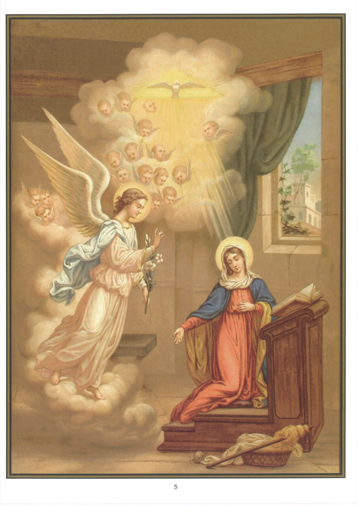

# Quadro 4 (ii) — A Encarnação: A Anunciação

*Terceiro artigo: Que foi concebido pelo poder do Espírito Santo…*

## Mistério da Encarnação

1. O mistério da Encarnação, contido no segundo e no terceiro artigo do Símbolo, é o mistério do Filho de Deus feito homem.

2. O Filho de Deus se fez homem assumindo um corpo e uma alma semelhantes aos nossos no seio da bem-aventurada Virgem Maria, sua mãe, por obra do Espírito Santo.

3. O Filho de Deus feito homem chama-se Jesus Cristo.

4. O nome Jesus significa Salvador: "Tu o chamarás Jesus", disse o anjo a são José, "porque ele salvará o seu povo dos seus pecados."

5. Chamamos ainda Jesus Cristo Nosso Senhor, isto é, nosso Mestre, porque ele nos criou e nos resgatou com o seu sangue.

6. Jesus Cristo é Deus e homem ao mesmo tempo, porque possui duas naturezas: a natureza divina e a natureza humana.

7. Há em Jesus Cristo uma só pessoa, que é a pessoa do Filho de Deus.

## Explicação do quadro

8. Este quadro representa o anjo Gabriel saudando a Santíssima Virgem em oração em sua casa de Nazaré, e anunciando-lhe que Deus a escolheu para ser a mãe do Salvador. No mesmo instante, o Espírito Santo opera nela, por um grande milagre, a Encarnação. Damos, segundo são Lucas, o relato da Anunciação e da Visitação:

## A Anunciação

9. 26 No sexto mês, o anjo Gabriel foi enviado por Deus a uma cidade da Galileia chamada Nazaré, 27 a uma Virgem desposada com um homem chamado José, da casa de Davi; e o nome da Virgem era Maria. 28 E o anjo, entrando aonde ela estava, disse-lhe: Eu te saúdo, cheia de graça, o Senhor é contigo, bendita és tu entre todas as mulheres. 29 Ela, ouvindo-o, perturbou-se com essas palavras, e perguntava-se que saudação seria aquela. 30 E o anjo retomou: Não temas, Maria, pois achaste graça diante de Deus: 31 eis que conceberás em teu seio e darás à luz um filho, e lhe porás o nome de Jesus. 32 Ele será grande, e será chamado Filho do Altíssimo, e o Senhor Deus lhe dará o trono de Davi, seu pai, e reinará eternamente sobre a casa de Jacó, 33 e o seu reino não terá fim.

10. 34 Maria disse ao anjo: Como se fará isto, pois não conheço varão? 35 E o anjo respondeu-lhe: O Espírito Santo descerá sobre ti, e a virtude do Altíssimo te cobrirá com sua sombra. Por isso, o santo que nascer de ti será chamado Filho de Deus. 36 E eis que Isabel, tua parenta, também concebeu um filho em sua velhice; e este é o sexto mês daquela que é chamada estéril, 37 porque a Deus nada é impossível. 38 E Maria disse: Eis aqui a serva do Senhor, faça-se em mim segundo a tua palavra. E o anjo retirou-se dela.

## A Visitação

11. 39 Naqueles dias, Maria, levantando-se, foi apressadamente às montanhas, a uma cidade de Judá, 40 e entrou na casa de Zacarias e saudou Isabel. 41 E logo que Isabel ouviu a saudação de Maria, sucedeu que a criança saltou em seu seio, e Isabel ficou cheia do Espírito Santo; 42 e levantando a voz, exclamou: Bendita és tu entre todas as mulheres, e bendito é o fruto do teu ventre. 43 E donde me vem isto, que a mãe do meu Senhor venha a mim? 44 Pois assim que a tua voz, ao saudar-me, soou em meus ouvidos, a criança saltou de alegria em meu seio. 45 E bem-aventurada és tu, que creste, porque se cumprirá o que te foi dito da parte do Senhor. 46 E Maria disse: Cântico de Maria.

12. Minha alma glorifica o Senhor, 47 e o meu espírito exultou de alegria em Deus, meu Salvador; 48 porque olhou para a humildade de sua serva. Eis que, doravante, todas as gerações me chamarão bem-aventurada, 49 porque aquele que é poderoso fez em mim grandes coisas, e o seu nome é santo, 50 e a sua misericórdia se estende de geração em geração sobre os que o temem. 51 Manifestou o poder do seu braço; dispersou os que se ensoberbeciam com os pensamentos do seu coração. 52 Depôs os poderosos de seus tronos e exaltou os humildes. 53 Encheu de bens os famintos e despediu vazios os ricos. 54 Tomou sob sua proteção a Israel, seu servo, lembrando-se de sua misericórdia, 55 conforme o prometera a nossos pais, a Abraão e à sua descendência, para sempre.
