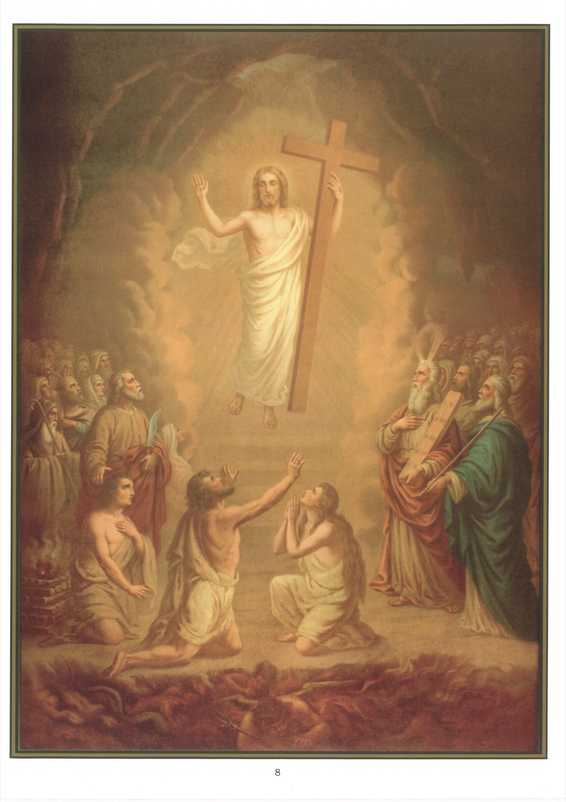

# Quadro 6 — A Descida aos infernos

*Quinto artigo: Desceu aos infernos…*

## Mistério da Redenção

1. As primeiras palavras deste artigo — Desceu aos infernos — significam que, tendo Jesus Cristo morrido, sua alma desceu aos infernos, e ali permaneceu durante todo o tempo em que o seu corpo esteve no sepulcro. O que não deve parecer estranho, pois, embora a alma de Jesus Cristo estivesse separada do seu corpo, a divindade permaneceu sempre unida à sua alma e ao seu corpo.

2. Por essa palavra "inferno", há que se entender os lugares ocultos, esses depósitos em que estão retidas, como prisioneiras, as almas que ainda não receberam a bem-aventurança eterna. É nesse sentido que a Sagrada Escritura usa essa palavra em vários lugares. Foi assim que são Paulo disse "que ao nome de Jesus todo joelho se dobra no céu, na terra e nos infernos".

3. Esses lugares, no entanto, expressos pela palavra infernos, não são todos semelhantes. Pois há um que é como uma prisão muito obscura e horrível, onde as almas dos condenados são continuamente atormentadas com os demônios por um fogo que não se pode extinguir. Esse lugar se chama geena, abismo e, propriamente, inferno.

4. Há outro que é o fogo do purgatório, onde as almas daqueles que morreram em graça, sendo ali atormentadas durante certo tempo, são inteiramente purificadas do que lhes impede a entrada na pátria eterna, "onde nada de impuro pode entrar".

5. O terceiro desses lugares chama-se limbo. É aquele em que as almas dos santos eram recebidas antes da vinda de Nosso Senhor Jesus Cristo, e onde permaneciam em repouso, sem nenhum sentimento de dor, na esperança da sua redenção. E são propriamente as almas desses santos, que aguardavam o seu Salvador no seio de Abraão, as que Nosso Senhor Jesus Cristo libertou pela sua descida aos infernos.

6. Ora, não se deve imaginar que Jesus Cristo desceu a esses lugares somente porque ali manifestou os efeitos do seu poder, mas é preciso crer firmemente que a sua alma desceu ali efetivamente, e que ali se fez realmente presente, como está expressamente assinalado nestas palavras de Davi: "Não deixareis a minha alma nos infernos."

7. Esta descida de Jesus Cristo aos infernos em nada diminuiu o seu poder e a sua majestade, e a obscuridade desses lugares de modo algum empanou o esplendor da sua glória. Pelo contrário, ele mostrou por aí não somente que tudo o que se havia publicado da sua santidade era muito verdadeiro, mas ainda que ele era o Filho de Deus, como antes o provara por tantos prodígios e milagres.

8. É o que se compreenderá facilmente comparando-se as razões que levaram Jesus Cristo a descer a esses lugares com aquelas que haviam obrigado os outros homens a ir para lá. Pois todos os homens haviam descido lá como cativos, ao passo que Jesus Cristo desceu como aquele que, "sendo o único livre entre todos os mortos", e o único vitorioso, ia para derrotar os demônios que os retinham estreitamente encerrados, por causa de seus pecados.

9. Desceu não somente para arrebatar ao demônio os seus despojos, libertando dessa cativeiro os santos Pais e os demais judeus que ali estavam detidos, mas ainda para levá-los como em triunfo consigo ao céu, o que fez de modo admirável e cheio de glória. Pois sua presença derramou uma luz brilhantíssima nesse lugar onde estavam aqueles cativos felizes; encheu o seu coração de uma alegria inconcebível, e fê-los gozar da soberana bem-aventurança, que consiste na visão de Deus; de modo que o que Nosso Senhor havia prometido ao bom ladrão por estas palavras — "Hoje estarás comigo no paraíso" — cumpriu-se ditosamente.

## Explicação do quadro

10. Este quadro representa a alma de Jesus Cristo aparecendo às almas cativas no limbo. Em primeiro plano figuram Adão e Eva, de joelhos; vêm em seguida, à esquerda, Abraão erguendo uma espada sobre Isaac; Jacó com um bastão na mão; Davi com a sua lira, etc.; à direita, Moisés, cuja fronte projeta raios de luz; Aarão com a sua vara; são José segurando um lírio, etc.

11. Nosso Senhor permanece com eles até a sua Ressurreição.

12. Na parte inferior do quadro, vê-se o inferno, onde queimam os demônios e os condenados. Jesus Cristo não desceu a essa morada de eternos sofrimentos, nem ao purgatório, mas fez sentir, contudo, a sua ação aos condenados, dando-lhes a conhecer a sua divindade, e às almas do purgatório, dando-lhes a esperança da glória.
