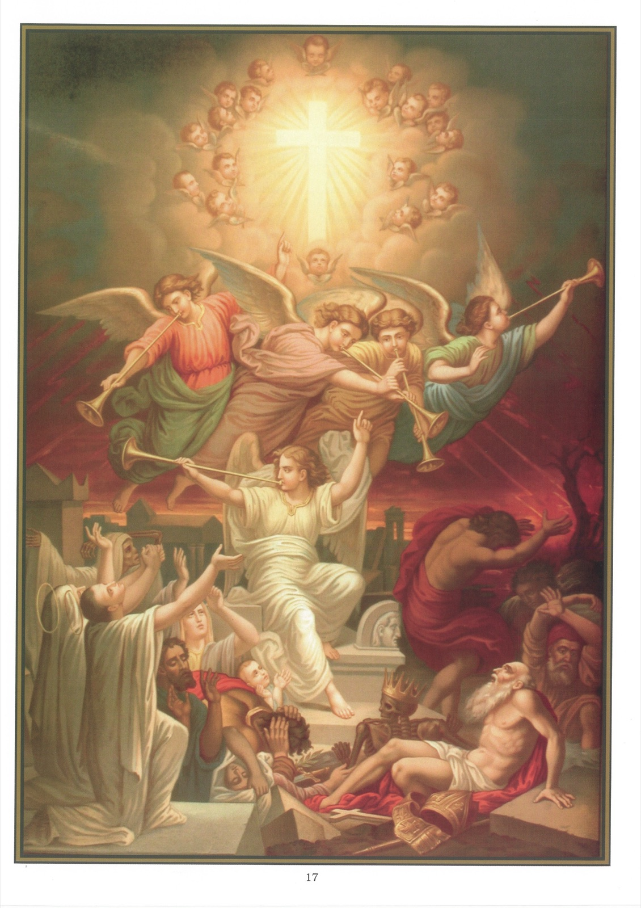

# Quadro 15 — A Ressurreição da carne

*Décimo primeiro artigo: Creio na ressurreição da carne*

1. Estas palavras — Creio na ressurreição da carne — significam que, no fim do mundo, nossos corpos voltarão a viver, unindo-se para sempre às nossas almas.

2. É certo que todos os homens ressuscitarão, pois 1º a Igreja no-lo ensina em seus Símbolos; 2º Jesus Cristo disse no Evangelho: "Virá a hora em que todos os que estão nos túmulos ouvirão a voz do Filho do homem: os que tiverem feito o bem ressuscitarão para uma vida feliz, e os que tiverem feito o mal ressuscitarão para sua condenação."

3. A ressurreição dos corpos se fará pela onipotência de Deus, que pode restituir a vida tão facilmente quanto a dá.

4. Encontramos um exemplo disso na natureza. Assim como uma espiga sai de um grão caído em apodrecimento, assim, da corrupção do túmulo, sairá um dia o corpo ressuscitado.

5. O corpo ressuscitará para participar da recompensa ou do castigo da alma, como terá participado de suas obras, boas ou más.

6. Nem todos os homens ressuscitarão no mesmo estado: os justos ressuscitarão com corpos gloriosos, e os pecadores com corpos hediondos e desfigurados.

7. As qualidades dos corpos gloriosos serão as mesmas que as de Jesus Cristo ressuscitado: a impassibilidade, a claridade, a agilidade e a sutileza.

8. A ressurreição dos corpos se fará no fim do mundo, imediatamente antes do juízo geral, como está marcado nos versículos 23 e 24 do Evangelho seguinte: 1 Entretanto, havia um enfermo, Lázaro, de Betânia, aldeia de Maria e de Marta, sua irmã. 2 Ora, Maria era a que ungira o Senhor com perfume e lhe enxugara os pés com seus cabelos, e era seu irmão Lázaro que estava doente. 3 Mandaram, pois, as suas irmãs dizer a Jesus: Senhor, eis que aquele a quem amas está doente. 4 Ouvindo isso, Jesus lhes disse: Esta doença não é para a morte, mas para a glória de Deus, a fim de que o Filho de Deus seja por ela glorificado. 5 Ora, Jesus amava Marta, Maria, sua irmã, e Lázaro. 6 Tendo, pois, ouvido que estava doente, ficou ainda dois dias no mesmo lugar. 7 Mas, depois disso, disse aos seus discípulos: Voltemos à Judeia. 8 Os discípulos lhe disseram: Mestre, há pouco os judeus queriam apedrejar-te, e tu vais novamente para lá! 9 Respondeu Jesus: Não há doze horas no dia? Se alguém anda de dia, não tropeça, porque vê a luz deste mundo. 10 Mas se anda de noite, tropeça, porque não tem luz. 11 Depois destas palavras, acrescentou: Nosso amigo Lázaro dorme, mas eu vou despertá-lo do seu sono. 12 Seus discípulos lhe disseram: Senhor, se dorme, ficará curado. 13 Jesus, porém, falara de sua morte; mas eles pensaram que falava do repouso do sono. 14 Então, Jesus lhes disse claramente: Lázaro morreu. 15 E me alegro por causa de vós, por não ter estado lá, para que creiais. Mas vamos a ele. 16 Disse então Tomé, chamado Dídimo, aos outros discípulos: Vamos também nós, e morramos com ele. 17 Veio, pois, Jesus, e encontrou Lázaro já havia quatro dias no túmulo. 18 Ora, Betânia ficava perto de Jerusalém, cerca de quinze estádios. 19 Muitos judeus tinham vindo até Marta e Maria, para as consolar da morte de seu irmão. 20 Marta, sabendo que Jesus vinha, foi-lhe ao encontro, mas Maria ficou sentada em casa. 21 Disse, pois, Marta a Jesus: Senhor, se tivesses estado aqui, meu irmão não teria morrido. 22 Mas, mesmo agora, sei que tudo o que pedires a Deus, Deus to dará. 23 Jesus lhe disse: Teu irmão ressuscitará. 24 Marta lhe disse: Eu sei que ressuscitará na ressurreição, no último dia. 25 Disse-lhe Jesus: Eu sou a ressurreição e a vida; quem crê em mim, ainda que morto, viverá; 26 e todo aquele que vive e crê em mim não morrerá jamais. Crês isto? 27 Ela lhe disse: Sim, Senhor, eu creio que tu és o Cristo, o Filho de Deus vivo, que vieste a este mundo. (Jo 11.)

## Explicação do quadro

9. Este quadro representa a ressurreição dos mortos. No meio da desordem geral que reina na natureza, os anjos, tocando a trombeta, chamam os homens ao juízo; os túmulos se abrem, os mortos ressuscitam e saem do pó. Entre eles, vemos um rei que conservou a sua coroa, e um Bispo que reencontra, ao ressuscitar, suas vestes pontificais.

10. No alto do quadro, a Cruz aparece nos ares, toda resplandecente de luz e cercada pelos espíritos bem-aventurados. Sua vista consola os bons, que lhe estendem os braços com confiança, e apavora os maus, que procuram esconder-se e chamam os montes para que os esmaguem.
