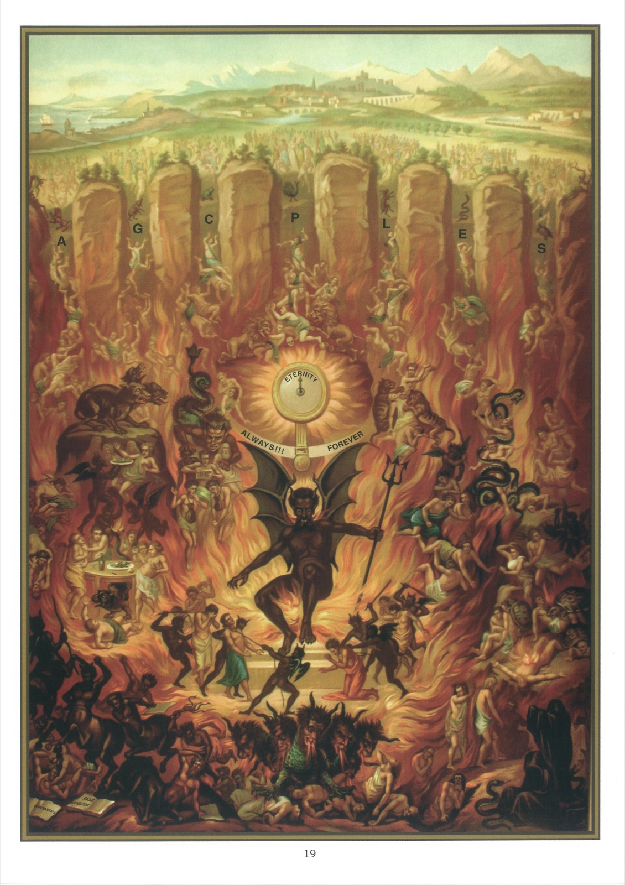

# Quadro 17 — O Inferno

*Décimo segundo artigo (continuação): Creio na vida eterna*

## O inferno

1. O inferno é um lugar de tormentos onde os condenados estão separados de Deus e queimam com os demônios em um fogo que jamais se apagará.

2. Os que vão ao inferno são os que morrem em estado de pecado mortal.

3. É certo que as penas dos condenados durarão para sempre, pois Jesus Cristo declara no Evangelho que, no juízo final, os maus serão condenados a queimar em um fogo eterno. Em outro lugar, Nosso Senhor repete até três vezes que "o verme que devora os condenados não morrerá, e o fogo que os queima não se apagará".

4. A desgraça dos condenados é tão terrível porque Deus os pune em Deus, isto é, com uma justiça infinita.

5. Embora todos os condenados estejam privados da vista de Deus, seus sofrimentos serão mais ou menos grandes, conforme o número e a gravidade de seus pecados.

6. Nada há de mais poderoso, se os crermos firmemente, para reprimir as más paixões do coração e afastar os homens do pecado. Por isso o Eclesiástico nos diz: "Em todas as vossas obras, lembrai-vos dos vossos fins últimos, e nunca pecareis."

7. Com efeito, seria preciso ser impelido ao mal com uma violência extraordinária para não ser reconduzido ao amor da virtude por este pensamento: que um dia será preciso comparecer diante do Juiz que é a própria justiça, e prestar-lhe contas, não somente de todas as suas ações, de todas as suas palavras, mas até dos seus pensamentos mais secretos, e sofrer o castigo que tiverem merecido.

## Explicação do quadro

8. Este quadro nos dá uma fraca ideia das penas que se sofrerão no inferno. No alto, veem-se sete aberturas do inferno, que estão marcadas com as primeiras letras dos sete pecados capitais. O designa o orgulho, A a avareza, L a luxúria, E a inveja, G a gula, C a cólera, P a preguiça. Quer-se mostrar assim que são sobretudo os pecados capitais que fazem com que os homens vão ao inferno.

9. Acima de cada uma dessas letras, um animal simboliza o pecado que ela representa. Um pavão simboliza o orgulho; um sapo, a avareza; um bode, a luxúria; uma serpente, a inveja; um porco, a gula; um leão, a cólera; uma tartaruga, a preguiça.

10. Um fogo devorador é a pena comum a todos os condenados; mas cada um deles sofre penas particulares apropriadas aos pecados que cometeu.

11. Sob a letra O, os orgulhosos são arrastados aos pés de Lúcifer e forçados a ajoelhar-se diante dele. São assim tratados porque, durante a vida, não quiseram humilhar-se diante de Deus.

12. Sob a letra A, veem-se os avaros levando uma bolsa suspensa ao pescoço. Essa bolsa lhes recorda como foram insensatos ao preferirem os bens perecíveis da terra aos bens eternos do paraíso.

13. Sob a letra L, os impudicos são cruelmente espancados pelos demônios ou dilacerados por animais ferozes. Não que haja animais no inferno, mas se quer com isso representar a fúria com que os demônios atormentam os condenados.

14. Sob a letra E, os invejosos são enlaçados, picados e dilacerados por monstruosos répteis.

15. Sob a letra G, os gulosos e os ébrios são devorados por uma fome e uma sede cruéis, saciados do fel do dragão e do veneno da áspide. São eternamente abeberados com o vinho da fúria de Deus; sua consciência, semelhante a um Cérbero de fauces escancaradas, lhes censura sem cessar a sua gula e os seus excessos passados.

16. Sob a letra C, os iracundos e os vingativos dilaceram-se uns aos outros e arrancam-se os cabelos.

17. Sob a letra P, os preguiçosos são trespassados com pontas inflamadas, picados por escorpiões e cravados em braseiros eternos.

18. Os transgressores dos dez mandamentos de Deus e os profanadores dos sete sacramentos são pisados por uma besta que tem sete cabeças e dez chifres, e sufocados pelo seu hálito ardente.

19. Na parte inferior do quadro, à esquerda, centauros pisam os heresiarcas, os que moveram processos injustos e os que combateram a religião com livros e jornais maus.

20. No centro da morada infernal, encontra-se um mostrador cujo ponteiro marca sempre a mesma hora, e essa hora é a eternidade. Quer-se assim mostrar que as penas dos condenados durarão para sempre, e que, uma vez entrado no inferno, dele jamais se sairá.
