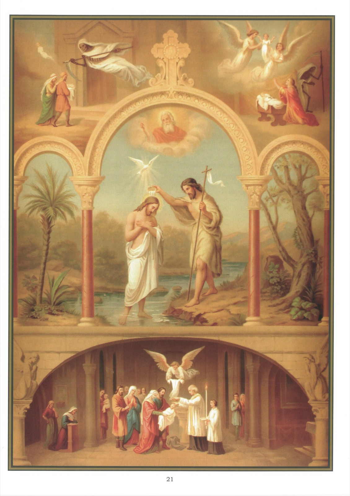

# Quadro 19 — O Batismo

## Dos Sacramentos em geral

1. Os sacramentos são sinais sagrados, instituídos por Nosso Senhor Jesus Cristo, para produzir a graça em nossas almas e nos santificar.

2. Digo que os sacramentos são sinais, porque significam ou representam a graça invisível que neles recebemos.

3. Há sete sacramentos: o Batismo, a Confirmação, a Eucaristia, a Penitência, a Extrema-Unção, a Ordem e o Matrimônio.

4. Os sacramentos que nos fazem passar da morte do pecado à vida da graça, e os outros, aumentando a graça santificante que já tínhamos.

5. Os sacramentos que nos fazem passar da morte do pecado à vida da graça são o Batismo e a Penitência; chamam-se sacramentos dos mortos.

6. Os sacramentos que aumentam em nós a graça santificante são a Confirmação, a Eucaristia, a Extrema-Unção, a Ordem e o Matrimônio; chamam-se sacramentos dos vivos.

7. Os sacramentos produzem a graça por si mesmos, em virtude dos méritos e da instituição de Jesus Cristo. Produzem essa graça em todos os que não lhe põem obstáculo por suas más disposições.

8. Quem recebe um sacramento com más disposições comete um sacrilégio, porque profana uma coisa santa.

9. Só uma vez se pode receber o Batismo, a Confirmação e a Ordem, porque estes três sacramentos imprimem na alma um caráter indelével.

10. Por esse caráter, entendo uma marca espiritual e invisível que nos distingue daqueles que não receberam estes três sacramentos, e que nos consagra a Deus de maneira particular.

## Do Batismo

11. O Batismo é um sacramento que apaga o pecado original e nos faz cristãos, filhos de Deus e da Igreja.

12. O Batismo apaga também o pecado atual, quando se recebe na idade da razão, com as disposições necessárias.

13. O dever dos pais, quando lhes nasce um filho, é portanto apresentá-lo ao Batismo o mais cedo possível, porque, ao adiá-lo, exporiam essa criança a morrer sem ter sido batizada e a ficar eternamente excluída do paraíso.

14. O Batismo, quando há impossibilidade de recebê-lo, pode ser suprido: 1º pelo martírio, a que se chama Batismo de sangue; 2º pela contrição perfeita, unida ao desejo do Batismo; é o que se chama Batismo de desejo.

15. Pertence aos Bispos e aos sacerdotes administrar o Batismo; mas em caso de necessidade, qualquer pessoa pode e deve batizar.

16. Para batizar, é preciso derramar água natural sobre a cabeça da pessoa que se batiza, dizendo: Eu te batizo, em nome do Pai, e do Filho, e do Espírito Santo.

17. Quem é batizado compromete-se a observar os mandamentos de Deus e da Igreja, e renuncia ao demônio, às suas pompas e às suas obras.

## Explicação do quadro

18. O batismo de Jesus Cristo, que se representa no meio deste quadro, indica bem os efeitos que o Batismo produz em nós. Enquanto Nosso Senhor era batizado por são João Batista nas águas do Jordão, ouviu-se a voz de Deus Pai que dizia: Este é meu Filho amado, em quem pus todas as minhas complacências; o Espírito Santo desceu sobre ele em forma de pomba, e os céus se abriram. Quando somos batizados, Deus nos adota como seus filhos; o Espírito Santo desce em nós pela sua graça, e tornamo-nos herdeiros do reino dos céus.

19. Vemos, em baixo deste quadro, um sacerdote que batiza uma criança. A veste branca que um anjo segura e com a qual se reveste o batizado significa que a alma do batizado está ornada de graça e de inocência como de uma veste que a torna bela e agradável aos olhos de Deus.

20. Uma criança que morre logo após ter sido batizada vai imediatamente para o céu. É o que representa este quadro, em cima, à direita, onde vemos a alma de uma criança que morreu depois do batismo ser levada ao céu pelos anjos.

21. O Batismo é tão necessário para a salvação que nem as próprias crianças podem entrar no céu se não forem batizadas. Eis por que vemos neste quadro, em cima, à esquerda, a alma de uma criança morta sem Batismo encaminhar-se para uma região desconhecida, onde será privada para sempre da felicidade celeste.
