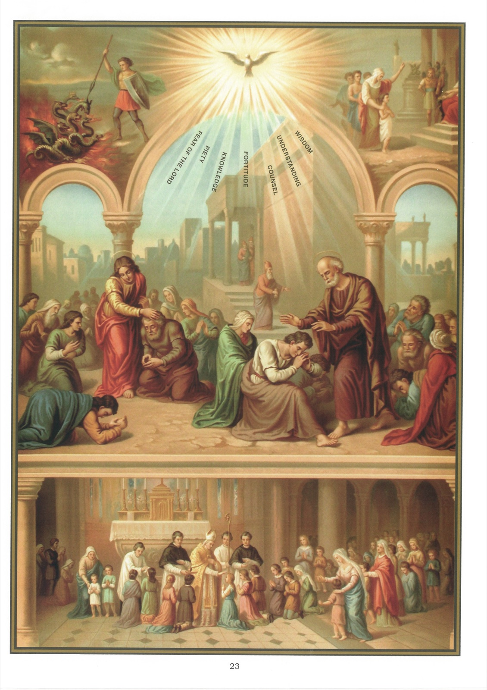

# Quadro 21 — A Confirmação

1. A Confirmação é um sacramento que nos dá o Espírito Santo com a abundância de seus dons para nos tornar cristãos perfeitos.

2. Há sete dons do Espírito Santo: a Sabedoria, o Entendimento, o Conselho, a Fortaleza, a Ciência, a Piedade e o Temor de Deus.

3. A Sabedoria é um dom que nos faz saborear as coisas de Deus.

4. O Entendimento é um dom que eleva o nosso espírito até a contemplação dos mistérios da fé.

5. O Conselho é um dom que nos faz conhecer e escolher oportunamente o que mais contribui para a glória de Deus e para a nossa salvação.

6. A Fortaleza é um dom que nos ajuda a cumprir todas as nossas obrigações, apesar dos obstáculos que possam aparecer.

7. A Ciência é um dom que nos dirige no conhecimento da vontade de Deus.

8. A Piedade é um dom que nos leva a cumprir fielmente os nossos deveres religiosos e a amar a Deus com amor filial.

9. O Temor de Deus é um dom que nos inspira por Deus um respeito misturado de amor, e que nos faz temer ofendê-lo.

10. Os ministros aos quais ordinariamente cabe dar o sacramento da Confirmação são os Bispos, sucessores dos apóstolos.

11. O Bispo, ao dar a confirmação, impõe as mãos sobre os que confirma, faz-lhes uma unção com o Santo Crisma em forma de Cruz na fronte, e ora ao Espírito Santo para que desça sobre eles com todos os seus dons.

12. O Santo Crisma é uma mistura de azeite de oliva e bálsamo, consagrada pelo Bispo na Quinta-Feira Santa.

13. Usa-se óleo na confirmação para indicar a abundância, a doçura e a força da graça que o Espírito Santo derrama naquele que é confirmado.

14. Usa-se bálsamo na Confirmação para indicar que o confirmado deve ser o bom odor de Jesus Cristo, isto é, edificar o próximo com bons exemplos.

15. O bálsamo é uma seiva que escorre de certas árvores e que exala um perfume agradável.

16. Faz-se a unção do Santo Crisma em forma de Cruz na fronte, para indicar ao confirmado que ele nunca deve corar da Cruz de Jesus Cristo.

17. A leve bofetada que o Bispo dá ao confirmado significa que o confirmado deve estar disposto a tudo sofrer por Jesus Cristo.

18. Para bem receber a Confirmação, é preciso estar instruído nos principais mistérios da fé, e não ser culpado de pecado mortal algum. Não é necessário estar em jejum.

19. Quando se recebeu a Confirmação, fica-se ainda mais estreitamente obrigado do que antes a viver como cristão perfeito.

20. A Confirmação não é absolutamente necessária para a salvação; mas tornar-se-ia culpado e privar-se-ia de muitas graças quem deixasse de recebê-la.

## Explicação do quadro

21. Em cima deste quadro, à esquerda, vemos um soldado que combate contra o dragão de sete cabeças. Quer-se mostrar com isso que recebemos, na confirmação, a força necessária para vencer os sete pecados capitais.

22. À direita, vê-se uma criança, fiel às lições de sua mãe, declarar-se cristã diante de um juiz pagão que quereria fazê-la renunciar à fé de Jesus Cristo. Com isso, quer-se mostrar que a confirmação nos dá a força de permanecer fiel a Jesus Cristo no meio das perseguições.

23. O assunto principal deste quadro representa são Pedro e são João dando a Confirmação aos fiéis de Samaria. Impõem-lhes as mãos e oram por eles, para que recebam o Espírito Santo. À direita de são Pedro, vê-se um homem que tem uma bolsa na mão: é Simão, o mágico, que vem pedir ao apóstolo que lhe venda o poder de dar o Espírito Santo. São Pedro o repreende severamente por querer comprar o dom de Deus a preço de dinheiro.

24. O Espírito Santo é representado neste quadro pairando em forma de pomba sobre os que são confirmados, e derramando neles todos os seus dons.

25. Em baixo do quadro, vê-se um Bispo que administra a confirmação a crianças de primeira Comunhão. Vai precedido do seu vigário-geral, que lhe diz os nomes daqueles que devem ser confirmados à medida que se apresentam; segue-o outro sacerdote, que traz uma bandeja sobre a qual se encontra a crismeira, assim chamada por conter o Santo Crisma. Um terceiro sacerdote, em sobrepeliz e estola, limpa, com bolinhas de algodão, a fronte daqueles que acabam de ser confirmados.
