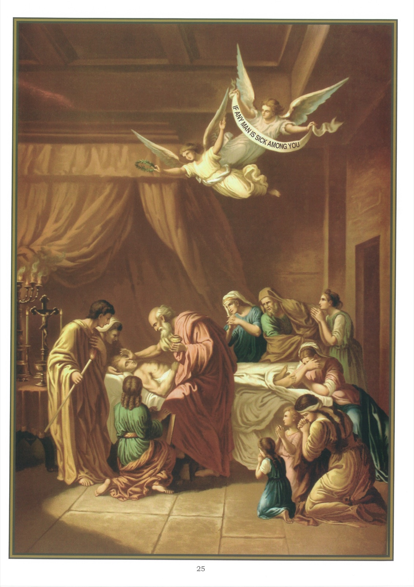

# Quadro 23 — A Extrema-Unção

## A EXTREMA-UNÇÃO

1. A Extrema-Unção é um sacramento instituído por Nosso Senhor Jesus Cristo para o alívio espiritual e corporal dos enfermos.

2. Este sacramento é chamado Extrema-Unção porque nele se faz a última Unção que os cristãos recebem. Os outros sacramentos nos quais se recebe a unção do Óleo Santo ou do Santo Crisma são o Batismo, a Confirmação e a Ordem.

3. Sabemos que a Extrema-Unção é de instituição divina por estas palavras do santo Concílio de Trento: Se alguém disser que a Extrema-Unção não é um verdadeiro sacramento instituído por Nosso Senhor Jesus Cristo, seja anátema.

4. Só aos Bispos e aos sacerdotes pertence administrar a Extrema-Unção.

5. Para administrar este sacramento, o sacerdote faz, com o Óleo Santo, unções sobre os olhos, os ouvidos, as narinas, a boca, as mãos e os pés do enfermo, e roga a Deus que lhe perdoe os pecados que cometeu por todos os seus sentidos.

6. O sacramento da Extrema-Unção remite aos enfermos os pecados que lhes restam, fortalece-os contra as tentações e os ajuda a morrer santamente.

7. Ao dizer que a Extrema-Unção remite aos enfermos os pecados que lhes restam, entendo: 1º que a Extrema-Unção apaga todos os pecados esquecidos ou que seria impossível confessar; 2º que ela livra os enfermos dos restos dos seus pecados, isto é, da perturbação da consciência, do medo da morte e de todas as imperfeições que permanecem na alma, depois que esta foi purificada do pecado.

8. Os enfermos estão sobretudo expostos a serem tentados: 1º de presunção, escondendo de si mesmos o mau estado de sua alma; 2º de desespero, pensando que cometeram demasiados pecados para obter o perdão.

9. A Extrema-Unção fortalece os enfermos contra estas duas tentações, inspirando-lhes sentimentos de penitência à vista de seus pecados, e de confiança na misericórdia de Deus.

10. A Extrema-Unção ajuda os enfermos a morrer santamente: 1º aumentando neles a graça santificante; 2º dando-lhes a força de fazer a Deus o sacrifício de sua vida.

11. A Extrema-Unção suaviza os sofrimentos dos enfermos e contribui para restituir-lhes a saúde, se Deus o julgar útil para a salvação de sua alma.

12. Não se deve esperar estar em extremo perigo para receber a Extrema-Unção, mas é preciso recorrer a este sacramento logo que se está gravemente enfermo, a fim de recebê-lo com mais frutos, e de não se expor a morrer sem o ter recebido.

13. Antes de receber a Extrema-Unção, o enfermo deve confessar-se se for culpado de pecado mortal; se não puder confessar-se, deve excitar-se à contrição e desejar a absolvição.

14. Enquanto o enfermo recebe a Extrema-Unção, deve pedir a Deus o perdão dos pecados que cometeu por todos os seus sentidos, esperar em sua misericórdia e fazer-lhe humildemente o sacrifício de sua vida.

15. Depois de ter recebido a Extrema-Unção, o enfermo deve fazer de quando em quando atos de fé, de esperança e de caridade, olhar para a Cruz e pronunciar piedosamente os nomes de Jesus, Maria, José.

16. Está-se obrigado a avisar os enfermos para que recebam os últimos sacramentos, e é o maior serviço que se lhes pode prestar, pois muitas vezes deles depende a sua salvação eterna. Se não se pode pessoalmente avisar o enfermo, deve-se ao menos prevenir do seu estado o pároco da sua paróquia.

17. Quando o enfermo está em agonia, os assistentes devem recitar as orações dos agonizantes, e lançar sobre ele água benta, cuja virtude é expulsar o demônio.

18. Pode-se receber várias vezes a Extrema-Unção, contanto que não seja na mesma enfermidade.

19. Pode-se e deve-se dar a Extrema-Unção às crianças que ainda não fizeram a primeira comunhão, quando estão gravemente enfermas, depois de terem atingido a idade da razão.

## Explicação do quadro

20. Vemos neste quadro um enfermo a quem um apóstolo administra o sacramento da Extrema-Unção. Acima, um anjo segura uma faixa onde se leem estas palavras que são Tiago escrevia aos primeiros fiéis: Está alguém entre vós enfermo? Chame os sacerdotes da Igreja, e estes orem sobre ele, ungindo-o com óleo em nome do Senhor. O Senhor o aliviará, e se ele tiver cometido pecados, ser-lhe-ão perdoados. Outro anjo mostra o céu com uma das mãos, e, com a outra, segura uma coroa.
