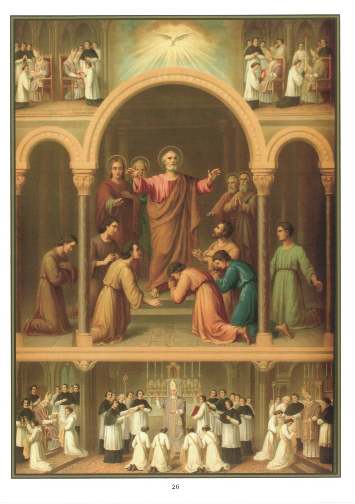

# Quadro 24 — A Ordem

## A ORDEM

1. A Ordem é um sacramento que dá o poder de exercer as funções eclesiásticas e a graça para exercê-las santamente.

2. As principais funções eclesiásticas são: oferecer o Santo Sacrifício da Missa, administrar os sacramentos e pregar a palavra de Deus.

3. O poder de exercer as funções eclesiásticas vem de Nosso Senhor Jesus Cristo, que o deu aos apóstolos com a faculdade de comunicá-lo a outros.

4. Para entrar no estado eclesiástico, é preciso ser chamado por Deus, ter em vista somente a sua glória e a salvação das almas, e ser irrepreensível nos costumes.

5. Os pais não têm o direito de impedir ou de forçar seus filhos a entrarem no estado eclesiástico; estão obrigados em consciência a deixar-lhes a liberdade de abraçar o estado para o qual Deus os chama.

6. Os fiéis devem honrar todos os sacerdotes como ministros de Jesus Cristo; devem especialmente ao seu pároco respeito e docilidade.

## Explicação do quadro

7. O assunto principal deste quadro representa são Pedro dando o sacramento da ordem aos sete primeiros diáconos. Eis a ocasião em que a Ordem dos diáconos foi instituída. Como o número dos primeiros cristãos crescia a cada dia, os apóstolos, não conseguindo mais cumprir todas as suas funções, fizeram que a assembleia dos fiéis elegesse sete diáconos, que ficariam encarregados da distribuição das esmolas. Feita a escolha, conduziram-se os eleitos até os apóstolos, que, "orando sobre eles, lhes impuseram as mãos" e lhes conferiram assim o diaconato.

8. O poder de exercer as funções eclesiásticas chegou dos apóstolos até nós por uma sucessão de Bispos que jamais foi interrompida, e que continuará na Igreja até o fim dos séculos.

9. O episcopado não é uma ordem, mas é a plenitude do sacerdócio. Confere aos que o recebem o poder de administrar todos os sacramentos, e em particular a Confirmação e a Ordem.

10. Só ao Bispo cabe conferir o sacramento da ordem.

11. Há na Igreja sete Ordens diferentes: quatro Ordens menores e três Ordens maiores.

12. As quatro Ordens menores são as Ordens de ostiário, de leitor, de exorcista e de acólito.

13. A função do ostiário é abrir e fechar as portas da igreja. Vemos, em cima do quadro, no canto da esquerda, um Bispo conferindo a Ordem de ostiário. Para isso, faz tocar as chaves da igreja pronunciando as palavras que dão a guarda das chaves.

14. Logo ao lado, o Bispo confere a Ordem de leitor, cuja função é ler na igreja, em voz alta, o Antigo e o Novo Testamento. Para isso, faz tocar o Missal pronunciando as palavras que dão o poder de ler a palavra de Deus.

15. Um pouco mais adiante, o Bispo confere a Ordem de exorcista, cuja função é expulsar o demônio do corpo dos possessos. Para isso, faz tocar o livro dos exorcismos, dando o poder de impor as mãos sobre os possessos.

16. No canto da direita, o Bispo confere a Ordem de acólito, cuja função é servir os ministros sagrados ao altar. Para isso, faz tocar um castiçal e uma vela, depois as galhetas vazias, e dá o poder de acender as velas da igreja e de servir o vinho e a água durante a missa.

17. Vemos em baixo do quadro, à esquerda, o Bispo conferindo o subdiaconato, cujas funções são servir o diácono ao altar e cantar a Epístola. Para isso, faz tocar àquele que deve receber o subdiaconato o cálice, a patena e o livro das Epístolas, dando-lhe o poder de lê-las na igreja. O subdiácono compromete-se a guardar a castidade perpétua e a recitar cada dia o ofício divino.

18. No canto da direita, o Bispo confere o diaconato, cujas funções são servir o sacerdote na Missa, cantar o Evangelho, pregar e batizar. Para isso, impõe as mãos sobre aquele que deve receber esta Ordem, dizendo-lhe: Recebei o Espírito Santo, para terdes a força de resistir ao demônio e às suas tentações.

19. No meio do quadro, o Bispo confere o sacerdócio, cujas funções são celebrar a Santa Missa, pregar e administrar os sacramentos. Para isso, impõe as mãos, e com ele todos os sacerdotes presentes, sobre aquele que deve receber o sacerdócio, faz-lhe uma unção com o óleo santo nas mãos e faz-lhe tocar o cálice em que há vinho, e a patena em que há uma hóstia. Ao mesmo tempo lhe diz: Recebei o poder de oferecer a Deus o sacrifício e de celebrar a Missa pelos vivos e pelos mortos.
