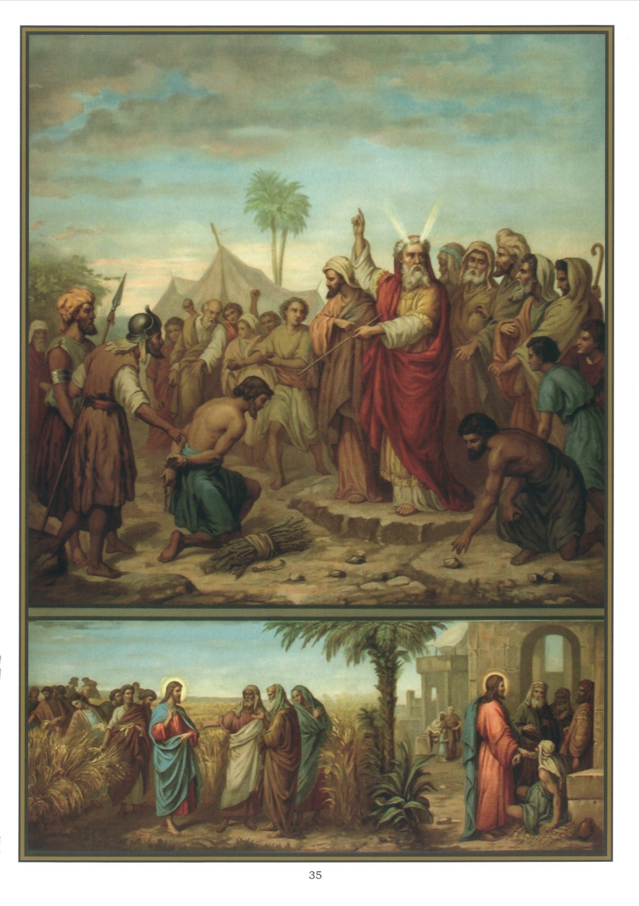

# Quadro 33 — 3º Mandamento (continuação)

*Terceiro Mandamento de Deus (continuação):*

> Guardar domingos e festas de guarda.

1. A profanação do domingo é muito nociva à sociedade, porque, já nesta vida, Deus a pune muitas vezes com terríveis castigos.

2. Pode-se trabalhar ao domingo quando há verdadeira necessidade e para realizar certos atos de caridade, mas nem por isso se está dispensado de ouvir Missa.

3. Como vimos, as obras liberais, isto é, aquelas em que o espírito tem mais parte que o corpo, como ler e escrever, não são proibidas ao domingo.

4. É permitido recrear-se ao domingo de maneira honesta e moderada; mas deve-se evitar com cuidado os divertimentos perigosos, que são, sobretudo para a juventude, a fonte dos maiores males.

5. Além da assistência à Missa, que é de obrigação, a Igreja nos recomenda ainda assistir aos ofícios da tarde e às instruções.

6. A Igreja, enfim, nos aconselha, ao domingo, praticar obras de piedade, como a recepção dos sacramentos, a via-sacra, boas leituras, e obras de caridade, como a visita aos pobres e aos enfermos.

7. Na antiga lei, a profanação do sabbat era punida de morte. Por isso os fariseus e os escribas, que buscavam todas as ocasiões de surpreender Nosso Senhor, mostrava-lhes ele que a caridade para com o próximo prevalecia sobre o sabbat. Eis a esse respeito, segundo os Evangelhos, as acusações dos fariseus contra Nosso Senhor: 1 Naquele tempo, Jesus passava ao longo das searas num dia de sabbat, e seus discípulos, tendo fome, puseram-se a colher espigas e a comê-las. 2 Os fariseus, vendo isso, lhe disseram: Eis que os teus discípulos fazem o que não é permitido fazer nos dias de sabbat. 3 Mas ele lhes disse: Não lestes o que fez Davi quando teve fome, e os que com ele estavam? 4 Como entrou na casa de Deus e comeu os pães da proposição, que não era permitido comer nem a ele nem aos que com ele estavam, mas só aos sacerdotes? 5 Ou não lestes na lei que aos dias de sabbat os sacerdotes violam o sabbat no templo, e ficam sem culpa? 6 Ora, eu vos digo: Há aqui alguém maior que o Templo. 7 Se compreendêsseis esta palavra: Quero a misericórdia e não o sacrifício, nunca teríeis condenado inocentes. 8 Porque o Filho do homem é senhor mesmo do sabbat. 9 E, tendo partido dali, veio para a sinagoga deles. 10 Ora, encontrava-se ali um homem que tinha a mão ressecada, e o interrogavam, dizendo: É permitido curar nos dias de sabbat? a fim de terem um pretexto para o acusar. 11 Mas ele lhes disse: Quem haverá entre vós que, tendo uma só ovelha, se ela cair num fosso no dia de sabbat, não a tome para dali tirá-la? 12 Quanto não vale mais o homem do que uma ovelha? É, portanto, permitido fazer o bem nos dias de sabbat. 13 Então disse a esse homem: Estende a tua mão, e ele a estendeu, e ficou tão sã quanto a outra. 14 Os fariseus, tendo saído, deliberaram contra ele sobre os meios de o perderem. (Mt 12; 1-14) 10 Ora, ele ensinava na sinagoga deles no dia de sabbat. 11 Eis que vem uma mulher possuída de um espírito que a tornava enferma havia dezoito anos; e estava curvada e não podia de modo algum olhar para cima. 12 Vendo-a, Jesus chamou-a e lhe disse: Mulher, estás livre da tua enfermidade. 13 E impôs-lhe as mãos, e logo ela se endireitou e glorificava a Deus. 14 Então o chefe da sinagoga tomou a palavra, e, indignado por ter Jesus curado no dia de sabbat, dizia à multidão: Há seis dias durante os quais é preciso trabalhar; vinde, pois, nesses dias para serdes curados, e não no dia de sabbat. 15 Mas o Senhor, respondendo-lhe, disse: Hipócritas, qual de vós, no dia de sabbat, não desprende seu boi ou seu jumento da manjedoura para levá-los a beber? 16 E esta filha de Abraão, que Satanás prendeu há dezoito anos, não devia ser solta dessa cadeia no dia de sabbat? 17 Enquanto ele assim falava, todos os seus adversários estavam cobertos de confusão. (Lc 13; 10-17)

## Explicação do quadro

8. Vemos, em cima deste quadro, Moisés ordenando aos israelitas, da parte de Deus, que lapidassem um homem que havia recolhido lenha no dia de sabbat.

9. Vemos, em baixo do quadro, à esquerda, Nosso Senhor Jesus Cristo, e, atrás dele, os apóstolos debulhando, num dia de sabbat, algumas espigas para saciar sua fome.

10. À direita, vemos, aos pés de Jesus Cristo, um homem que tem uma mão ressecada, e, diante dele, escribas e fariseus.
