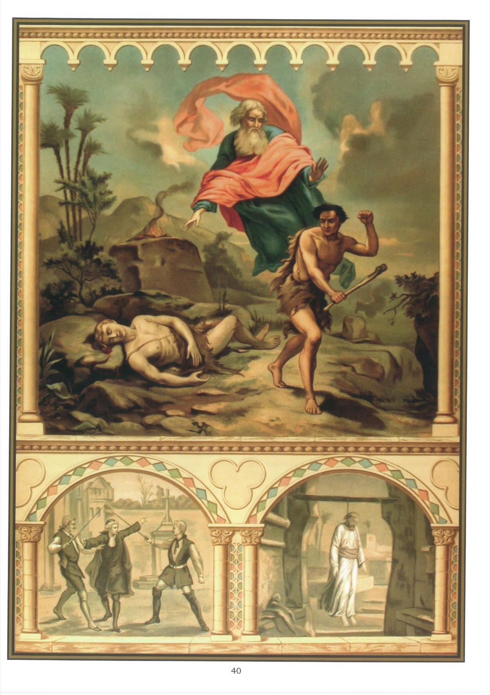

# Quadro 38 — 5º Mandamento

## Quinto Mandamento de Deus:

> Não matar.

## O que ele proíbe: o homicídio

1. O quinto mandamento proíbe: 1º matar alguém por autoridade privada; 2º matar-se a si mesmo e bater-se em duelo; 3º ferir o próximo, dirigir-lhe injúrias e odiá-lo.

2. O crime daqueles que dão a morte ao próximo chama-se homicídio, e o crime daqueles que se dão a morte chama-se suicídio.

3. Comete-se homicídio quando se dá voluntária e injustamente a morte ao próximo.

4. Há três casos em que se pode, sem pecado, dar a morte ao próximo: 1º em uma guerra justa; 2º em caso de legítima defesa; 3º para executar as sentenças da justiça.

5. É grande pecado desejar a morte do próximo ou alegrar-se com ela, quando se faz isso por ódio ou por interesse.

6. Não é permitido acelerar a morte de alguém, a fim de abreviar suas dores.

7. Não é permitido dar-se a morte, por mais infeliz que se seja, porque nossa vida pertence a Deus e só ele tem o direito de dispor dela.

8. Aquele que se dá a morte expõe-se à danação eterna, pois, ordinariamente, não tem tempo de fazer penitência.

9. O suicídio é tão grande crime, que a Igreja recusa ao suicida a sepultura cristã, quando se está certo de que ele estava em pleno uso de suas faculdades ao dar-se a morte.

10. Nunca é permitido, nem mesmo à autoridade pública, matar um inocente, ainda que o bem comum o exigisse e o inocente nisso consentisse, pois ele não é dono de sua vida, e é intrinsecamente mau matá-lo.

11. Não é permitido desejar a morte para si mesmo, a menos que seja pelo desejo de ver a Deus no céu ou de não mais ofendê-lo aqui embaixo.

12. Aquele que se bate em duelo é muito culpado, porque se expõe: 1º a dar a morte ou a recebê-la; 2º a cair no inferno ou a precipitar nele a alma de seu próximo.

13. As testemunhas daqueles que se batem em duelo são tão culpadas quanto eles, porque autorizam o duelo com sua presença.

14. Ter ódio contra o próximo já não é ser discípulo de Jesus Cristo, pois Nosso Senhor declarou no Evangelho que seus discípulos seriam reconhecidos pelo amor que tivessem uns pelos outros: 38 Ouvistes que foi dito: Olho por olho e dente por dente. 39 E eu vos digo: Não resistais ao mau; mas se alguém vos ferir na face direita, oferecei-lhe ainda a outra face. 40 E ao que vos quiser chamar à justiça para vos tomar a túnica, deixai-lhe ainda o manto. 41 E ao que vos quiser obrigar a andar mil passos, fazei outros dois mil com ele. 42 A quem vos pedir, dai, e não vos afasteis daquele que quer pedir-vos emprestado. 43 Ouvistes que foi dito: Amareis vosso próximo e odiareis vosso inimigo. 44 E eu vos digo: Amai vossos inimigos, fazei o bem aos que vos odeiam, e orai pelos que vos perseguem e caluniam, 45 a fim de que sejais filhos de vosso Pai que está nos céus, que faz nascer seu sol sobre os bons e sobre os maus, e descer a chuva sobre os justos e sobre os injustos. 46 Pois se amais aqueles que vos amam, que recompensa tereis? Os publicanos também não fazem isso? 47 E se saudais somente vossos irmãos, que fazeis de extraordinário? Os pagãos não fazem o mesmo? 48 Sede vós, pois, perfeitos como vosso Pai celeste é perfeito. (Mt 5,38-48)

15. Não nos é permitido vingar-nos daqueles que nos ofenderam, porque só Deus tem o direito de punir os que fazem o mal, e reservou-se a si o poder de vingar-nos daqueles que nos ofenderam.

## Explicação do Quadro

16. O alto deste quadro representa Caim, que acaba de matar seu irmão Abel. No momento em que procura fugir, Deus lhe reprova o crime, amaldiçoa-o e o expulsa de sua presença.

17. Vemos, na parte inferior do quadro, à direita, Aquitofel enforcando-se em sua casa, depois de ter induzido Absalão a usurpar o trono de Davi, seu pai.

18. A parte inferior do quadro, à esquerda, representa dois indivíduos que se batem em duelo. Um piedoso cristão, colocando-se entre eles, com uma das mãos os acalma e, com a outra, mostra-lhes a Cruz, do alto da qual Jesus Cristo os vê e condena a sua conduta.
