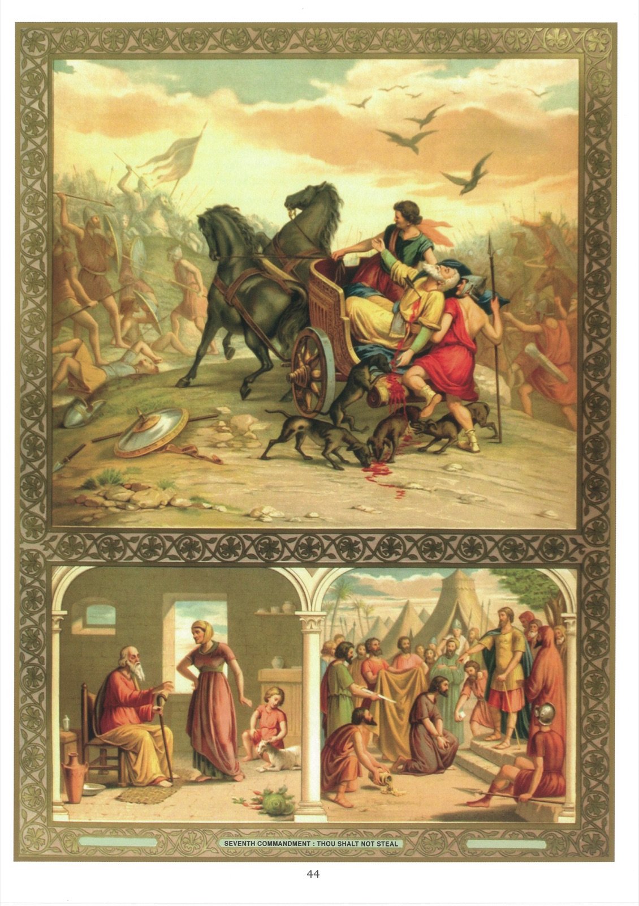

# Quadro 42 — 7º Mandamento

## Sétimo Mandamento de Deus:

> Não furtar.

1. O sétimo mandamento nos proíbe: 1º tomar o bem alheio; 2º retê-lo injustamente; 3º causar qualquer dano ao próximo.

2. Aqueles que tomam o bem alheio são: os ladrões, os empregados e operários infiéis, os comerciantes sem probidade, os litigantes de má-fé, os magistrados e juízes corruptos, os usurários e, enfim, todos aqueles que se apropriam do que não lhes pertence.

3. Os filhos que furtam de seus pais pecam contra o sétimo mandamento, porque se apropriam de um bem que ainda não lhes pertence.

4. É sempre pecado tomar injustamente o bem alheio; mas esse pecado é mais ou menos grave, conforme o maior ou menor valor do objeto que se tomou.

5. Pode haver circunstâncias que tornem mortal um furto leve em si mesmo; por exemplo, quando um furto leve causa dano notável, ou quando se tem a intenção de chegar, por meio de vários furtos leves, a tomar uma soma considerável.

6. Retém-se injustamente o bem alheio: 1º guardando um objeto encontrado sem procurar a quem pertence; 2º desviando bens de uma herança; 3º não restituindo um depósito que se recebeu; 4º não pagando, ou fazendo esperar demais, o salário aos operários e aos empregados.

7. Causa-se dano ao próximo: 1º estragando ou destruindo o que lhe pertence; 2º impedindo-o, por meios injustos, de obter um ganho legítimo.

8. Peca-se ainda contra o sétimo mandamento, participando da injustiça dos outros.

9. Eis os conselhos de João Batista às multidões que vinham confessar-lhe suas injustiças: 9 Já o machado está posto à raiz das árvores. Toda árvore que não produzir bom fruto será cortada e lançada no fogo. 10 E o povo o interrogava, dizendo: Que faremos, pois? 11 E ele lhes respondia: Quem tiver duas túnicas, dê uma ao que não tem, e o que tem o que comer, faça o mesmo. 12 Vieram também publicanos para ser batizados, e lhe disseram: Mestre, que faremos? 13 Ele lhes disse: Não exijais nada além do que vos foi prescrito. 14 E soldados também o interrogavam, dizendo: E nós, que faremos? E ele lhes disse: Não bateis em ninguém, não caluniai, e contentai-vos com o vosso soldo. 15 Ora, como o povo aguardava expectante e todos se perguntavam em seus corações se João não seria por acaso o Cristo, 16 João lhes respondeu a todos, dizendo: Eu vos batizo na água, mas virá Aquele que é mais forte do que eu, de quem não sou digno de desatar a correia das sandálias; ele vos batizará no Espírito Santo e no fogo. 17 Tem na mão a pá, e limpará sua eira, e recolherá o trigo no celeiro, mas a palha queimá-la-á no fogo que não se apaga. (Lc 3.)

## Explicação do Quadro

10. Vemos, à esquerda, o velho Tobias, tornado cego e pobre, depois de ter possuído grandes bens e praticado muitas obras de caridade. Sua esposa trabalhava para alimentá-lo com seu jovem filho. Um dia em que lhe haviam dado um cabrito, Tobias, ouvindo o balido do animal, disse imediatamente: "Tomai cuidado, para que não seja fruto de furto; nesse caso, seria preciso devolvê-lo a seus donos, pois não nos é permitido aproveitar para nosso alimento o que foi furtado."

11. O alto deste quadro representa Acab, rei de Israel, traspassado por uma flecha em combate. Um dia, esse príncipe quis ter uma vinha que pertencia a um israelita chamado Nabot; mas este recusou ceder-lhe a herança de seus pais. De acordo com Jezabel, sua esposa, ainda mais perversa que ele, Acab fez perecer Nabot e apoderou-se de sua vinha. O profeta Elias então veio dizer-lhe da parte de Deus: "Neste lugar onde os cães lamberam o sangue de Nabot, lamberão também o teu sangue." Algum tempo depois, Acab, estando em guerra com o rei da Síria, disfarçou-se para evitar os golpes dos inimigos; mas uma flecha lançada ao acaso veio atravessá-lo, e o sangue que correu de sua ferida foi lambido pelos cães, como predissera Elias.

12. Vemos embaixo, à direita, um israelita chamado Acan que, após a tomada de Jericó, apropriara-se, contra a proibição do Senhor, de uma parte das ovelhas, duzentos siclos de prata, uma régua de ouro e um manto de escarlate. Esse furto recebeu um terrível castigo. Por ordem de Josué, Acan foi apedrejado pelo povo e queimado com tudo o que lhe pertencia.
