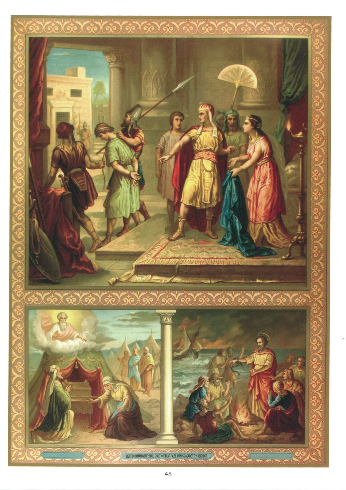

# Quadro 46 — 8º Mandamento (continuação)

## Oitavo Mandamento de Deus (continuação):

> Não levantar falso testemunho.

## A calúnia

1. Caluniar é imputar a alguém uma falta de que é inocente, ou um defeito que não tem.

## A maledicência

2. Maldizer é descobrir sem necessidade os defeitos ou as faltas do próximo, ou então rebaixar suas boas qualidades.

3. Quando é necessário revelar os defeitos ou as faltas do próximo, só se devem fazer conhecer àqueles que podem remediá-los, ou àqueles que sofreriam algum dano se não fossem advertidos.

4. Embora a coisa que se relata seja verdadeira, há pecado em dizê-la, porque a caridade nos proíbe tirar sem razão do próximo a boa reputação de que goza.

5. Não é maledicência dizer do próximo um mal conhecido e público, mas então é preciso evitar tudo o que tivesse sabor de malignidade.

6. A maledicência pode ser pecado mortal, pois são Paulo disse que "os maldizentes não entrarão no reino dos céus".

7. A calúnia e a maledicência são pecados mortais quando o mal que se diz injustamente do próximo é grave em si e causa dano considerável à sua reputação.

8. Há circunstâncias que aumentam a gravidade destes dois pecados, por exemplo, quando se diz mal dos superiores, das pessoas consagradas a Deus, de muitas pessoas ao mesmo tempo, ou diante de um grande número de pessoas.

9. Não é permitido escutar com prazer a maledicência ou a calúnia, pois isso é participar do pecado dos maldizentes e dos caluniadores.

10. Quando se ouve maldizer, deve-se, se possível, impedir a maledicência; se não se pode, deve-se desviar a conversa, ou, ao menos, mostrar pelo silêncio que não se tem prazer na maledicência.

11. É proibido, em geral, relatar a alguém o mal que se ouviu dizer dele; a Sagrada Escritura diz que Deus detesta aqueles que, por suas delações, semeiam a divisão entre os irmãos.

12. Aquele que prejudicou o próximo por calúnia ou por maledicência é obrigado a reparar, na medida do possível, o dano que lhe causou.

13. Deve-se reparar o dano causado ao próximo pela calúnia, declarando que o mal que se disse dele é falso. O maldizente deve fazer tudo o que puder para restabelecer a reputação do próximo, escusando suas faltas ou ressaltando suas boas qualidades.

## O juízo temerário

14. Julgar temerariamente é conceber má opinião do próximo sem razão suficiente.

15. O juízo temerário é pecado, porque a justiça e a caridade proíbem pensar mal de alguém sem prova suficiente.

## Explicação do Quadro

16. O alto deste quadro representa o jovem José conduzido à prisão por um crime de que tinha sido falsamente acusado pela mulher de Putifar. Esta, enamorada dele com amor culpável, certo dia o solicitou a consentir em sua paixão. Mas José, não querendo ofender a Deus, recusou-se e fugiu. Essa mulher má reteve seu manto e o acusou diante do marido de ter tentado seduzi-la. Putifar acreditou nessa calúnia e mandou lançar José na prisão.

17. Embaixo do quadro, à esquerda, vemos o sumo sacerdote Arão e sua irmã Maria, de joelhos diante da Arca da aliança; acima da Arca, vê-se o próprio Deus. Arão e Maria haviam murmurado contra Moisés, seu irmão. Mas o Senhor, fazendo-os comparecer diante da Arca, repreendeu-os por sua murmuração e feriu Maria de uma lepra que durou sete dias.

18. À direita, vemos são Paulo na ilha de Malta, onde havia desembarcado após uma tempestade. Os habitantes da ilha o trataram, assim como aos seus companheiros, com muita humanidade. Acenderam uma grande fogueira, por causa da chuva e do frio que fazia. Ora, Paulo, tendo lançado no fogo alguns sarmentos que recolhera, o calor fez sair uma víbora que se lançou sobre sua mão. Os bárbaros, vendo essa serpente pendurada à sua mão, diziam uns aos outros: "Sem dúvida, este homem é um assassino; pois, depois de ter sido salvo do mar, a justiça divina não quer deixá-lo viver." Mas logo viram quão pouco fundado era esse juízo, pois Paulo, sacudindo a víbora no fogo, não recebeu nenhum mal.
