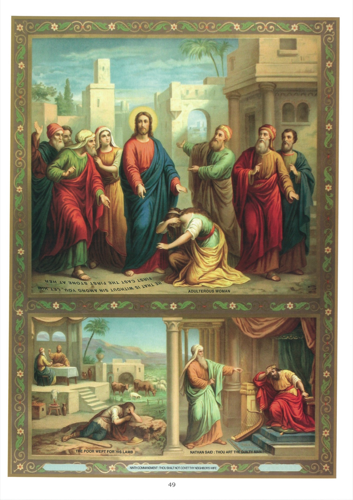

# Quadro 47 — 9º Mandamento

## Nono Mandamento de Deus:

> Não desejar a mulher do próximo.

1. Pelo nono mandamento, Deus nos proíbe todo desejo e todo pensamento desonesto. Nosso Senhor diz no Evangelho: 27 Ouvistes que foi dito aos antigos: Não cometerás adultério. 28 Eu, porém, vos digo: Quem olhar para uma mulher para a cobiçar, já cometeu adultério em seu coração. (Mt 5.)

2. O nono mandamento difere do sexto em que o sexto proíbe todo ato exterior de impureza, como as palavras e as ações, enquanto o nono proíbe até o desejo e o pensamento de uma ação impura.

3. Há mau desejo quando se quereria fazer o mal, se fosse possível. Há mau pensamento quando se representa o mal ao espírito sem querer fazê-lo.

4. O mau desejo é pecado, embora não se execute, porque não se tem o direito de desejar o que não é permitido fazer.

5. Os maus pensamentos em que se demora voluntariamente são pecados, ainda que não se tenha intenção alguma de executá-los.

6. A razão é que se ofende a Deus pensando voluntária e com prazer em coisas que lhe desagradam soberanamente e que levam a fazer o mal.

7. Os maus pensamentos aos quais se resiste fielmente não são pecados; tornam-se mesmo, para nós, ocasiões de mérito, e é isso que nos deve excitar a combater corajosamente contra as tentações.

8. Para vencer as tentações impuras, é preciso: 1º lembrar que Deus nos vê e nos julgará; 2º elevar o coração a Deus por uma curta invocação; 3º resistir desde o começo da tentação; 4º invocar a Santíssima Virgem.

## Explicação do Quadro

9. O alto deste quadro representa Nosso Senhor e, a seus pés, uma mulher que, arrastada por um mau desejo, se tornara culpável de adultério. Eis o relato, segundo o Evangelho: 3 Então os escribas e os fariseus trouxeram-lhe uma mulher surpreendida em adultério, e, colocando-a no meio, 4 disseram a Jesus: Mestre, esta mulher acaba de ser surpreendida em adultério. 5 Ora, Moisés, na lei, ordenou-nos apedrejar essas mulheres; e tu, que dizes? 6 Falavam assim para tentá-lo, a fim de poder acusá-lo. Mas Jesus, baixando-se, escrevia na terra com o dedo. 7 E, como continuavam a interrogá-lo, levantou-se e lhes disse: Aquele de vós que está sem pecado, atire-lhe a primeira pedra. 8 E, baixando-se de novo, escrevia na terra. 9 Tendo ouvido essas palavras, saíram um após outro, começando pelos mais velhos; e Jesus ficou só com a mulher, que estava de pé no meio. 10 Então Jesus, levantando-se, lhe disse: Mulher, onde estão aqueles que te acusavam? Ninguém te condenou? 11 Ela respondeu: Ninguém, Senhor. Jesus lhe disse: Nem eu te condenarei; vai, e não peques mais. (Jo 8.)

10. Embaixo do quadro, à direita, vê-se o rei Davi e, diante dele, o profeta Natã. Este reprova a Davi o adultério que cometeu com Betsabeia e o assassinato de Urias, seu marido.

11. A imagem da esquerda nos coloca diante dos olhos a parábola de que Natã se serviu para fazer Davi sentir a enormidade de seu crime. "Havia, lhe disse, dois homens em uma cidade, um rico e outro pobre. O rico tinha ovelhas e bois em grande número; mas o pobre não tinha senão uma pequena ovelha que havia comprado e criado, e que crescera com seus filhos, comendo de seu pão, bebendo de seu copo e dormindo em seu peito, e ele a amava como uma filha. Ora, vindo um viajante à casa do rico, este não quis tocar suas ovelhas e bois para regalar seu hóspede, mas tomou a ovelha do pobre e a serviu em banquete àquele que viera visitá-lo. Davi entrou em grande cólera contra esse homem e disse a Natã: — Vive Jeová! ele é réu de morte, o homem que assim agiu." — Tu és esse homem, replicou o profeta. Eis o que diz o Senhor: Eu te sagrei rei sobre Israel, e te livrei da mão de Saul. Dei-te sua casa e todos os seus bens, e a tantos benefícios estava prestes a acrescentar mais. Por que, desprezando a palavra do Senhor, cometeste a iniquidade, fazendo perecer pela espada Urias, o heteu, e desposando sua mulher? Em castigo de teu duplo crime, é de tua própria família que o Senhor tirará os ministros de sua vingança: ela se tornará para ti fonte de desgraças. O rei ficou abalado, e, do fundo de sua alma dilacerada pelo arrependimento, exalou esse grito salvador da penitência que Deus nunca despreza: "Pequei contra o Senhor."
