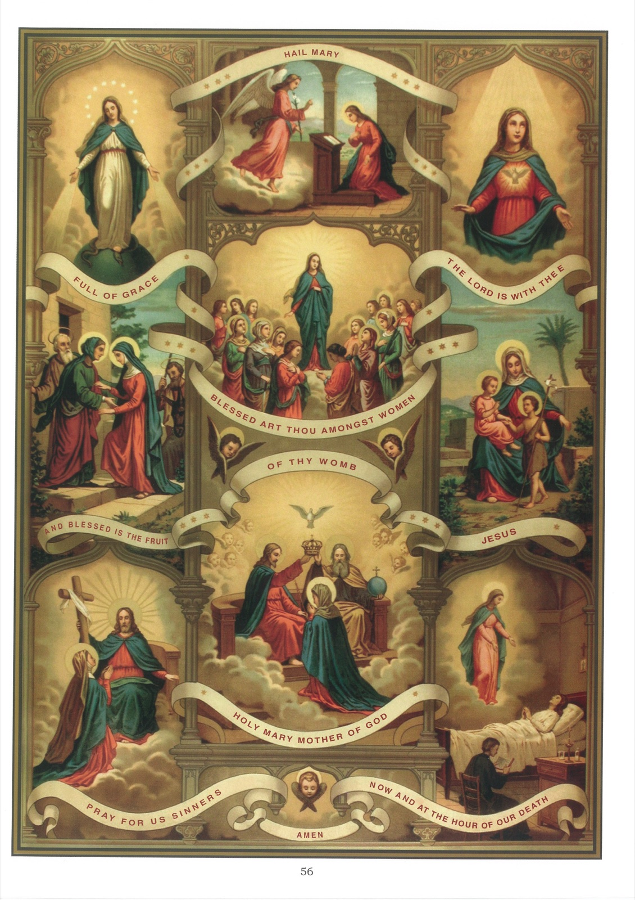

# Quadro 54 — A Ave-Maria

## Explicação do quadro

1. O tema deste quadro é a Saudação Angélica, assim chamada porque começa com as palavras com as quais o anjo saudou a Santíssima Virgem, anunciando-lhe que ela seria a mãe do Salvador. Eis estas palavras: Ave-Maria, cheia de graça, o Senhor é convosco; bendita sois vós entre as mulheres.

2. As palavras que se seguem: E bendito é o fruto do vosso ventre (Jesus), foram pronunciadas por santa Isabel. A Igreja acrescentou a seguinte invocação: Santa Maria, Mãe de Deus, rogai por nós, pecadores, agora e na hora da nossa morte. Amém.

3. As palavras: Ave-Maria, significam: Eu vos honro, eu vos felicito e me alegro convosco por vossos gloriosos privilégios. Elas são representadas, no alto do quadro, pelo anjo Gabriel anunciando a Maria que Deus a havia escolhido para ser a Mãe de seu Filho.

4. As palavras: Cheia de graça, significam que a alma de Maria nunca foi maculada pelo pecado original nem pelo menor pecado atual, e que, desde o primeiro momento de sua existência, ela foi adornada com a graça santificante, com todas as virtudes e todos os dons celestes. Estas palavras são aqui representadas por Maria imaculada desde o primeiro momento de sua conceição.

5. As palavras: O Senhor é convosco, significam que Deus habitava na alma de Maria pela sua graça e em seu corpo, operando ali, pela sua onipotência, o mistério da encarnação. Estas palavras são aqui representadas pelo Espírito Santo habitando no coração de Maria como em seu templo.

6. As palavras: Bendita sois vós entre as mulheres, significam que Maria foi elevada acima de todas as outras mulheres, tornando-se mãe sem deixar de ser virgem e dando à luz um filho que é Deus. Estas palavras são aqui representadas por Maria colocada acima de um grande número de santas mulheres e superando-as todas em santidade, em glória e em poder. Uma dessas mulheres, à direita, segura uma espada na mão: é Judite, que cortou a cabeça de Holofernes e, por isso, figurou Maria, vitoriosa sobre a serpente infernal.

7. Estas palavras: Bendito é o fruto do vosso ventre, significam que Jesus Cristo, o Filho de Deus feito homem no seio de Maria, foi cumulado por seu Pai de bênçãos infinitas, e que nele foram benditas todas as nações.

8. Estas palavras são representadas, à direita, por santa Isabel, que as dirige a Maria, e, à esquerda, pelo Menino Jesus, que abençoa são João Batista.

9. A Igreja acrescentou as palavras: Santa Maria, Mãe de Deus, para vingar Maria da impiedade de Nestório, que lhe recusava esse glorioso título.

10. Estas palavras são aqui representadas por Maria, Mãe de Deus, coroada no céu Rainha dos anjos e dos homens pelas três pessoas divinas.

11. Dizemos: Rogai por nós, pecadores, porque a Santíssima Virgem, que é para todos os homens o canal das graças de Deus, é particularmente a advogada e o refúgio dos pecadores.

12. Estas palavras são aqui representadas por Maria intercedendo por nós junto a seu Filho no céu.

13. Pedimos a Maria que rogue por nós agora e na hora da nossa morte, porque temos necessidade do seu auxílio durante toda a nossa vida, e mais ainda no momento de deixar este mundo para entrar na eternidade.

14. Estas palavras são aqui representadas por Maria aparecendo a um enfermo e protegendo-o na hora de sua morte.

15. Há práticas de piedade nas quais se recita várias vezes a Saudação Angélica: as principais são o Angelus, que se reza três vezes ao dia, e o Rosário.

16. O Rosário compõe-se de quinze dezenas de Ave-Marias, precedidas cada uma de um Pai-Nosso, e acompanhadas da meditação de um dos quinze principais mistérios, ou gozosos, ou gloriosos, ou dolorosos de Nosso Senhor e da Santíssima Virgem. Os mistérios gozosos são: a Anunciação, a Visitação, o Nascimento de Nosso Senhor, sua Apresentação no Templo, seu Reencontro entre os doutores. Os mistérios dolorosos são: a Agonia de Nosso Senhor no jardim das Oliveiras, a Flagelação, a Coroação de espinhos, o Caminho da Cruz, a Crucificação.

17. Os mistérios gloriosos são: a Ressurreição de Nosso Senhor, sua Ascensão, a Descida do Espírito Santo sobre os apóstolos, a Assunção da Santíssima Virgem, sua Coroação no céu.

18. O Terço é a terceira parte do Rosário.
