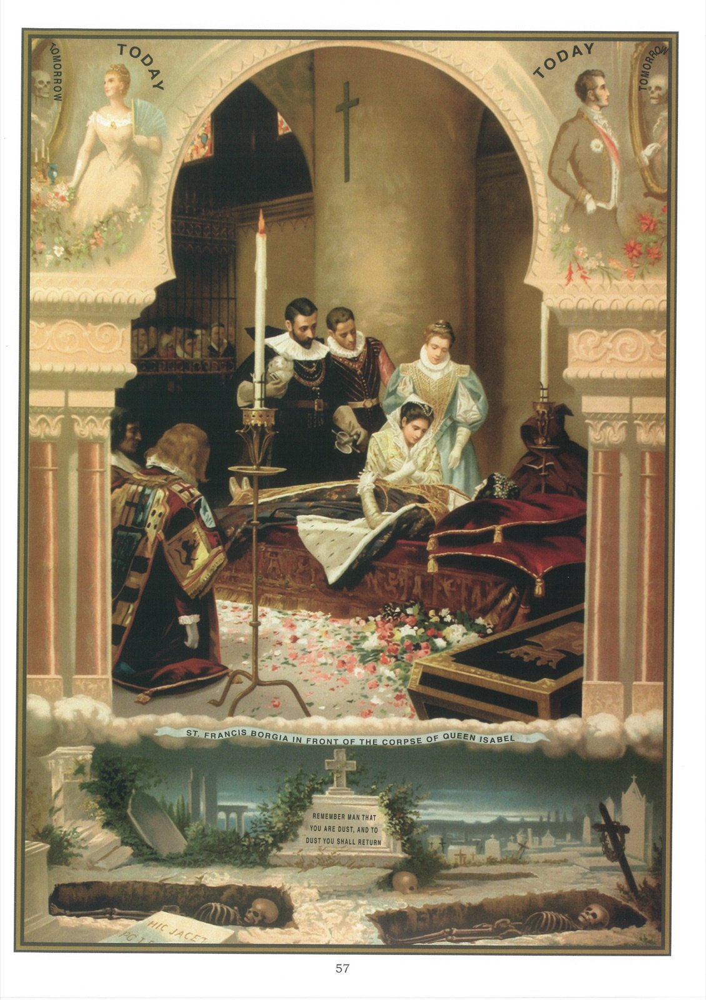

# Quadro 55 — A Vaidade

1. Os fins últimos do homem são: a morte, o juízo, o céu, o inferno.

2. É bom pensar com frequência em nossos fins últimos; este pensamento nos afasta do pecado e nos inspira fervor no serviço de Deus. Por isso a Sagrada Escritura nos diz: "Lembrai-vos de vossos fins últimos e jamais pecareis."

## A morte

3. A morte é a separação da alma do corpo e a passagem do tempo à eternidade.

4. Foi pelo pecado de nossos primeiros pais que a morte entrou no mundo. "Se comerdes do fruto da árvore que está no meio do paraíso", dissera Deus a Adão e Eva, "morrereis de morte." Adão e Eva não obedeceram a Deus e, pelos pérfidos conselhos do demônio, comeram do fruto proibido. Deus os expulsou do paraíso, e eles e seus descendentes ficaram sujeitos às misérias da vida e à morte.

5. É, pois, certo que todos morreremos em castigo do pecado de nosso primeiro pai: "A sentença está dada", diz são Paulo, "todos os homens hão de morrer uma vez."

6. Morreremos quando aprouver a Deus; nossa morte é certa, mas não sabemos nem o dia nem a hora.

7. Deus quis que a hora de nossa morte nos fosse oculta, a fim de que nos preparássemos sem cessar para ela, pois cada dia pode ser o último de nossa vida.

8. Devemos preparar-nos para a morte por uma vida verdadeiramente cristã e pela recepção dos últimos sacramentos.

9. Não se deve esperar o tempo da doença para se dispor a bem morrer. Esperar esse tempo é agir como um insensato e expor muito a salvação eterna. Foi isso que fez o mau rico, do qual o Evangelho nos fala na parábola seguinte: 13 Alguém, do meio da multidão, lhe disse: Mestre, dize a meu irmão que reparta comigo a nossa herança. 14 Mas Jesus lhe disse: Homem, quem me estabeleceu sobre vós para julgar e fazer partilhas? 15 E disse-lhes: Vede e guardai-vos de toda avareza; pois, mesmo na abundância das coisas, a vida de um homem não depende dos bens que ele possui. 16 Depois lhes disse esta parábola: Um homem rico tinha um campo que lhe produziu frutos abundantes. 17 E pensava consigo mesmo, dizendo: Que farei, pois não tenho onde guardar os meus frutos? 18 E disse: Eis o que farei: destruirei os meus celeiros, e farei outros maiores, e ali ajuntarei todos os meus produtos e todos os meus bens. 19 E direi à minha alma: Alma, tens muitos bens em reserva para muitos anos; descansa, come, bebe, faz boa cheira. 20 Mas Deus lhe disse: Insensato, esta mesma noite te pedirão a alma, e os bens que ajuntaste, de quem serão? 21 Assim é aquele que ajunta tesouros para si mesmo e não é rico diante de Deus. (Lucas, XII)

## Explicação do quadro

10. Este quadro representa a morte; faz-nos ver que é útil pensar na morte, para nos penetrarmos da vaidade das coisas da terra e nos prendermos unicamente aos bens da outra vida.

11. No meio do quadro, vemos Francisco de Borja, fidalgo na corte de Carlos V, e, diante dele, o cadáver da imperatriz Isabel. Após a morte desta, Francisco foi encarregado de conduzir seu corpo a Granada, onde deveria ser sepultado. Quando o cortejo entrou nessa cidade, abriu-se o caixão, segundo o costume, para que Francisco jurasse que o rosto que se via era o da imperatriz; mas esse rosto estava tão desfigurado que não foi possível reconhecê-lo; o cadáver, ademais, exalava um odor tão fétido que ninguém o podia suportar. Vivamente impressionado por esse hediondo espetáculo, Francisco tomou a resolução de renunciar ao mundo e às suas vaidades; mais tarde, entrou na companhia de Jesus e tornou-se um grande santo.

12. No alto do quadro, veem-se uma mulher e um homem cheios de saúde que se contemplam num espelho. Acima de suas cabeças, lê-se esta palavra: Hoje; e, abaixo da Morte, que lhes aparece no espelho, lê-se esta outra palavra: Amanhã. Este contraste entre o estado de um homem com boa saúde e aquele em que cairá após a morte deve incitar-nos a preferir os bens da alma, que durarão sempre, aos bens do corpo, que a morte nos há de tirar.

13. A parte inferior do quadro representa um cemitério semeado de Cruzes, de monumentos fúnebres, de inscrições funerárias; túmulos abertos deixam ver esqueletos.
