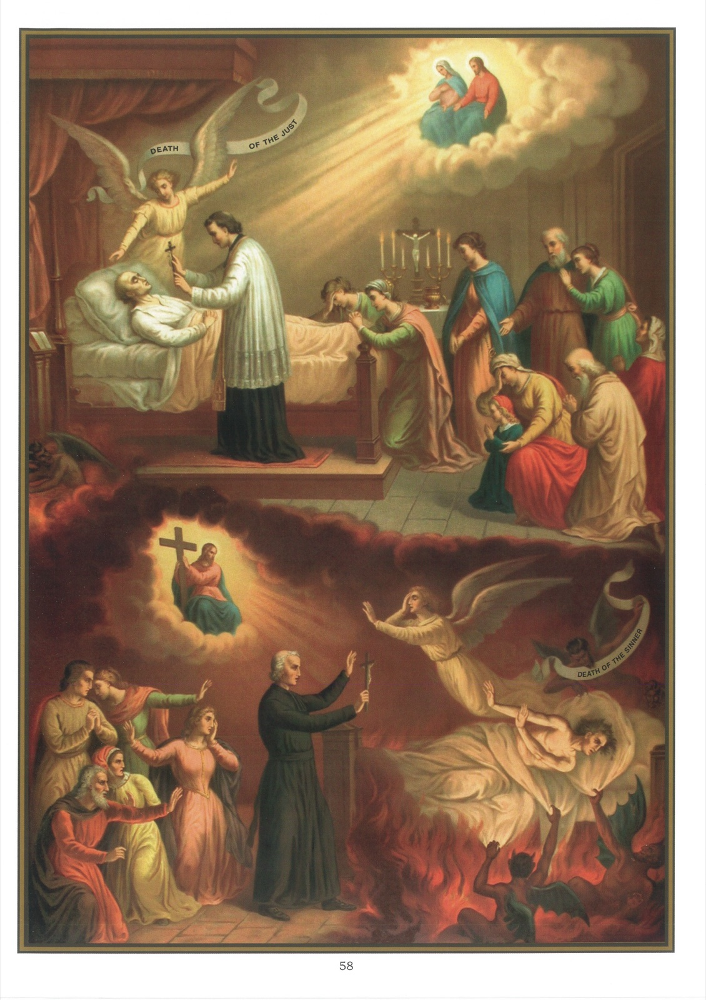

# Quadro 56 — A Morte

1. Uma boa morte é a morte em estado de graça; ela é a suprema felicidade do homem.

2. Uma má morte é a morte em estado de pecado mortal: ela é a soberana desgraça do homem.

3. A Sagrada Escritura diz que a morte do pecador é péssima.

4. A morte do pecador é péssima: 1º porque ele experimenta uma grande pena ao deixar os bens deste mundo, aos quais está unicamente apegado, pela lembrança de seus pecados; 2º porque irá em breve sofrer no inferno o castigo de sua vida criminosa.

5. Uma morte péssima foi a de Herodes, cujo relato nos é feito nos

## Atos:

19 Herodes, tendo mandado buscar Pedro e não o tendo encontrado, depois de ter feito interrogar os guardas, mandou que fossem levados ao suplício; depois foi da Judeia para Cesareia, onde permaneceu. 20 Ora, ele estava em hostilidade com os tírios e sidônios, mas eles vieram ter com ele de comum acordo; e, tendo ganhado Blasto, que era camareiro do rei, pediram a paz, porque o seu país tirava o sustento das terras do rei. 21 Herodes, então, tendo marcado um dia para lhes falar, apresentou-se vestido com uma túnica real; e, sentado no seu trono, dirigiu-lhes um discurso. 22 E o povo aclamava: É a voz de um deus e não de um homem. 23 Mas, no mesmo instante, um anjo do Senhor o feriu, porque não havia dado glória a Deus, e, roído pelos vermes, morreu. (At. XII.)

6. Tal foi também a morte de Judas, cujo relato eis aqui segundo os Atos: 13 E, tendo entrado numa casa, subiram a um quarto onde permaneciam Pedro, João, Tiago, André, Filipe, Tomé, Bartolomeu, Mateus, Tiago, filho de Alfeu, Simão, chamado o Zelote, e Judas, irmão de Tiago, 14 os quais perseveravam todos unanimemente em oração com as mulheres, e Maria, mãe de Jesus, e seus irmãos. 15 Naqueles dias, Pedro se levantou no meio dos irmãos (que estavam reunidos em número de cerca de cento e vinte), e lhes disse: 16 É preciso que se cumpra o que o Espírito Santo predisse na Escritura pela boca de Davi, acerca de Judas, que foi o condutor dos que prenderam a Jesus. 17 Ele nos era associado e havia sido chamado às funções do mesmo ministério. 18 E ele possuiu um campo adquirido com o preço de seu pecado, pois, tendo-se enforcado, rebentou pelo meio do ventre; e todas as suas entranhas se derramaram. 19 O que foi tão conhecido de todos os habitantes de Jerusalém, que esse campo foi chamado, na sua língua, Haceldama, isto é, o campo do sangue. 20 Ora, está escrito no livro dos Salmos: que a sua morada se torne deserta; que não haja quem a habite, e que outro tome o seu lugar no episcopado. 21 É necessário, pois, que entre os que estiveram em nossa companhia durante todo o tempo em que o Senhor Jesus viveu entre nós, 22 começando desde o batismo de João até o dia em que o vimos subir ao céu, se escolha um para que seja conosco testemunha de sua ressurreição. 23 Então apresentaram dois: José, chamado Barsabás, cognominado o Justo, e Matias. 24 E, postos em oração, disseram: Senhor, vós que conheceis os corações de todos os homens, mostrai qual destes dois escolhestes 25 para preencher este ministério e apostolado, do qual Judas decaiu por seu crime para ir para o seu lugar. 26 Logo lançaram sortes, e a sorte caiu sobre Matias; e foi associado aos onze. (At. I.)

7. A Sagrada Escritura diz que a morte do justo é preciosa diante do Senhor.

8. A morte do justo é preciosa: 1º porque o livra de todos os males desta vida; 2º porque ele ama a Deus e tem a consciência em paz; 3º porque vai receber no céu a recompensa das boas obras que praticou em sua vida.

## Explicação do quadro

9. Este quadro representa a morte do justo e a morte do pecador. O justo é representado, no alto do quadro, em seu leito de dor, resignado e recebendo as últimas consolações da religião. Seu anjo da guarda vela sobre ele e o encoraja; seus parentes oram por ele; Jesus Cristo e a Santíssima Virgem o contemplam do alto do céu e lhe estendem os braços; o demônio, cheio de raiva e de vergonha, foge para os infernos.

10. Embaixo do quadro, o pecador moribundo repele o sacerdote com desprezo. Seu anjo da guarda cobre o rosto e se vai chorando. O sacerdote, antes de deixá-lo, mostra-lhe ainda uma vez o Crucifixo. Seus parentes estão na consternação e no espanto. Jesus Cristo lhe aparece e lhe mostra a Cruz onde morreu para o salvar e diante da qual o julgará. Os demônios cercam o seu leito e esperam que ele dê o último suspiro para se apoderarem de sua alma.
