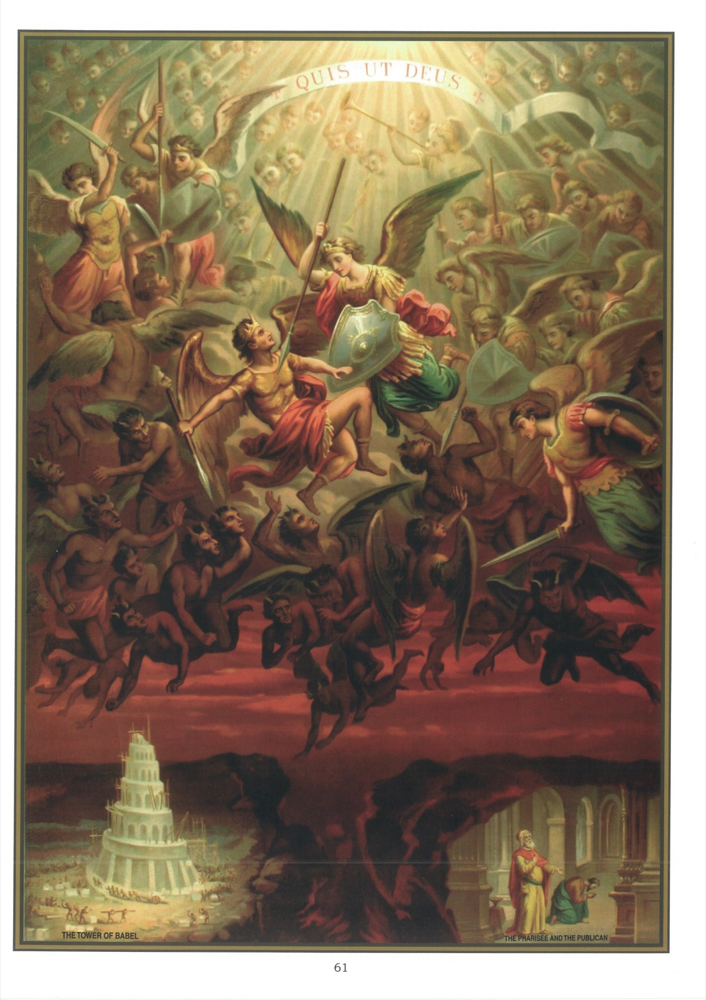

# Quadro 59 — Os Pecados capitais

## OS PECADOS CAPITAIS — A SOBERBA

## O pecado atual

1. O pecado atual é aquele que cometemos por nossa própria vontade.

2. Esse pecado é atual porque, ao cometê-lo, a nossa vontade age por si mesma, pratica um ato que lhe é próprio, diferentemente do pecado original, que contraímos sem agir por nós mesmos.

3. Torna-se alguém culpado de pecado de quatro maneiras: por pensamento, por palavra, por ação e por omissão.

4. Julgar temerariamente é um pecado de pensamento; blasfemar, um pecado de palavra; trabalhar no domingo, um pecado de ação; não comungar na Páscoa, um pecado de omissão.

5. Há duas espécies de pecados atuais: o pecado mortal e o pecado venial.

6. O pecado mortal é aquele que nos faz perder a graça de Deus e que nos torna dignos da danação eterna.

7. Chama-se mortal porque dá a morte à nossa alma, tirando-lhe a vida da graça, e porque merece a morte eterna do inferno.

8. Um pecado é mortal quando se desobedece a Deus em matéria grave e com pleno consentimento.

9. O pecado mortal é apagado: 1º pelo sacramento da Penitência; 2º por um ato de contrição perfeita, unido ao desejo da confissão.

10. O pecado venial é aquele que enfraquece em nós a graça de Deus e que nos torna dignos de penas temporais neste mundo ou no purgatório.

11. Comete-se o pecado venial quando se desobedece a Deus em coisa leve ou, se a coisa é grave, sem inteiro consentimento.

12. Devemos evitar com cuidado o pecado venial: 1º porque ofende a Deus; 2º porque conduz frequentemente ao pecado mortal; 3º porque Deus o pune neste mundo e no outro.

13. Devemos evitar com cuidado o pecado venial pelo sacramento da Penitência, por atos de contrição, pela piedosa assistência à missa, pela esmola e por outras boas obras feitas em estado de graça.

14. Há sete pecados capitais: 1º a soberba; 2º a avareza; 3º a luxúria; 4º a gula; 5º a inveja; 6º a ira; 7º a preguiça.

15. Chamam-se esses pecados de capitais porque são a fonte de muitos outros pecados.

16. Os pecados capitais são mortais ou veniais, conforme se cede a eles em coisa grave ou leve, e com maior ou menor consentimento.

## A Soberba

17. A soberba é uma estima desregrada de si mesmo, que faz com que nos prefiramos aos outros e que queiramos elevar-nos acima deles.

18. Foi o demônio quem cometeu o primeiro pecado de soberba quando se revoltou contra Deus.

19. Os efeitos da soberba são: a ostentação, a presunção, a hipocrisia, a desobediência e o desprezo dos outros: 1º o soberbo procura ostentar as qualidades que crê ter: é a ostentação; 2º crê-se capaz de tudo: é a presunção; 3º quer parecer melhor do que é de fato: é a hipocrisia; 4º desobedece a seus pais e a seus superiores; 5º despreza os seus iguais e os seus inferiores.

## Explicação do quadro

20. Este quadro representa o combate dos bons anjos e dos maus anjos. No centro, vemos são Miguel, chefe dos bons anjos, lutando contra Lúcifer, chefe dos maus anjos. Este havia lançado, com os seus partidários, o grito da revolta: Serei semelhante a Deus. São Miguel e todos os bons anjos após ele responderam: Quem é semelhante a Deus? No mesmo instante, Lúcifer caiu com a rapidez do relâmpago, arrastando consigo, ao fundo dos infernos, todos os que o haviam seguido.

21. Embaixo do quadro, à esquerda, vemos a torre de Babel, que os descendentes de Noé queriam erguer até o céu para tornar célebre o seu nome. Mas Deus, para puni-los de sua louca soberba, confundiu a sua linguagem, e foram obrigados a se dispersar. Em memória desse acontecimento, a torre inacabada foi chamada Babel, isto é, confusão.

22. À direita, vê-se o fariseu e o publicano do Evangelho, que foram ao Templo para orar. O fariseu, em pé, fez uma oração cheia de soberba, na qual ousou preferir-se ao resto dos homens. O publicano, em atitude modesta, orava com um profundo sentimento de humildade e de penitência. Sua oração o justificou diante de Deus, mas a do fariseu só serviu para torná-lo mais culpado: "Porque", acrescenta Nosso Senhor, "todo aquele que se eleva será humilhado, e todo aquele que se humilha será elevado."
