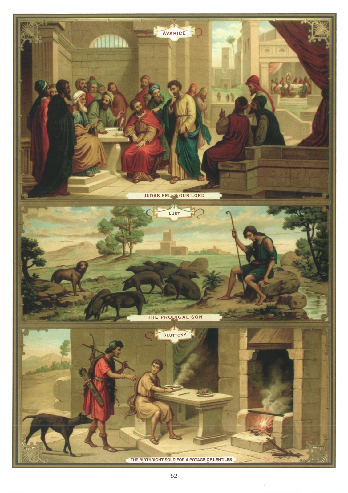

# Quadro 60 — Os Pecados capitais (continuação)

## A AVAREZA — A LUXÚRIA — A GULA

## A Avareza

1. A avareza é um amor desregrado dos bens da terra, e principalmente do dinheiro.

2. Não é absolutamente proibido amar os bens da terra: é apenas proibido amá-los em excesso e por si mesmos; mas pode-se amá-los em vista de Deus, considerando-os como meios de trabalhar pela nossa salvação.

3. Reconhece-se que se ama os bens da terra com excesso quando se está disposto a ofender a Deus para os adquirir, conservar ou aumentar.

4. A avareza é um grande pecado: são Paulo a chama de idolatria e declara que os avarentos não entrarão no reino dos céus.

5. Os pobres podem tornar-se culpados de avareza, pois esse pecado consiste não somente no amor desregrado dos bens que se possui, mas ainda no desejo desregrado dos bens que não se tem.

6. A avareza nos torna duros para com os pobres, indiferentes aos bens do céu, e às vezes nos leva mesmo a nos apoderar dos bens alheios.

7. A virtude oposta à avareza é o desprendimento dos bens da terra.

8. Os principais remédios contra a avareza são: 1º lembrar-se que Nosso Senhor era pobre e não tinha onde reclinar a cabeça; 2º pensar na morte, que em breve nos despojará de todos os nossos bens; 3º fazer esmola aos pobres segundo as nossas posses.

## A Luxúria

9. A luxúria é o vício vergonhoso da impureza, proibido pelo sexto e nono mandamento de Deus.

10. A luxúria nos desgosta dos deveres da religião; ela cega o espírito, endurece o coração, arruína a saúde e as mais belas qualidades da alma, e conduz frequentemente à impenitência final.

11. A virtude oposta à luxúria é a castidade.

## A Gula

12. A gula é um amor desregrado do beber e do comer.

13. O amor do beber e do comer é desregrado quando se come ou se bebe em excesso, ou só pelo prazer de satisfazer a sensualidade.

14. Deve-se ter por fim, ao tomar as refeições, conservar a vida para empregá-la em servir a Deus e em cumprir os seus deveres.

15. A gula é um grande pecado; são Paulo compara aos idólatras aqueles que a ela se entregam, dizendo que fazem um deus de seu ventre.

16. A gula mais perigosa é a embriaguez, que consiste em beber até perder a razão.

17. Os efeitos da gula são: a violação da lei do jejum e da abstinência, o embrutecimento, as palavras indiscretas, as querelas e a impureza.

18. A embriaguez tem ainda por efeito arruinar a saúde, a reputação e a fortuna; muitas vezes também causa uma morte prematura e funesta.

19. A virtude oposta à gula é a temperança.

20. Os remédios contra a gula são: 1º recitar as orações antes e depois das refeições; 2º praticar cada dia algumas mortificações nas refeições; 3º evitar a frequentação das tavernas e das pessoas que poderiam para lá nos arrastar.

## Explicação do quadro

21. A avareza levou Judas a entregar Jesus Cristo aos seus inimigos por trinta moedas de prata. Vemos, no alto do quadro, o apóstolo infiel, esquecido de todas as bondades do Mestre, que se apresenta, com uma bolsa na mão, diante dos príncipes dos sacerdotes e dos escribas, no momento em que estes deliberavam sobre a maneira de prender a Jesus e fazê-lo morrer. Coloca-se diante do presidente da assembleia para tratar com ele do preço da traição de seu mestre.

22. A gula levou Esaú a vender o seu direito de primogenitura a Jacó por um prato de lentilhas. É esse fato que vemos representado embaixo do quadro. Um dia em que Jacó tinha preparado para si um prato de lentilhas, Esaú, chegando todo fatigado da caça, pediu-lho e, para obtê-lo, cedeu-lhe o seu direito de primogenitura, ao qual estava ligada a herança das promessas feitas a Abraão.

23. Vemos, no meio do quadro, o filho pródigo reduzido a guardar porcos, em consequência da terrível miséria a que o conduziu a sua vida de prazeres e devassidões.

24. Um pouco mais acima, à direita, vê-se, ao longe, a povoação de Betânia, e Jesus, à mesa com os seus discípulos, na casa de Simão, o Leproso, bem como o lugar desocupado do avarento Judas.
