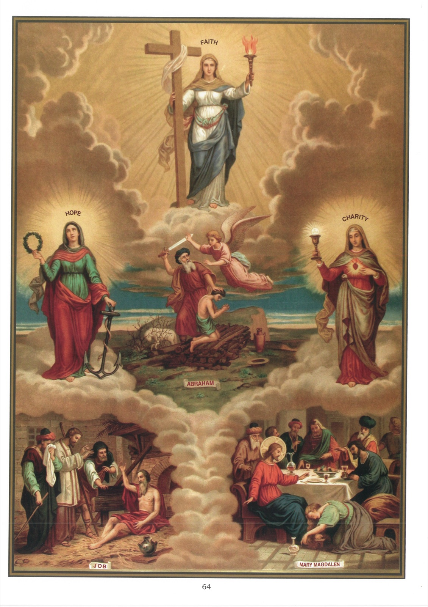

# Quadro 62 — As Virtudes teologais

1. Uma virtude é uma disposição habitual da alma que nos leva a fazer o bem e a evitar o mal.

2. Chamam-se virtudes naturais aquelas que nos levam a fazer o bem por motivos tirados da razão. Por exemplo, fazer esmola a um pobre, porque a razão nos diz que se deve aliviar o semelhante, é praticar uma virtude puramente natural.

3. Chamam-se virtudes sobrenaturais aquelas que não podemos adquirir por nossas próprias forças, e que nos levam a fazer o bem por motivos tirados da Fé, como fazer esmola a um pobre porque a Fé nos faz ver nele a própria pessoa de Jesus Cristo.

4. As virtudes sobrenaturais dividem-se em virtudes teologais e virtudes morais.

5. Há três virtudes teologais: a Fé, a Esperança e a Caridade. Estas três virtudes são chamadas teologais ou divinas porque se referem imediatamente a Deus.

## A Fé

6. A Fé é uma virtude sobrenatural pela qual cremos firmemente todas as verdades que Deus revelou e que ele nos ensina por sua Igreja.

7. É preciso crer em todas as verdades que Deus revelou, porque ele é a própria verdade, e não pode enganar-se nem enganar-nos.

8. A Fé é absolutamente necessária para sermos salvos, pois Jesus Cristo disse que aquele que não crer será condenado.

## A Esperança

9. A Esperança é uma virtude sobrenatural pela qual aguardamos de Deus, com firme confiança, a vida eterna e as graças necessárias para a ela chegar.

## A Caridade

10. A Caridade é uma virtude sobrenatural pela qual amamos a Deus sobre todas as coisas, e ao nosso próximo como a nós mesmos, por amor de Deus.

11. Amar a Deus sobre todas as coisas é amá-lo mais que qualquer criatura, mais que a nós mesmos, e querer antes morrer do que ofendê-lo.

12. Devemos amar a Deus: 1º porque ele é infinitamente bom e infinitamente perfeito; 2º porque ele no-lo ordena; 3º porque nos deu grandes bens; 4º porque ainda nos promete bens maiores; 5º porque, sem o amor de Deus, as outras virtudes e as melhores ações não poderiam salvar-nos.

## Explicação do quadro

13. A Fé é simbolizada, no alto deste quadro, por uma virgem apoiada com a mão direita sobre a Cruz, e segurando com a esquerda um facho aceso. A Cruz significa que o mistério da Redenção é uma das principais verdades que devemos crer; o facho, que a Fé é como uma viva luz que ilumina as nossas almas.

14. Abaixo dessa virgem, vemos Abraão imolando seu filho Isaque. Esse santo patriarca praticou a fé de maneira heroica, crendo que Deus, que lhe ordenara, cumpriria contudo a promessa que lhe havia feito de lhe dar numerosa posteridade.

15. A Esperança é simbolizada, à esquerda deste quadro, por uma virgem segurando com a mão direita uma coroa e, com a esquerda, uma âncora. A coroa representa a glória do céu. A âncora significa a esperança dos bens do céu.

16. Abaixo dessa virgem, vemos Jó sobre o seu monturo, magro e coberto de chagas dos pés à cabeça. No meio de suas maiores aflições, ele demonstrava uma esperança heroica ao dizer: "Ainda que Deus me faça perecer, ainda assim esperarei nele."

17. A Caridade é simbolizada, à direita do quadro, por uma virgem mostrando com a mão esquerda seu coração inflamado, segurando com a mão direita um cálice encimado por uma grande hóstia. O coração inflamado mostra que devemos amar a Deus de todo o nosso coração; o cálice e a hóstia significam que a Eucaristia é o principal foco onde se alimenta o amor de Deus nas almas.

18. Vemos, abaixo da virgem que representa a Caridade, Nosso Senhor à mesa em casa de Simão Fariseu, e Maria Madalena, com um vaso de perfume, regando-lhe os pés com as suas lágrimas e enxugando-os com seus cabelos. Nosso Senhor faz o elogio de sua caridade ao dizer a Simão: "Eu te declaro que muitos pecados lhe são perdoados, porque ela muito amou."
