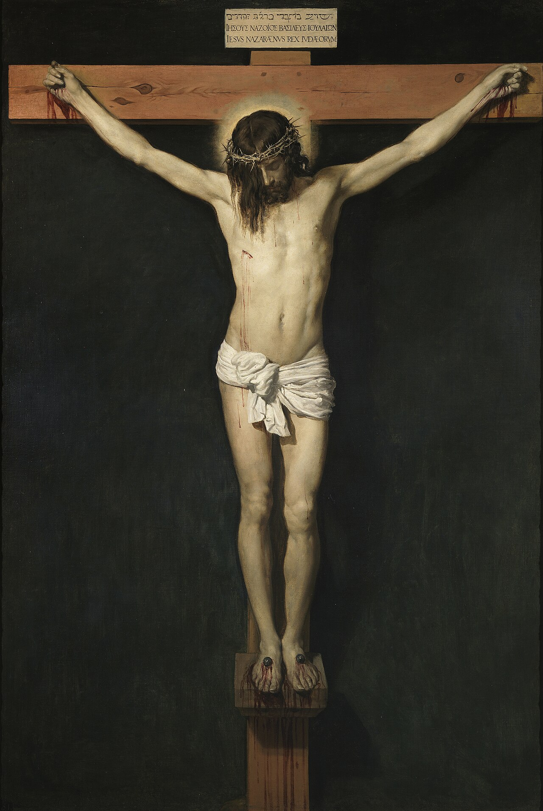

# Session 04 — The Sign of the Cross

*Diego Velázquez, Christ Crucified (c. 1632). Public Domain via Wikimedia Commons.*

> *A bare cross. Wood, nails, no decoration. The first gesture of a Christian life is to trace this on yourself — forehead, breast, shoulders, Amen. Before doctrine, before commandment, before sacrament: this. The whole of what you believe is folded inside it.*

## Pius X asks

**32.** Do we profess and express the two principal mysteries of the Faith also in another way?

*We also profess and express the two principal mysteries of the Faith by the Sign of the Cross, which for this reason is the sign of the Christian.*

**33.** How is the Sign of the Cross made?

*The Sign of the Cross is made by raising the right hand to the forehead, saying: In the name of the Father; then to the breast, saying: and of the Son; then to the left shoulder and to the right, saying: and of the Holy Spirit; and ending with the word Amen.*

**34.** In the Sign of the Cross, how do we express the two principal mysteries of the Faith?

*In the Sign of the Cross, by the words we express the Unity and Trinity of God, and by the figure of the cross we express the Passion and Death of Our Lord Jesus Christ.*

**35.** Is it useful to make the Sign of the Cross?

*It is most useful to make the Sign of the Cross often and devoutly, because it is an outward act of faith that revives this virtue in us, overcomes human respect and temptations, and obtains for us graces from God.*

**36.** When is it good to make the Sign of the Cross?

*It is always good to make the Sign of the Cross, but especially before and after every act of religion, before and after meals and rest, and in dangers of soul and body.*

## A pastoral reading

**The Sign of the Cross is the smallest catechism in Christendom.** Five words and four touches — *In the name of the Father, and of the Son, and of the Holy Spirit. Amen* — and the entire faith is summarized: the Trinity invoked, the Incarnation traced (forehead to breast), the redemption marked (shoulder to shoulder, the spread of the Cross), the *Amen* sealing the whole. The catechism above is asking the modern Catholic to recover what *centuries of Catholic instinct* knew: that this gesture is the **doctrinal grammar** of the Christian.

What does the Sign of the Cross actually do?

  * **It professes the Trinity.** *The single Name* — *in the name of the Father, and of the Son, and of the Holy Spirit*, with *name* in the singular — is the formula by which Christ Himself commanded baptism (Matthew 28:19). To trace the Sign is, in miniature, to renew baptismal faith.

  * **It commemorates the Cross.** The shape itself is the saving instrument. Every traced Cross silently re-presents *the moment by which the world was saved*. Aquinas: *we glory in the Cross of our Lord Jesus Christ* (Galatians 6:14) — and to glory in it gestural is to confess the doctrine in muscle.

  * **It claims us.** Made on the forehead at Baptism, again at Confirmation, made by the priest at the Penitential Rite, made over the bread and wine at consecration, made at the dismissal of every Mass. The Christian is *Cross-marked* — visibly, ritually, throughout the liturgical year.

  * **It is also a *sacramental* — a small channel of grace.** Not a sacrament proper (which Christ instituted), but a sign which the Church has long blessed and through which grace can flow when it is made with faith. The classical practice: *make the Sign before any important act* — before meals, before sleep, before a difficult conversation, before crossing a threshold of any consequence. Each is a small *renewal* of the soul's openness to God.

What this asks of you:

  * **Make the Sign of the Cross slowly today.** Not as a ritual reflex but as the entire Creed in compressed form. *Father* — touch the forehead, name where you have come from. *Son* — touch the breast, name what holds you up. *Holy Spirit* — touch shoulder to shoulder, name what carries you outward into the world. *Amen* — seal the whole.

  * **Recover the use of holy water.** A small font at the door of the church, or even at the door of the home, lets the Christian *re-baptize the day* on entering and leaving. The traditional Catholic practice is intentionally bodily; the body learns the doctrine the mind sometimes forgets.

  * **Sign yourself in public when appropriate.** Before a meal in a restaurant; passing a Catholic church; at a public moment of grief or joy. *The Cross is not a private gesture.* The Sign before Christians who have stopped praying may be the only catechesis they receive in a year.

*Before doctrine, before commandment, before sacrament: this.* The whole of what you believe is folded inside it. **Today, unfold it once.**

> **Scripture.** *But God forbid that I should glory, save in the cross of our Lord Jesus Christ.* — Galatians 6:14

> *Lord, when I sign myself today, let it not be an absent gesture. Let it be a small profession — true, awake, mine.*
