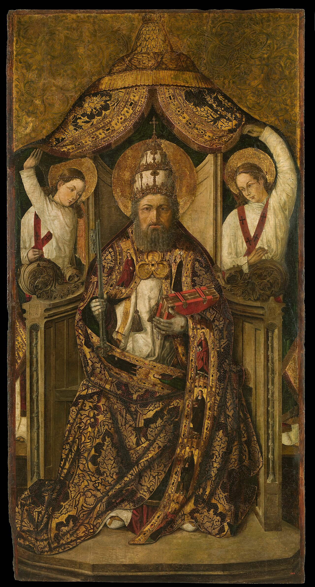

# Session 26 — The Pope, the Bishops, and Infallibility

*Roderic d'Osona, Saint Peter Enthroned (c. 1490). Public Domain via Wikimedia Commons.*

> *An old chair holds a man dressed in white. He is not the source of the gospel; he is its custodian. The Pope and the bishops in communion with him preserve, transmit, decide, against all the times that try to overrun them. Christ promised it would hold.*

## Pius X asks

**112.** Who are the legitimate Pastors of the Church?

*The legitimate Pastors of the Church are the Pope, or Supreme Pontiff, and the Bishops united with him.*

**113.** Who is the Pope?

*The Pope is the successor of Saint Peter in the See of Rome and in the primacy, that is, in the universal apostolate and episcopate; and therefore the visible head, Vicar of Jesus Christ the invisible head, of the whole Church, which for this reason is called Roman Catholic.*

**114.** What do the Pope and the Bishops united with him constitute?

*The Pope and the Bishops united with him constitute the teaching Church, so called because she has from Jesus Christ the mission to teach the divine truths and laws to all human beings, who from her alone receive the full and certain knowledge of them that is necessary to live as Christians.*

**115.** Can the teaching Church err in teaching us the truths revealed by God?

*The teaching Church cannot err in teaching us the truths revealed by God: she is infallible, because, as Jesus Christ promised, "the Spirit of truth" (John XV. 26) assists her continually.*

**116.** Can the Pope, by himself, err in teaching us the truths revealed by God?

*The Pope, by himself, cannot err in teaching us the truths revealed by God; that is, he is infallible like the Church when, as Pastor and Teacher of all Christians, he defines doctrines concerning faith and morals.*

**117.** Can any Church outside the Roman Catholic Church be the Church of Jesus Christ, or at least a part of it?

*No Church outside the Roman Catholic Church can be the Church of Jesus Christ, or a part of it, because no other Church can possess together with her those singular distinctive marks — one, holy, catholic, and apostolic — as in fact none of the other Churches calling themselves Christian possesses them.*

## A pastoral reading

**The papacy is one of the most misunderstood institutions in Christendom**, both inside and outside the Catholic Church. The catechism above asks the reader to recover what the Church actually claims, *exactly*, no more and no less.

What the Catholic Church claims about the Pope:

  * **The Pope is the *successor of Peter*.** Christ said to Peter alone (not to Peter-and-the-other-Apostles): *Thou art Peter, and upon this rock I will build My Church... I will give to thee the keys of the kingdom of heaven* (Matthew 16:18-19). Peter, by tradition unbroken from the first century, became Bishop of Rome and was martyred there. Every Bishop of Rome since Peter is, by the Church's understanding, *Peter's successor*, holding the same primacy of jurisdiction Christ gave Peter.

  * **The Pope is *infallible*** — but only in carefully defined conditions. The First Vatican Council (1870) gave the precise formula: *when, in his role as supreme shepherd and teacher of all Christians, he proclaims, by a definitive act, a doctrine concerning faith or morals to be held by the universal Church*. This is the *extraordinary magisterium*, used rarely. Two prominent examples: the Immaculate Conception (Pius IX, 1854 — defined sixteen years before Vatican I formally articulated the doctrine, but universally recognized as an exercise of the same authority) and the Assumption (Pius XII, 1950). The Pope is *not* infallible in his political opinions, his off-the-cuff homilies, his prudential judgments about Church discipline, his tweets, or his books-as-private-theologian. The doctrine is narrower than its caricatures.

  * **The Pope, with the bishops in communion with him, exercises the *ordinary magisterium*** — the day-to-day teaching authority of the Church. This is not infallible in each instance but is to be received with religious assent. The catechism, the universal liturgy, the constant teaching of the Church — these reach the faithful through this magisterium.

What the doctrine *does not* claim:

  * The Pope is not impeccable. He can sin; some have. The papacy has weathered Popes who were saints (most), Popes who were administrators, and a small number of Popes who were embarrassments. *The doctrine of papal infallibility was given precisely because the Church needed protection from the second and third kinds.* The Holy Spirit ensures the Pope cannot teach heresy *bindingly* even when his personal life or judgment fails.

  * The Pope is not the source of the Gospel. He is its *custodian*. *He is not the source of the gospel; he is its custodian* — today's ekphrasis is exact. His authority is *to preserve, transmit, and decide*, not to invent.

What this asks of you:

  * **Pray for the Pope, by name, daily.** *That* the Holy Spirit guard him from error, that he be granted long life, that he be a good shepherd. The petition *for our Pope* is not optional; the early Church included it in every liturgy.

  * **Distinguish the levels.** When you read what the Pope says, ask: is this a definitive teaching? An ordinary catechetical reminder? A prudential judgment? An off-the-cuff opinion? Each warrants a different kind of assent. Mature Catholic discernment is not blind submission, and not blind dismissal. *Faithful intelligence* is the third path.

  * **Trust the institution Christ founded.** *Christ promised it would hold.* Twenty centuries of evidence support the promise.

> **Scripture.** *But I have prayed for thee, that thy faith fail not: and thou, being once converted, confirm thy brethren.* — Luke 22:32

> *Lord, You promised faith would not fail in Peter. Confirm me through him today, against my own private opinion.*
