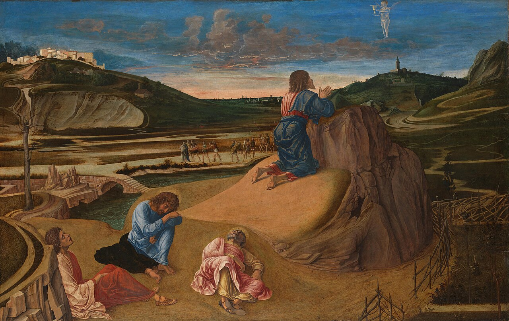

# Session 46 — Fifth Commandment — Suicide and Dueling

*Giovanni Bellini, The Agony in the Garden (c. 1465). Public Domain via Wikimedia Commons.*

> *Christ in Gethsemane — alone, awake, surrounded by the worst hours of His life — and He does not turn the cup over. He drinks. Suicide and despair are not options for one who has watched Him drink it.*

## Pius X asks

**195.** Has the Church established penalties against suicide?

*The Church has established the deprivation of ecclesiastical burial against the suicide who is responsible for the act committed.*

**196.** Why is dueling a sin?

*Dueling is a sin because it is always an attempt at murder, and even — almost — at suicide, made out of private vengeance, in contempt of the law and of public justice; moreover, because by it the decision of right and wrong is foolishly committed to force, to skill, and to chance.*

**197.** Has the Church established penalties against duelists?

*The Church has established excommunication against duelists and against anyone who voluntarily attends a duel.*

## A pastoral reading

The Church speaks of suicide with a tenderness most outsiders never hear. The catechism mentions a *penalty* — historically, the deprivation of ecclesiastical burial — but it conditions it carefully on responsibility for the act. **The Church has always known that depression, addiction, despair, and madness can take a soul out of its own hands.** She does not place herself in God's seat at that final moment. Pastoral practice, especially in our own century, has come to grant Christian burial in nearly every case, trusting in God's mercy on a person who, in the last extremity, was no longer truly free.

Yet the doctrine still names a real evil. Suicide refuses the gift of one's own life and rejects the duty to wait on God's deliverance. St. Thomas adds two reasons that may help a friend understand: it is an injustice to the community that lost a member, and it is a usurpation of the right of God alone over life and death. *I am not my own*, the Apostle says — and the Christian who knows this can speak it back to despair when it whispers that there is no way through. There is. He has walked it Himself.

If suicide is the temptation of total despair, **dueling** is the temptation of fragile pride — the willingness to kill, or to be killed, over a perceived slight. The catechism's prohibition is severe (*excommunication, even on those who voluntarily attend*) precisely because pride disguised as honor cannot be allowed to play with human life. The duels of our own time look different — public destruction of a person's reputation, retaliation that escalates a feud, the slow violence of contempt. The same temptation, the same root.

The Christian remedy for both is what we see in tonight's image. Christ in Gethsemane does not turn the cup over. He drinks. *Father, if it is possible, let this cup pass from me — yet not as I will, but as Thou wilt.* For one who has watched Him drink it, despair and revenge are not options. There is another way through. Sit awake with Him tonight, even if only briefly. He has been awake for you.

If you, or someone you love, is in that darkness now: *call*. Speak the words. The seal of confession, the help of a friend, the help of the suicide-prevention hotline in your country — these are real doors. He prepared them for you in advance.

> **Scripture.** *Revenge not yourselves, my dearly beloved; but give place unto wrath, for it is written: Revenge is mine, I will repay, saith the Lord.* — Romans 12:19

> *Lord, when I am tempted to despair, sit with me as You sat in the garden. Do not let me be alone there.*
