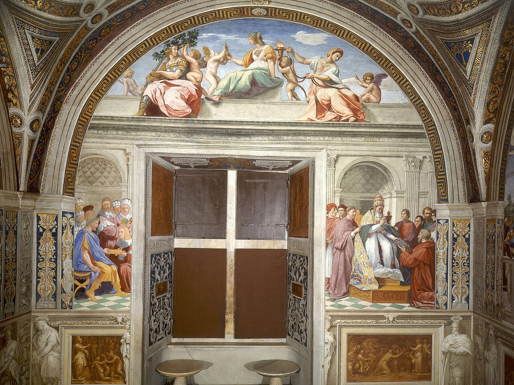

# Session 55 — What Virtue Is — and the Virtues of God

*Raphael, Theological Virtues (Stanza della Segnatura) (1511). Public Domain via Wikimedia Commons.*

> *Three figures with crosses and chalices and flames — Faith, Hope, Charity. They are not your achievements; they are infused. Grace plants them in you at baptism. The work is to let them grow without strangling them.*

## Pius X asks

**227.** What is virtue?

*Virtue is a constant disposition of the soul to do good.*

**228.** How many kinds of virtue are there?

*There are two kinds of virtue: the natural virtues, which we acquire by repeating good acts, such as those called moral; and the supernatural virtues, which we cannot acquire and cannot even exercise by our own forces alone, but which are given to us by God, and which are the virtues proper to the Christian.*

**229.** What are the virtues proper to the Christian?

*The virtues proper to the Christian are the supernatural virtues, and especially faith, hope, and charity, which are called theological or divine, because they have God Himself as their object and motive.*

**230.** How do we receive and exercise the supernatural virtues?

*We receive the supernatural virtues together with sanctifying grace, by means of the sacraments or by the love of charity, and we exercise them with the actual graces of good thoughts and inspirations by which God moves and helps us in every good act.*

**231.** Among the supernatural virtues, which is the most excellent?

*Among the supernatural virtues, the most excellent is charity, because it is inseparable from sanctifying grace, unites us intimately to God and to our neighbor, moves us to the perfect observance of the Law and to every good work, and will never cease: in it lies Christian perfection.*

## Faith

**232.** What is faith?

*Faith is that supernatural virtue by which we believe, on the authority of God, what He has revealed and proposes to us to be believed through the Church.*

**233.** Where is preserved that which God has revealed and proposes to us to be believed through the Church?

*That which God has revealed and proposes to us to be believed through the Church is preserved in Sacred Scripture and in Tradition.*

**234.** What is Sacred Scripture?

*Sacred Scripture is the collection of the books written by inspiration of God in the Old and the New Testament, and received by the Church as the work of God Himself.*

**235.** What is Tradition?

*Tradition is the teaching of Jesus Christ and of the Apostles, given by living voice, and transmitted by the Church to us without alteration.*

**236.** Who can with authority make known to us, fully and in their true sense, the truths contained in Scripture and in Tradition?

*The Church alone can with authority make known to us, fully and in their true sense, the truths contained in Scripture and in Tradition; for to her alone God entrusted the deposit of Faith, and sent the Holy Spirit, who continually assists her, so that she may not err.*

**237.** Is it enough to believe in general the truths revealed by God?

*It is not enough to believe in general the truths revealed by God; some — namely, the existence of God the Rewarder and the two principal mysteries — must also be believed by an explicit act of faith.*

*237 a. The two principal mysteries of the Faith are: 1. The Unity and Trinity of God; 2. The Incarnation, Passion, Death, and Resurrection of Our Lord Jesus Christ.*

## A pastoral reading

A virtue is not a feeling. It is a *habit* — a steady disposition of the soul that bends the will toward the good without strain. Wood becomes a violin not because someone forces it once, but because the form has been worked into it. So with us. The catechism calls virtue "a constant disposition of the soul to do good"; St. Thomas explains that it is a *habitus* through which we act well almost as a second nature.

There are virtues we can acquire by repetition — courage in the body, patience with the people who live with us, honesty when no one is checking. These are real and necessary; the moral life depends on them. But there are virtues that no human effort can produce, because their direct object is God Himself: **faith**, by which we believe what He has revealed; **hope**, by which we trust His promise of eternal life; **charity**, by which we love Him for His own sake and our neighbor for love of Him. These are the *theological virtues* — gifts infused with sanctifying grace, the divine life flowing through the natural channels we already are.

This is why faith is named first. Without it, the soul has no door open to God; the supernatural life cannot begin. St. Thomas writes:

> *The first thing that is necessary for every Christian is faith, without which no one is truly called a faithful Christian.*

Faith unites the soul to God as in a marriage. It begins eternal life *now*, because eternal life is to know God, and faith is the beginning of that knowing. It teaches us how to live when reason cannot reach far enough on its own. And it overcomes temptation, because what we believe about God quietly reorders what we want.

Pius X teaches that this faith is preserved in Sacred Scripture and Tradition, and known with authority through the Church. That is good news, not a leash. You do not have to invent the faith you live by. It has been handed to you, intact, by hands older than your own. Today, receive it. Tomorrow we will turn to its sister virtues — hope and charity.

> **Scripture.** *And now there remain faith, hope, and charity, these three: but the greatest of these is charity.* — 1 Corinthians 13:13

> *Lord, plant in me — or water in me — what You have already given. Today, let charity be the bigger part.*
