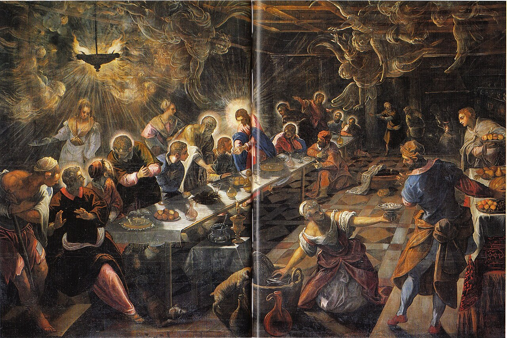

# Session 66 — What the Eucharist Is — and Its Institution

*Tintoretto, The Last Supper (1592-1594). Public Domain via Wikimedia Commons.*

> *Tintoretto's Last Supper: the table tilts, the lamps blaze, the apostles lean in. "This is My Body." The Mass began here, before the Cross, in His own hands. Every Mass since reaches back into that room.*

## Pius X asks

**316.** What is the Eucharist?

*The Eucharist is the sacrament that, under the appearances of bread and wine, really contains the Body, Blood, Soul, and Divinity of Our Lord Jesus Christ for the nourishment of souls.*

**317.** What is the matter of the Eucharist?

*The matter of the Eucharist is wheat bread and wine of the grape.*

**318.** What is the form of the Eucharist?

*The form of the Eucharist is the words of Jesus Christ: "This is my Body; this is the chalice of my Blood ... shed for you and for many unto the remission of sins."*

**319.** Who is the minister of the Eucharist?

*The minister of the Eucharist is the priest, who, by pronouncing in the Mass the words of Jesus Christ, changes the bread into His Body and the wine into His Blood.*

**320.** When did Jesus Christ institute the Eucharist?

*Jesus Christ instituted the Eucharist at the Last Supper, before His Passion, when He consecrated bread and wine and distributed them to the Apostles as His Body and Blood, commanding that they should afterward do the same in His memory.*

**321.** Why did Jesus Christ institute the Eucharist?

*Jesus Christ instituted the Eucharist so that it might be in the Mass the permanent sacrifice of the New Testament, and in Communion the food of souls, in perpetual remembrance of His love and of His Passion and Death.*

## The Roman Catechism teaches

## Institution of the Eucharist

In this matter it will be necessary that pastors, following
the example of the Apostle Paul, who professes to have delivered
to the Corinthians what he had received from the Lord, first of
all explain to the faithful the institution of this Sacrament.

That its institution was as follows, is clearly inferred from
the Evangelist. Our Lord, having loved his own, loved them to the
end. As a divine and admirable pledge of this love, knowing that
the hour had now come that He should pass from the world to the
Father, that Hemight not ever at any period be absent from His
own, He accomplished with inexplicable wisdom that which
surpasses all the order and condition of nature. For having kept
the supper of the Paschal lamb with His disciples, that the
figure might yield to the reality, the shadow to the substance,
He took bread, and giving thanks unto God, He blessed, and brake,
and gave to the disciples, and said: "Take ye and eat, this
is my body which shall be delivered for you; this do for a
commemoration of me." In like manner also, He took the
chalice after he had supped, saying: "This chalice is the
new testament in my blood; this do, as often as you shall drink
it, in commemoration of me".

## Meaning of the Word "Eucharist"

Wherefore sacred writers, seeing that it was not at all
possible that they should manifest by one term the dignity and
excellence of this admirable Sacrament, endeavoured to express it
by many words.

For sometimes they call it Eucharist, which word we may
render either by good grace, or by thanksgiving. And rightly,
indeed, is it to be called good grace, as well because it first
signifies eternal life, concerning which it has been written: The
grace of God is eternal life; and also because it contains Christ
the Lord, who is true grace and the fountain of all favours.

No less aptly do we interpret it thanksgiving; inasmuch as
when we immolate this purest victim, we give daily unbounded
thanks to God for all His kindnesses towards us, and above all
for so excellent a gift of His grace, which He grants to us in
this Sacrament. This same name, also, is fully in keeping with
those things which we read were done by Christ the Lord at the
institution of this mystery. For taking bread he brake it, and
gave thanks. David also, when contemplating the greatness of this
mystery, before he pronounced that song: He hath made a
remembrance of his wonderful works, being a merciful and gracious
Lord, he hath given food to them that fear him, thought that he
should first make this act of thanksgiving: His work is praise
and magnificence.

## Other Names Of This Sacrament

Frequently, also, it is called Sacrifice. Concerning this
mystery there will be occasion to speak more at length presently.

It is called, moreover, communion, the term being evidently
borrowed from that passage of the Apostle where we read: The
chalice of benediction which we bless, is it not the communion of
the blood of Christ? And the bread which we break, is it not the
partaking of the body of the Lord? For, as Damascene has
explained, this Sacrament unites us to Christ, renders us
partakers of His flesh and Divinity, reconciles and unites us to
one another in the same Christ, and forms us, as it were, into
one body.

Whence it came to pass, that i. was called also the Sacrament
of peace and love. We can understand then how unworthy they are
of the name of Christian who cherish enmities, and how hatred,
dissensions and discord should be entirely put away, as the most
destructive bane of the faithful, especially since by the daily
Sacrifice of our religion, we profess to preserve nothing with
more anxious care, than peace and love.

It is also frequently called the Viaticum by sacred writers,
both because it is spiritual food by which we are sustained in
our pilgrimage through this life, and also because it paves our
way to eternal glory and happiness. Wherefore, according to an
ancient usage of the Catholic Church, we see that none of the
faithful are permitted to die without this Sacrament.

The most ancient Fathers, following the authority of the
Apostle, have sometimes also called the Holy Eucharist by the
name of Supper, because it was instituted by Christ the Lord at
the salutary mystery of the Last Supper.

It is not, however, lawful to consecrate or partake of the
Eucharist after eating or drinking, because, according to a
custom wisely introduced by the Apostles, as ancient writers have
recorded, and which has ever been retained and preserved,
Communion is received only by persons who are fasting.

## Constituent Parts of the Eucharist

### The Matter

It is particularly incumbent on pastors to know the matter of
this Sacrament, in order that they themselves may rightly
consecrate it, and also that they may be able to instruct the
faithful as to its significance, inflaming them with an earnest
desire of that which it signifies.

#### The First Element Of The Eucharist Is Bread

The matter of this Sacrament is twofold. The first element is
wheaten bread, of which we shall now speak. Of the second we
shall treat hereafter. As the Evangelists, Matthew, Mark and Luke
testify, Christ the Lord took bread into His hands, blessed, and
brake, saying: This is my body; and, according to John, the same
Saviour called Himself bread in these words: I am the living
bread, that came down from heaven.

#### The Sacramental Bread Must Be Wheaten

There are, however, various sorts of bread, either because
they consist of different materials,  such as wheat, barley,
pulse and other products of the earth; or because they possess
different qualities,  some being leavened, others altogether
without leaven. It is to be observed that, with regard to the
former kinds, the words of the Saviour show that the bread should
be wheaten; for, according to common usage, when we simply say
bread, we are sufficiently understood to mean wheaten bread. This
is also declared by a figure in the Old Testament, because the
Lord commanded that the loaves of proposition, which signified
this Sacrament, should be made of fine flour.

#### The Sacramental Bread Should Be Unleavened

But as wheaten bread alone is to be considered the proper
matter for this Sacrament — a doctrine which has been handed
down by Apostolic tradition and confirmed by the authority of the
Catholic Church — so it may be easily inferred from the doings
of Christ the Lord that this bread should be unleavened. It was
consecrated and instituted by Him on the first day of unleavened
bread, on which it was not lawful for the Jews to have anything
leavened in their house.

Should the authority of John the Evangelist, who says that
all this was done before the feast of the Passover, be objected
to, the argument is one of easy solution. For by the day before
the pasch John understands the same day which the other
Evangelists designate as the first day of unleavened bread. He
wished particularly to mark the natural day, which commences at
sunrise; whereas they wanted to point out that our Lord
celebrated the Pasch on Thursday evening just when the days of
the unleavened bread were beginning. Hence St. Chrysostom also
understands the first day of unleavened bread to be the day on
the evening of which unleavened bread was to be eaten.

The peculiar suitableness of the consecration of unleavened
bread to express that integrity and purity of mind which the
faithful should bring to this Sacrament we learn from these words
of the Apostle: Purge out the old leaven, that you may be a new
paste, as you are unleavened. For Christ our Passover is
sacrificed. Therefore, let us feast, not with the old leaven, nor
with the leaven of malice and wickedness, but with the unleavened
bread of sincerity and truth.

#### Unleavened Bread Not Essential

This quality of the bread, however, is not to be deemed so
essential that, if it be wanting, the Sacrament cannot exist; for
both kinds are called by the one name and have the true and
proper nature of bread. No one, however, is at liberty on his own
private authority, or rather presumption, to transgress the
laudable rite of his Church. And such departure is the less
warrantable in priests of the Latin Church, expressly obliged as
they are by the supreme Pontiffs, to consecrate the sacred
mysteries with unleavened bread only.

#### Quantity Of The Bread

With regard to the first matter of this Sacrament, let this
exposition suffice. It is, however, to be observed, that the
quantity of the matter to be consecrated is not defined, since we
cannot define the exact number of those who can or ought to
receive the sacred mysteries.'

#### The Second Element Of The Eucharist Is Wine

It remains for us to treat of the other matter and element of
this Sacrament, which is wine pressed from the fruit of the vine,
with which is mingled a little water.

That in the institution of this Sacrament our Lord and
Saviour made use of wine has beep at all times the doctrine of
the Catholic Church, for He Himself said: I will not drink from
henceforth of this fruit of the vine until that day. On this
passage Chrysostom observes: He says, "Of the fruit of the
vine," which certainly produced wine not water; as if he had
it in view, even at so early a period, to uproot the heresy which
asserted that in these mysteries water alone is to be used.

#### Water Should Be Mixed With The Wine

With the wine, however, the Church of God has always mingled
water. First, because Christ the Lord did so, as is proved by the
authority of Councils and the testimony of St. Cyprian; next,
because by this mixture is renewed the recollection of the blood
and water that issued from His side. Waters, also, as we read in
the Apocalypse, signify the people; and hence, water mixed with
the wine signifies the union of the faithful with Christ their
Head. This rite, derived as it is from Apostolic tradition, the
Catholic Church has always observed.

But although there are reasons so grave for mingling water
with the wine that it cannot be omitted without incurring the
guilt of mortal sin, yet its omission does not render the
Sacrament null.

Again as in the sacred mysteries priests must be mindful to
mingle water with wine, so, also, must they take care to mingle
it in small quantity, for, in the opinion and judgment of
ecclesiastical writers, that water is changed into wine. Hence
these words of Pope Honorius on the subject: A pernicious abuse
has prevailed in your district of using in the sacrifice a
greater quantity of water than of wine; whereas, according to the
rational practice of the universal Church, the wine should be
used in much greater quantity than the water.

#### No Other Elements Pertain To This Sacrament

These, then, are the only two elements of this Sacrament; and
with reason has it been enacted by many decrees that, although
there have been those who were not afraid to do so, it is
unlawful to offer anything but bread and wine.

#### Peculiar Fitness Of Bread And Wine

We have now to consider the aptitude of these two symbols of
bread and wine to represent those things of which we believe and
confess they are the sensible signs.

In the first place, then, they signify to us Christ, as the
true life of men; for our Lord Himself says: My flesh is meat
indeed, and my blood is drink indeed. As, then, the body of
Christ the Lord furnishes nourishment unto eternal life to those
who receive this Sacrament with purity and holiness, rightly is
the matter composed chiefly of those elements by which our
present life is sustained, in order that the faithful may easily
understand that the mind and soul are satiated by the Communion
of the precious body and blood of Christ.

These very elements serve also somewhat to suggest to men the
truth of the Real Presence of the body and blood of the Lord in
the Sacrament. Observing, as we do, that bread and wine are every
day changed by the power of nature into human flesh and blood, we
are led the more easily by this analogy to believe that the
substance of the bread and wine is changed, by the heavenly
benediction, into the real flesh and real blood of Christ.

This admirable change of the elements also helps to shadow
forth what takes place in the soul. Although no change of the
bread and wine appears externally, yet their substance is truly
changed into the flesh and blood of Christ; so, in like manner,
although in us nothing appears changed, yet we are renewed
inwardly unto life, when we receive in the Sacrament of the
Eucharist the true life.

Moreover, the body of the Church, which is one, consists of
many members, and of this union nothing is more strikingly
illustrative than the elements of bread and wine; for bread is
made from many grains and wine is pressed from many clusters of
grapes. Thus they signify that we, though many, are most closely
bound together by the bond of this divine mystery and made, as it
were, one body.

### Form Of The Eucharist

The form to be used in the consecration of the bread is next
to be treated of, not, however, in order that the faithful should
be taught these mysteries, unless necessity require it; for this
knowledge is not needful for those who have not received Holy
Orders. The purpose (of this section) is to guard against most
shameful mistakes on the part of priests, at the time of the
consecration, due to ignorance of the form.

#### Form To Be Used In The Consecration Of The Bread

We are then taught by the holy Evangelists, Matthew and Luke,
and also by the Apostle, that the form consists of these words:
This is my body; for it is written: Whilst they were at supper,
Jesus took bread, and blessed it, and brake, and gave to his
disciples, and said: Take and eat, This is my body.

This form of consecration having been observed by Christ the
Lord has been always used by the Catholic Church. The testimonies
of the Fathers, the enumeration of which would be endless, and
also the decree of the Council of Florence, which is well known
and accessible to all, must here be omitted, especially as the
knowledge which they convey may be obtained from these words of
the Saviour: Do this for a commemoration of me. For what the Lord
enjoined was not only what He had done, but also what he had
said; and especially is this true, since the words were uttered
not only to signify, but also to accomplish.

That these words constitute the form is easily proved from
reason also. The form is that which signifies what is
accomplished in this Sacrament; but as the preceding words
signify and declare what takes place in the Eucharist, that is,
the conversion of the bread into the true body of our Lord, it
therefore follows that these very words constitute the form. In
this sense may be understood the words of the Evangelist: He
blessed; for they seem equivalent to this: Taking bread, he
blessed it, saying: "This is my body".

#### Not All The Words Used Are Essential

Although in the Evangelist the words, Take and eat, precede
the words (This is my body), they evidently express the use only,
not the consecration, of the matter. Wherefore, while they are
not necessary to the consecration of the Sacrament, they are by
all means to be pronounced by the priest, as is also the
conjunction for in the consecration of the body and blood. But
they are not necessary to the validity of the Sacrament,
otherwise it would follow that, if this Sacrament were not to be
administered to anyone, it should not, or indeed could not, be
consecrated; whereas, no one can lawfully doubt that the priest,
by pronouncing the words of our Lord according to the institution
and practice of the Church, truly consecrates the proper matter
of the bread, even though it should afterwards never be
administered.

#### Form To Be Used In The Consecration Of The Wine

With regard to the consecration of the wine, which is the
other element of this Sacrament, the priest, for the reason we
have already assigned, ought of necessity to be well acquainted
with, and well understand its form. We are then firmly to believe
that it consists in the following words: This is the chalice of
my blood, of the new and eternal testament, the mystery of faith,
which shall be shed for you and for many, to the remission of
sins. Of these words the greater part are taken from Scripture;
but some have been preserved in the Church from Apostolic
tradition.

Thus the words, this is the chalice, are found in St. Luke
and in the Apostle; but the words that immediately follow, of my
blood, or my blood of the new testament, which shall be shed for
you and for many to the remission of sins, are found partly in
St. Luke and partly in St. Matthew. But the words, eternal, and
the mystery of faith, have been taught us by holy tradition, the
interpreter and keeper of Catholic truth.

Concerning this form no one can doubt, if he here also attend
to what has been already said about the form used in the
consecration of the bread. The form to be used (in the
consecration) of this element, evidently consists of those words
which signify that the substance of the wine is changed into the
blood of our Lord. since, therefore, the words already cited
clearly declare this, it is plain that no other words constitute
the form.

They moreover express certain admirable fruits of the blood
shed in the Passion of our Lord, fruits which pertain in a most
special manner to this Sacrament. Of these, one is access to the
eternal inheritance, which has come to us by right of the new and
everlasting testament. Another is access to righteousness by the
mystery of faith; for God hath set forth Jesus to be a
propitiator through faith in his blood, that he himself may be
just, and the justifier of him, who is of the faith of Jesus.
Christ. A third effect is the remission of sins.

#### Explanation Of The Form Used In The Consecration Of The Wine

Since these very words of consecration are replete with
mysteries and most appropriately suitable to the subject, they
demand a more minute consideration.

The words: This is the chalice of my blood, are to be
understood to mean: This is my blood, which is contained in this
chalice. The mention of the chalice made at the consecration of
the blood is right and appropriate, inasmuch as the blood is the
drink of the faithful, and this would not be sufficiently
signified if it were not contained in some drinking vessel.

Next follow the words: Of the new testament. These have been
added that we might understand the blood of Christ the Lord to be
given not under a figure, as was done in the Old Law, of which we
read in the Epistle to the Hebrews that without blood a testament
is not dedicated; but to be given to men in truth and in reality,
as becomes the New Testament. Hence the Apostle says: Christ
therefore is the mediator of the new testament, that by means of
his death, they who are called may receive the promise of eternal
inheritance.

The word eternal refers to the eternal inheritance, the right
to which we acquire by the death of Christ the Lord, the eternal
testator.

The words mystery of faith, which are subjoined, do not
exclude the reality, but signify that what lies hidden and
concealed and far removed from the perception of the eye, is to
be believed with firm faith. In this passage, however, these
words bear a meaning different from that which they have when
applied also to Baptism. Here the mystery of faith consists in
seeing by faith the blood of Christ veiled under the species of
wine; but Baptism is justly called by us the Sacrament of faith,
by the Greeks, the mystery of faith, because it embraces the
entire profession of the Christian faith.

Another reason why we call the blood of the Lord the mystery
of faith is that human reason is particularly beset with
difficulty and embarrassment when faith proposes to our belief
that Christ the Lord, the true Son of God, at once God and man,
suffered death for us, and this death is designated by the
Sacrament of His blood.

Here, therefore, rather than at the consecration of His body,
is appropriately commemorated the Passion of our Lord, by the
words. which shall be shed for the remission of sins. For the
blood, separately consecrated, serves to place before the eyes of
all, in a more forcible manner, the Passion of our Lord, His
death, and the nature of His sufferings.

The additional words for you and for many, are taken, some
from Matthew, some from Luke, but were joined together by the
Catholic Church under the guidance of the Spirit of God. They
serve to declare the fruit and advantage of His Passion. For if
we look to its value, we must confess that the Redeemer shed His
blood for the salvation of all; but if we look to the fruit which
mankind have received from it, we shall easily find that it
pertains not unto all, but to many of the human race. When
therefore ('our Lord) said: For you, He meant either those who
were present, or those chosen from among the Jewish people, such
as were, with the exception of Judas, the disciples with whom He
was speaking. When He added, And for many, He wished to be
understood to mean the remainder of the elect from among the Jews
or Gentiles.

With reason, therefore, were the words for all not used, as
in this place the fruits of the Passion are alone spoken of, and
to the elect only did His Passion bring the fruit of salvation.
And this is the purport of the Apostle when he says: Christ was
offered once to exhaust the sins of many; and also of the words
of our Lord in John: I pray for them; I pray not for the world,
but for them whom thou hast given me, because they are thine.

Beneath the words of this consecration lie hid many other
mysteries, which by frequent meditation and study of sacred
things, pastors will find it easy, with the divine assistance, to
discover for themselves.

## A pastoral reading

Tintoretto's lamps blaze for a reason. The Eucharist is the one place in the Christian life where a doctrine and a meal are the same thing. Whatever you believe about the Real Presence, today's catechism is unambiguous: under the appearances of bread and wine, the Body, Blood, Soul, and Divinity of Jesus Christ are *really* there. Not symbolically. Not in our imagination. Really.

St. Thomas, the most careful theologian in Christian history, also wrote some of the Church's greatest Eucharistic hymns. He had to. The Real Presence cannot be held in syllogisms alone — it has to be *adored*. He gave us the *Pange Lingua* and the *Adoro Te Devote*. The latter begins:

> *Adoro Te devote, latens Deitas, / quae sub his figuris vere latitas* — *I devoutly adore Thee, hidden Deity, who truly liest hidden under these figures.*

He chose the word *latens* — *hidden* — deliberately. The doctrine is *Christ is here.* The mystery is *He is here in this way.* The senses report bread; faith reports God. Aquinas insists that what fails in the Eucharist is not the Real Presence but human seeing.

The Second Vatican Council called the Eucharist the *fons et culmen* — the source and summit — of the Christian life. Aquinas himself called it the *consummatio* of all the sacraments, the one to which all the others are ordered. Source: every grace flows from it. Summit: every prayer ascends to it.

The next time you go up for Communion, slow down. The species you receive is not a wafer. It is the same Body the apostles touched at the Last Supper, the same Body Mary held in Bethlehem, the same Body now risen in glory. Receive Him as if for the first time. He gives Himself as if for the first time, every time.

> **Scripture.** *Take ye, and eat: this is my body, which shall be delivered for you: this do for the commemoration of me.* — 1 Corinthians 11:24

> *Lord, every Mass is that night. Today, even far from an altar, let me remember.*
