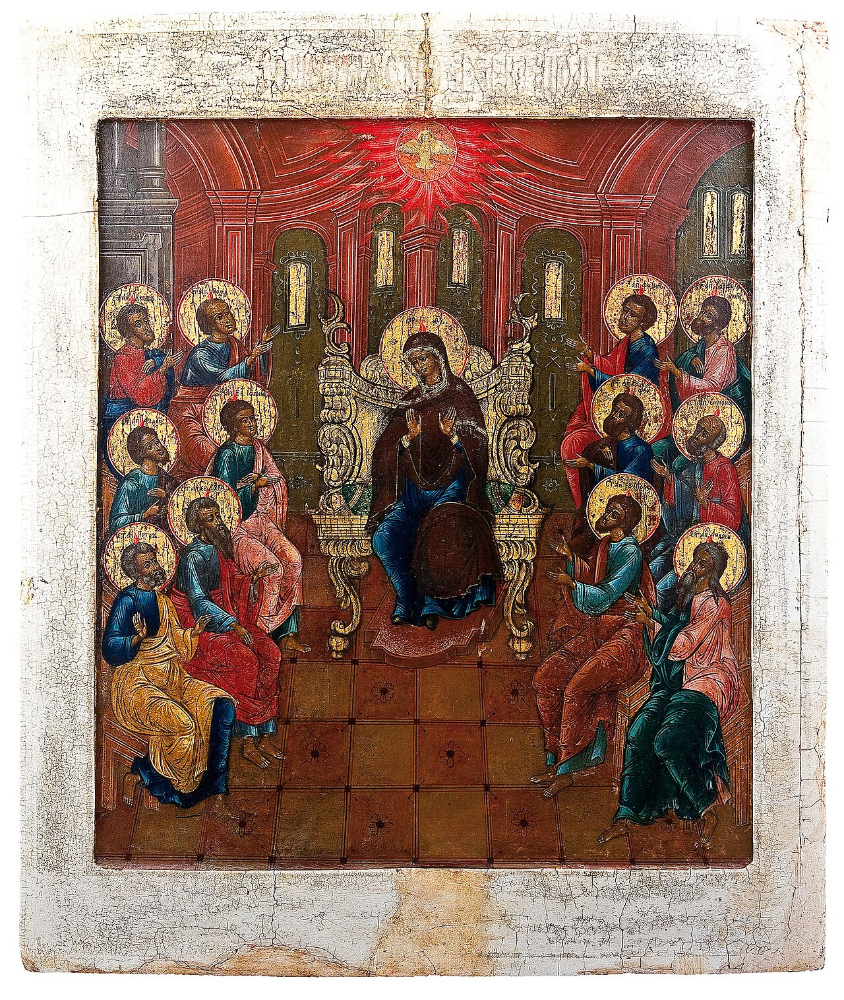

# Sessão 03 — O que Deus revelou

*Russian iconographer, Pentecost (Russian icon) (18th century). Public Domain via Wikimedia Commons.*

> *Um apóstolo segura um pergaminho, ou a chama do Pentecostes pousa sobre uma cabeça. A Fé não é um sentimento que produzimos — é uma coisa entregue, um depósito, palavras lembradas corretamente atravessando séculos. O Credo não é seu; é aquilo que faz de você o que você é.*

## São Pio X pergunta

**28.** Quais são as verdades reveladas por Deus?

*As verdades reveladas por Deus são principalmente as compendiadas no Credo ou Símbolo dos Apóstolos, e se chamam verdades de Fé porque devemos crer nelas com plena Fé como ensinadas por Deus, que não se engana nem pode enganar.*

**29.** O que é o "Credo" ou "Símbolo dos Apóstolos"?

*O Credo ou Símbolo dos Apóstolos é uma profissão dos principais mistérios e outras verdades reveladas por Deus, por meio de Jesus Cristo e dos Apóstolos, e ensinados pela Igreja.*

**30.** O que é mistério?

*Mistério é uma verdade superior mas não contrária à razão, que cremos porque Deus a revelou.*

**31.** Quais são os principais mistérios da Fé professados no Credo?

*Os principais mistérios da Fé professados no Credo são dois: Unidade e Trindade de Deus; Encarnação, Paixão e Morte de Nosso Senhor Jesus Cristo.*

## O Catecismo Romano ensina

## Quanto à fé

[1] Nas Divinas Escrituras, o termo "fé" admite várias significações. Aqui vamos falar daquela virtude pela qual assentimos plenamente a tudo quanto nos foi revelado por Deus.

Ninguém terá justo motivo de duvidar que essa fé seja necessária para a salvação, mormente por estar escrito que "sem fé não é possível agradar a Deus".[^59]

Realmente, o fim que se propõe ao homem para sua bem-aventurança, é tão elevado que o não poderia descobrir a agudeza do espírito humano. Era, pois, necessário que o homem recebesse de Deus tal conhecimento.

Ora, esse conhecimento não é outra coisa senão a própria fé, cuja virtude nos leva a ter por certo o que a autoridade da Santa Madre Igreja declara ser revelado por Deus. Nenhuma dúvida podem ter os fiéis das afirmações que vêm de Deus, porque Deus é a própria verdade.[^60] Esse critério nos faz compreender a diferença que vai entre a fé que temos em Deus, e a fé que se dá aos autores de história humana.

A fé tem grande extensão, e admite vários graus de grandeza e dignidade, como se depreende da Sagrada Escritura: "Homem de pouca fé, por que duvidaste?"[^61] — "Grande é a tua fé".[^62] — "Aumentai a nossa fé"[^63] — E ainda: "Fé sem obras é morta". — "A fé que opera pela caridade".[^64]

Entanto, a fé é uma só virtude, e os diversos graus que possa ter entram perfeitamente na mesma definição.

Quantos frutos, e quantas vantagens dela se tiram, é o que vamos ver na explicação dos Artigos.

## Quanto ao Símbolo

[2] Os cristãos devem saber, em primeiro lugar, as verdades que os santos Apóstolos, guias e mestres da fé, inspirados pelo Espírito de Deus, distribuíram nos doze Artigos do Símbolo.

Tendo recebido do Senhor a ordem de irem como Seus embaixadores[^65], pelo mundo inteiro, a pregar o Evangelho a toda criatura[^66], os Apóstolos acharam que se devia compor uma fórmula de fé cristã. Serviria esta para que todos tivessem a mesma crença e a mesma linguagem, e não houvesse separações entre os que foram chamados à unidade da mesma fé, mas fossem todos "perfeitamente conformes no mesmo modo de pensar e de sentir".[^67]

[3] A esta profissão de fé e esperança cristã, que acabavam de redigir, os Apóstolos chamaram-lhe "Símbolo", ou porque se forma das várias proposições que cada um deles apresentou[^68], ou porque devia servir de senha para identificar os desertores, os irmãos falsos e intrusos[^69] que adulteravam o Evangelho[^70], e assim distingui-los daqueles que verdadeiramente tomavam um santo compromisso na milícia de Cristo.

[4] Muitas são as verdades que a religião cristã propõe aos fiéis, com a obrigação de aceitá-las numa fé inabalável, quer cada uma delas em particular, quer todas em seu conjunto.

Mas a primeira verdade e a mais essencial, que todos devem acreditar, por ser propriamente a base e o resumo da Revelação, consiste naquilo que o próprio Deus nos ensinou acerca da unidade da essência divina, da distinção das três Pessoas, das operações que lhes são atribuídas de maneira mais particular. O pároco mostrará, pois, que no Símbolo se contém resumida a doutrina desse mistério.

O Símbolo divide-se em três partes, como já diziam os antigos cristãos, quando se punham a explicá-lo com amor e cuidado. A primeira parte trata da Primeira Pessoa da natureza divina, e da prodigiosa obra da Criação. A segunda trata da Segunda Pessoa e do mistério da Redenção dos homens. A terceira afinal descreve, em várias fórmulas adequadas, a Terceira Pessoa, autor e princípio de nossa santificação.

As proposições do Símbolo chamam-se "Artigos", de acordo com uma analogia que nossos Santos Padres usavam com frequência. Na verdade, assim como os membros do corpo se distinguem pelas articulações[^71], assim também podemos chamar Artigos às verdades que nesta profissão de fé temos de crer, distintas e separadas umas das outras.

[^59]: Hebr 11, 6; DU 801 1793.
[^60]: Io 14, 6; DU 1789 ss. 1811 2025 2081.
[^61]: Mt 14, 31.
[^62]: Mt 15, 28.
[^63]: Lc 17, 5.
[^64]: Gal 5, 6.
[^65]: 2 Cor 5, 20.
[^66]: Mc 16, 15.
[^67]: 1 Cor 1, 10.
[^68]: Alusão à lenda que cada Apóstolo teria formulado individualmente um artigo do Símbolo, antes de se espalharem pelo mundo inteiro. Cfr. S. Ambrósio nas Explicatio symboli.
[^69]: Gal 2.
[^70]: 2 Cor 2.
[^71]: Em latim: articulis.

## Uma leitura pastoral

Você está prestes a caminhar por trinta e dois dias pelo Símbolo dos Apóstolos.

A tentação será tratar o Credo como um teste — uma lista de itens com os quais você concorda, do modo como concorda com os termos-de-uso de um aplicativo. Mas não é para isso que serve o Credo. O Credo não é a sua *opinião* sobre Deus. É o **depósito da fé** — o que os Apóstolos receberam de Cristo, o que a Igreja carregou, íntegro, atravessando vinte séculos, e o que agora *é entregue a você*.

São Tomás distingue cuidadosamente entre o que *conhecemos* e o que *cremos*. Conhecemos aquilo que a razão alcança. Cremos aquilo que Deus revelou. Algumas verdades estão na fronteira — a existência de um só Deus, por exemplo, pode ser alcançada pela razão cuidadosa — mas o quadro completo (um só Deus em três Pessoas, o Pai um Pai, o Filho gerado, o Espírito procedente) só emerge porque o próprio Deus falou. A fé não é inferior à razão. A fé alcança o que a razão não alcança. *Sem a fé é impossível agradar a Deus* (Hebreus 11, 6).

Um *mistério*, como ensina Pio X, não é um quebra-cabeça insolúvel. É *uma verdade acima, mas não contrária, à razão* — algo maior que a sua mente, mas não dirigido contra ela. Doze mistérios formam o Credo; dois são centrais (a Trindade e a Encarnação, com Sua Paixão, Morte e Ressurreição). Os próximos trinta dias o conduzirão a eles.

Leia com esta expectativa: você não dominará o Credo. O Credo o dominará. É exatamente este o ponto. A vida cristã começa não quando *você* decide o que é verdadeiro, mas quando você deixa que *o que é verdadeiro* decida *você*.

> **Escritura.** *A fé é o fundamento das coisas que se esperam, a prova das que se não veem.* — Hebreus 11, 1

> *Eu creio, Senhor — socorrei a minha descrença. Tornai a minha fé menos minha e mais Vossa, esta manhã, este minuto.*
