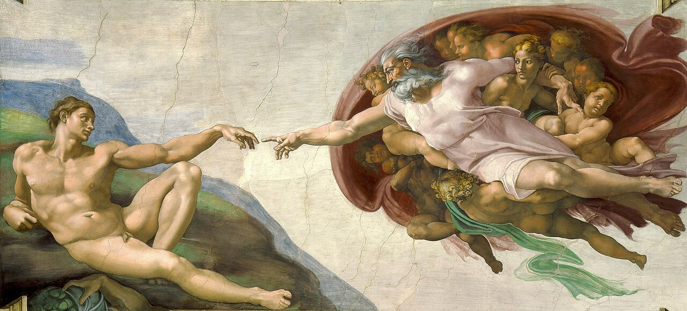

# Sessão 10 — O que é o homem — alma e liberdade

*Michelangelo Buonarroti, The Creation of Adam (1508-1512). Public Domain via Wikimedia Commons.*

> *O famoso vão. Dois dedos quase se tocam — o de Deus, pleno de intenção; o de Adão, frouxo com o ser recém-recebido. Você é isto. Um corpo, sim, mas um corpo aceso por uma alma que não morrerá. Hoje, escolha à altura.*

## São Pio X pergunta

**60.** Quem é o homem?

*O homem é um ser racional, composto de alma e corpo.*

**61.** O que é a alma?

*A alma é a parte espiritual do homem, pela qual ele vive, entende e é livre, e por isso capaz de conhecer, amar e servir a Deus.*

**62.** A alma do homem morre com o corpo?

*A alma do homem não morre com o corpo, mas, sendo espiritual, vive eternamente.*

**63.** Que cuidado devemos ter com a alma?

*Devemos ter o máximo cuidado com a alma porque ela é em nós a parte melhor e imortal, e só salvando a alma seremos eternamente felizes.*

**64.** Como o homem é livre?

*O homem é livre, visto que pode fazer uma coisa e não fazê-la, ou fazer antes esta do que aquela outra, como bem sentimos em nós mesmos.*

**65.** Se é livre, o homem pode também fazer o mal?

*O homem pode, ou seja, é capaz também de fazer o mal; porém não o deve fazer justamente porque é mal; deve-se usar a liberdade só para o bem.*

## Uma leitura pastoral

**Você é um corpo iluminado por uma alma que não morrerá.** O catecismo acima ensina a doutrina que o mundo moderno fez o possível para esquecer — que a pessoa humana é *um só ser* em *duas naturezas*, corpo e alma, indivisivelmente até a morte e reunidos na ressurreição.

A antropologia católica é **rigorosa** neste ponto contra vários erros:

  * **O materialismo** diz que você é *só* corpo — neurônios, química, evolução produzindo a ilusão de um eu. A Igreja rejeita. Aquino, trabalhando com Aristóteles, argumenta, a partir da própria natureza do *pensamento*, que a alma não pode ser meramente material: o pensamento alcança verdades universais (matemática, justiça, a própria noção de ser) que nenhuma coisa puramente física pode apreender. **O que pensa deve ser mais do que matéria.**

  * **O espiritualismo / dualismo** diz que o corpo é um traje que a alma um dia jogará fora. A Igreja também rejeita. O corpo é *parte de quem você é*. Cristo ressuscitou corporalmente; você ressuscitará corporalmente (Sessão 033). Desprezar o corpo é heresia cristã, não humildade cristã.

  * **O reducionismo moderno** diz que a alma é apenas *a experiência da atividade cerebral* — quando o cérebro morre, a alma termina. A Igreja rejeita com a maior firmeza: a alma é **diretamente criada por Deus** para cada ser humano e é **imortal**. Aquino, de novo, argumenta a partir das *operações imateriais* da alma (o pensar, o querer livre): uma coisa imaterial não pode ser destruída pela dissolução de um corpo material.

A doutrina tem consequências profundas:

  * **O livre-arbítrio é real.** O catecismo acima ensina: *o homem pode também fazer o mal; mas não deve fazê-lo, precisamente porque é mau*. O materialismo não pode fundar a liberdade — a química não tem *dever*. A reivindicação católica é que você é *responsável* pelos seus atos porque é *livre* para agir de outro modo. Isto é desconfortável; é também a razão pela qual a sua vida significa algo.

  * **Você pode rezar pelos moribundos.** Uma alma não se desliga no instante da morte biológica. O leito de morte é um *momento real de decisão*, às vezes durando além do que as aparências sugerem. O cristão que reza pelos moribundos — conhecidos e desconhecidos — intercede por uma alma *ainda no tempo*.

  * **O suicídio e a eutanásia são teologicamente graves** — não porque o corpo seja sagrado e a alma seja irrelevante, mas porque *cada ser humano é pessoa*, e não temos autoridade sobre o *tempo* da pessoa toda. (Cf. Sessão 045.)

A *Criação de Adão* da Sistina (a imagem de hoje) é o ícone. *Dois dedos quase se tocam — o de Deus, cheio de intenção; o de Adão, lasso com o novo ser.* O detalhe é teológico: Deus alcança; ao humano é *dada* a centelha. **Você não gerou a sua alma. Recebeu-a. É a parte de si que veio diretamente d'Ele.**

Hoje, tire cinco minutos sozinho — sem celular, sem música, sem estímulos — e perceba que *algo está lendo estas palavras*. Esse algo é a sua alma. Ele a fez. Ele a sustenta agora. Fale com Ele a partir dali.

> **Escritura.** *E Deus criou o homem à sua imagem; à imagem de Deus o criou; varão e mulher os criou.* — Gênesis 1, 27

> *Vós me fizestes livre, Senhor. Hoje, libertai-me daquilo que só parece liberdade e conduzi-me à verdadeira.*
