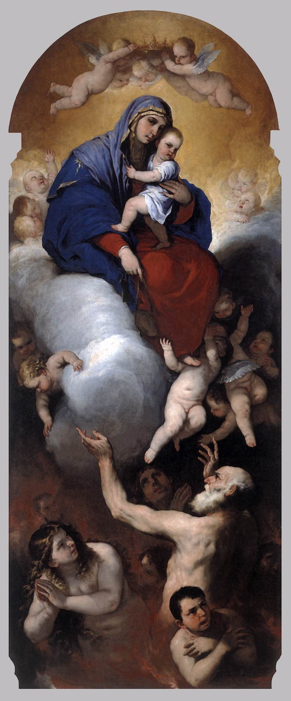

# Sessão 22 — O purgatório e as almas que ajudamos

*Luca Giordano, Virgin and Child with Souls in Purgatory (c. 1660-1665). Public Domain via Wikimedia Commons.*

> *Um pintor espanhol mostra almas em chamas, mas a chama é gentil e elas se erguem para o alto. O purgatório não é castigo dos perdidos; é o último polimento dos salvos. Reze por elas. Elas rezarão por você.*

## São Pio X pergunta

**101.** O que é o Purgatório?

*O Purgatório é o padecimento temporário da privação de Deus e de outras penas que removem da alma todo resto de pecado para torná-la digna de ver Deus.*

**102.** Podemos socorrer e inclusive liberar as almas das penas do Purgatório?

*Podemos socorrer e inclusive liberar as almas das penas do Purgatório com os sufrágios, ou seja, com orações, indulgências, esmolas e outras boas obras e, sobretudo com a Santa Missa.*

## O Catecismo Romano ensina

## Sentido da palavra "infernos"

[2] Para maior evidência deste Artigo, o pároco começará por explicar em que sentido se toma aqui a palavra "infernos". Deverá, pois, inculcar que não quer dizer sepultura, conforme alguns asseveravam, com uma impiedade igual à sua própria ignorância.

No Artigo anterior, vimos com efeito que Cristo Nosso Senhor fora sepultado. Ora, não havia motivo para que os Apóstolos, na composição do Símbolo, repetissem a mesma verdade com outras palavras, por sinal que mais obscuras.

A expressão "infernos" designa os ocultos receptáculos em que são detidas as almas que não conseguiram a bem-aventurança do céu.

Neste sentido, ocorre em muitos lugares da Sagrada Escritura. Lê-se, por exemplo, numa epístola do Apóstolo: "Ao nome de Jesus, deve dobrar-se todo o joelho, no céu, na terra, e nos infernos".[^313] E nos Atos dos Apóstolos atesta São Pedro que "Cristo Nosso Senhor ressuscitou, depois de vencer as dores dos infernos".[^314]

[3] Mas esses receptáculos são de várias categorias. Um deles é a horrenda e tenebrosa prisão, em que as almas réprobas são atormentadas num fogo eterno e inextinguível[^315], juntamente com os espíritos imundos. Chama-se também "geena"[^316], e "abismo".[^317] É o inferno propriamente dito.

Há também um fogo de expiação, no qual por certo tempo se purificam as almas dos justos, até que lhes seja franqueado o acesso da Pátria Celestial, [lugar] onde nada de impuro pode entrar.[^318]

Consoante as declarações dos Santos Concílios[^319], esta verdade tem por si os testemunhos da Escritura e da Tradição Apostólica. O pároco deve, pois, apregoá-la com maior desvelo e assiduidade, do que nenhuma outra, porquanto chegamos a uma época, em que os homens já não suportam a sã doutrina.[^320]

Existe, afinal, um terceiro receptáculo, em que eram recolhidas as almas justas, antes da vinda de Cristo. Ali desfrutavam um suave remanso, sem nenhuma sensação de dor. Alentavam-se com a doce esperança do resgate. Estas almas eleitas aguardavam o Salvador no seio de Abraão[^321]; foi a elas que Cristo Nosso Senhor libertou, na descida aos infernos.

## Uma leitura pastoral

O Purgatório é uma das doutrinas mais silenciosamente abandonadas em nossa geração. Católicos modernos, envergonhados da caricatura das chamas e do caixa-livro, às vezes derivam para uma vaga esperança de que *provavelmente todo mundo vai mais ou menos direto para o céu*. Não é isto que a Igreja ensina, e o catecismo gentil acima está pedindo que recuperemos a doutrina sem a caricatura.

O ensinamento é este. **A maior parte dos salvos não está, no momento da morte, pronta para a presença de Deus.** Morrem na Sua amizade — isto é salvação; estão *salvos* — mas com apegos ao pecado ainda agarrados, dívidas de justiça ainda não reparadas, o tecido tenro da alma ainda em recuperação das feridas de uma vida. A presença plena de Deus é fogo para tudo o que em nós ainda não é puro (1 Coríntios 3, 13–15 — *o fogo provará a obra de cada um* — é o lugar clássico). Esse fogo, encontrado como alma salva, *termina* o que a graça começou na terra. **O Purgatório é o último polimento dos salvos**, não a punição dos perdidos.

Pio X é preciso quanto ao que podemos fazer por eles. Podemos **ajudá-los e até libertá-los** por meio de:

  * **A Santa Missa** — *acima de tudo*. Cada Missa oferecida pelos defuntos aplica os méritos infinitos do Calvário a uma alma em particular. Mande celebrar uma Missa por alguém que morreu. O estipêndio que você dá à paróquia não é taxa; é participação.
  * **A oração**. As três familiares: *Dai-lhes, Senhor, o eterno descanso, brilhe para eles a luz perpétua. Descansem em paz. Amém.* Reze diariamente por alguém em particular. Eles estarão rezando por você.
  * **As indulgências** aplicadas aos defuntos — a autoridade da Igreja para recorrer ao tesouro inesgotável de Cristo e dos santos a fim de aliviar a pena temporal de uma alma. Especialmente as indulgências ligadas ao Dia de Finados (2 de novembro) e à visita ao cemitério na oitava que se segue.
  * **A esmola e outras obras boas**. A misericórdia obrada aqui, na nossa vida encarnada, pode ser oferecida por eles. *Levai as cargas uns dos outros* — atravessando a fronteira da morte.

Duas notas para o leitor moderno.

  1. **Eles são pessoas reais.** A sua avó. O seu amigo que morreu cedo. O trabalho deles no Purgatório não é mitologia; é o último esforço de amor pelo qual se tornam inteiramente capazes de Deus. A sua oração os alcança.
  2. **Você estará lá também.** O cristão pensa no Purgatório não só pelos outros, mas como a forma muito provável da sua própria transição final. *Reze pelas almas do Purgatório*, diz a Igreja, *e elas rezarão por você* — inclusive, eventualmente, quando *você* for uma delas.

Hoje, nomeie uma. Reze por ela. A doutrina da Comunhão dos Santos não é abstrata; é a família que não se quebra na sepultura.

> **Escritura.** *É, portanto, um pensamento santo e salutar orar pelos defuntos, para que sejam libertados dos pecados.* — 2 Macabeus 12, 46

> *Dai-lhes o descanso eterno, Senhor. E concedei-me, a seu tempo, a mesma misericórdia que peço por elas.*
