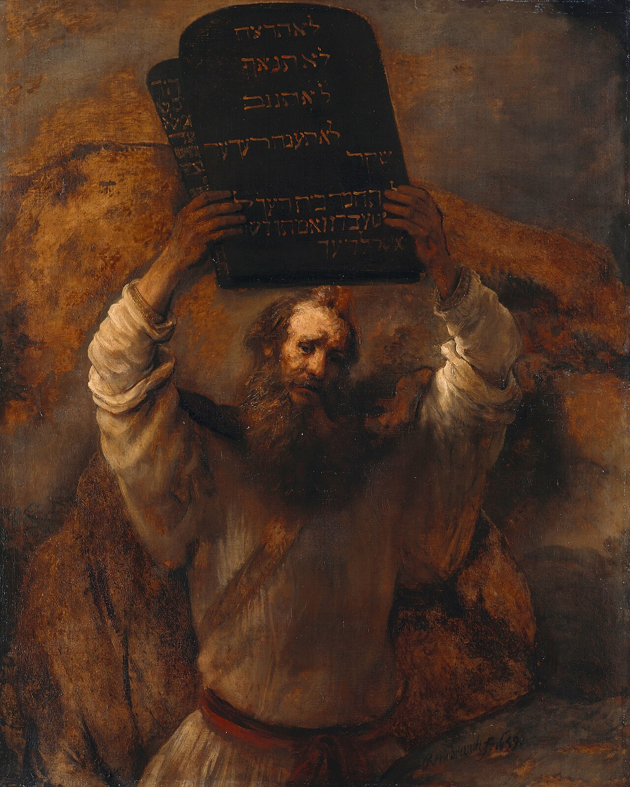

# Sessão 35 — O Decálogo e os dois grandes mandamentos

*Rembrandt van Rijn, Moses with the Ten Commandments (1659). Public Domain via Wikimedia Commons.*

> *O Moisés de Rembrandt levanta as tábuas, os olhos duros com a luz que viu. Os Dez Mandamentos não são arbitrários — são a geometria do amor. Eles dizem a forma de um coração que quer a Deus e a forma de um próximo que ele não fere.*

## São Pio X pergunta

**161.** O que são os Mandamentos de Deus?

*Os Mandamentos de Deus ou Decálogo são as Leis morais que Deus, no Velho Testamento, deu a Moisés sobre o Monte Sinai, e Jesus Cristo aperfeiçoou no Novo.*

**162.** O que nos impõe o Decálogo?

*O Decálogo nos impõe os mais estritos deveres naturais com relação a Deus, a nós mesmos e ao próximo, assim como os outros deveres que dele provém: os do próprio estado, por exemplo.*

**163.** A que se resumem os nossos deveres com relação a Deus e com relação ao próximo?

*Os nossos deveres com relação a Deus e com relação ao próximo resumem-se à caridade, isto é, ao "máximo e primeiro mandamento" do amor de Deus e àquele "semelhante" do amor do próximo: "Destes dois mandamentos", disse Jesus Cristo, "dependem toda Lei e os Profetas" (São Mateus XXII, 40).*

*163 a. Os dois mandamentos da caridade: 1. Amarás o Senhor Teu Deus com todo o teu coração, com toda a tua alma, com toda a tua mente e com todas as tuas forças; 2. Amarás o teu próximo como a ti mesmo.*

**164.** Por que o Mandamento do amor de Deus é o máximo mandamento?

*O Mandamento do amor de Deus é o máximo mandamento porque quem o observa amando a Deus com toda a alma, observa certamente todos os outros mandamentos.*

**165.** Os Mandamentos de Deus são possíveis de serem observados?

*Os Mandamentos de Deus são possíveis de serem observados todos e sempre, inclusive nas mais fortes tentações, com a graça que Deus não nega nunca a quem o invoca de coração.*

## São Tomás ensina

## Os Dez Mandamentos

I. Eu sou o Senhor teu Deus, que te tirei da terra do Egito, da casa da servidão. Não terás outros deuses diante de Mim. Não farás para ti escultura, nem semelhança alguma do que há em cima no céu, nem embaixo na terra, nem nas águas debaixo da terra. Não os adorarás, nem lhes prestarás culto. Eu sou o Senhor teu Deus, forte, zeloso, que vinga a iniquidade dos pais nos filhos, até a terceira e quarta geração daqueles que Me odeiam, e uso de misericórdia para com milhares dos que Me amam e guardam os Meus mandamentos.

II. Não tomarás o nome do Senhor teu Deus em vão.

III. Lembra-te de santificar o dia de sábado.

IV. Honra teu pai e tua mãe.

V. Não matarás.

VI. Não cometerás adultério.

VII. Não furtarás.

VIII. Não levantarás falso testemunho contra o teu próximo.

IX. Não cobiçarás a mulher do teu próximo.

X. Não cobiçarás a casa do teu próximo, nem o seu campo, nem o seu servo, nem a sua serva, nem o seu boi, nem o seu jumento, nem coisa alguma que lhe pertença.[^1]

[^1]: Êx 20, 2-17, e Dt 5, 6-21.

## Uma leitura pastoral

O catecismo acima, como um porteiro, lhe entregou a planta do prédio: os Dez Mandamentos são a *geometria do amor*. Os três primeiros dizem respeito ao amor de Deus — Seu nome, Seu dia, Seu culto exclusivo. Os sete últimos dizem respeito ao amor do próximo — vida, matrimônio, propriedade, verdade, os movimentos interiores da inveja e da concupiscência. Juntos, como o próprio Cristo declarou, *toda a Lei e os Profetas* dependem do duplo mandamento: amar a Deus com tudo, amar o próximo como a si mesmo.

Por isso não se pode reduzir a vida moral a "regras". Uma regra é algo imposto de fora; um mandamento é algo que articula como uma criatura feita para o amor pode de fato tornar-se *capaz* de amar. São Tomás, ao tratar do Decálogo em seus sermões de Nápoles, pergunta por que Deus nos deu *dez* mandamentos, e não mais nem menos. Sua resposta é marcante: a lei de Deus é, na raiz, uma lei única — **o amor** — mas o amor precisa tomar dez formas diferentes numa criatura como nós, que vive no tempo, num corpo, com pais e vizinhos e bens. Amar a Deus só com o coração, enquanto se rouba, mente e cobiça, é reivindicar amor sem corpo. Guardar os mandamentos sem amor é reivindicar o corpo sem a alma. Ambos estão mortos.

Pio X nos lembra — e esta é a frase mais importante do catecismo de hoje — que *os mandamentos podem ser observados em todo o tempo, mesmo nas mais fortes tentações, pela graça que Deus jamais nega a quem O invoca de coração.* Isto não é otimismo. É doutrina. Não há mandamento demasiado pesado para a graça. Não há tentação demasiado forte. A graça é real. O pedir, também, precisa ser real.

Pelas dezoito sessões seguintes você caminhará pelos Dez um a um — primeiro as leis em relação a Deus (Sessões 37–43), depois as leis em relação ao próximo (Sessões 44–52). Tome-os na ordem. Não são entediantes. Vividos por dentro, são a arquitetura de uma vida que não se desperdiça.

> **Escritura.** *Amarás o Senhor teu Deus de todo o teu coração, de toda a tua alma e de todo o teu espírito. Este é o maior e o primeiro mandamento. O segundo lhe é semelhante: Amarás o teu próximo como a ti mesmo.* — Mateus 22, 37-39

> *Senhor, a lei é amor. Hoje, não me deixeis reduzir o amor a um sentimento. Fazei-me obedecer.*

---

#### Aprofundamento — *Catecismo de Trento*

## I. Importância do Decálogo

[1] Conforme escreveu Santo Agostinho[^1], o Decálogo é um resumo ou apanhado de todas as leis. Ainda que o Senhor falasse de muitas coisas, a Moisés entregou só duas lápides, as chamadas tábuas do futuro testemunho[^2] na Arca da Aliança.

Na verdade, quem faz por compreender, reconhecerá que todas as outras determinações de Deus dependem daqueles dez preceitos gravados nas duas lápides; e que os dez Mandamentos, por sua vez, se reduzem aos dois preceitos fundamentais do amor a Deus e ao próximo, "em que se funda toda a Lei e os Profetas".[^3]

### 1. ... no púlpito

[2] Sendo, portanto, o Decálogo a suma de toda a Lei, cabe aos pastores a obrigação de meditá-lo dia e noite[^4], não sòmente para ajustarem sua vida por essa norma, mas também para instruírem, na Lei do Senhor, o povo que lhes está confiado. Pois "os lábios do sacerdote guardam a ciência, e de sua boca procuram os homens conhecer a Lei, porque ele é um Anjo do Senhor dos exércitos".[^5]

Esta passagem se refere, de modo particular, aos pastores da Nova Lei. Eles estão mais chegados a Deus, e devem transformar-se "de claridade em claridade, como que levados pelo Espírito do Senhor".[^6] Como Cristo Nosso Senhor disse que eles eram "luz"[^7], compete-lhes a obrigação natural de serem um luzeiro[^8] para os que se acham nas trevas[^9]; de ensinarem os ignorantes, de educarem as crianças; e, "se alguém tiver o descuido de cair em algum pecado", eles, "que são homens espirituais, devem corrigi-lo".[^10]

### 2. no confessionário

Ao ouvirem Confissões, exercem a função de juízes, e devem pronunciar a sentença segundo o gênero e a gravidade dos pecados. Portanto, se não quiserem, por sua ignorância, prejudicar-se a si mesmos e aos outros, devem aplicar nesse ministério a maior vigilância possível, e ser muito seguros na interpretação dos Preceitos da Lei de Deus, para poderem julgar, por essa norma divina, qualquer falta por comissão ou omissão; para transmitirem "a sã doutrina", como diz o Apóstolo[^11]: quer dizer, uma doutrina que não envolva em si nenhum erro, e cure as enfermidades das almas, quais são os pecados, a fim de que o povo seja agradável a Deus, e "zeloso na prática de boas obras".[^12]

Nestas explanações, o pároco proporá, a si mesmo e aos outros, os argumentos que sejam mais próprios para induzir à observância da Lei.

## III. A particularidade da promulgação aos Hebreus

[11] Apesar de ter sido dada pelo Senhor aos Judeus, no cimo da Montanha[^40], a Lei já estava, desde o princípio, impressa e gravada pela natureza nos corações de todos os homens.[^41] Por isso, quis Deus que todos os homens lhe estivessem sujeitos por uma obediência perpétua.

Será, pois, de muito proveito não só explicar cuidadosamente os termos em que a Lei foi promulgada aos Hebreus, por ofício e interpretação de Moisés[^42], mas também contar a história do povo de Israel, que é toda cheia de mistérios.

O pároco começará por contar que, de todas as nações existentes debaixo do céu, Deus só escolheu uma[^43], cujo tronco é Abraão[^44], que por ordem de Deus viveu como forasteiro na terra de Canaã. Deus lhe havia prometido a posse dessa terra, mas ele e seus descendentes tiveram de vaguear por mais de quatrocentos anos, antes de poderem habitar na terra prometida.

Todavia, Deus nunca deixou de velar por eles durante essa peregrinação. Verdade é que passavam "de nação em nação, de um reino a outro reino", mas Ele nunca permitiu lhes fosse feito o menor agravo, e chegou até a castigar reis por causa deles.[^45]

Antes de descerem ao Egito, enviou, por diante, um homem que, graças à sua prudência, havia de salvá-los, tanto a eles como aos Egípcios.[^46] No Egito, porém, Sua bondade os amparou de tal forma, que se multiplicavam milagrosamente, por mais que Faraó se opusesse a eles, e procurasse exterminá-los.[^47]

Quando a perseguição recrudesceu, e que eles eram tratados como escravos, com a maior crueldade, suscitou como chefe a Moisés, que os livrou com mão forte. A esta libertação alude o Senhor, no início da Lei, quando diz expressamente: "Eu sou o Senhor teu Deus que te tirei da terra do Egito, da casa da servidão".[^48]
