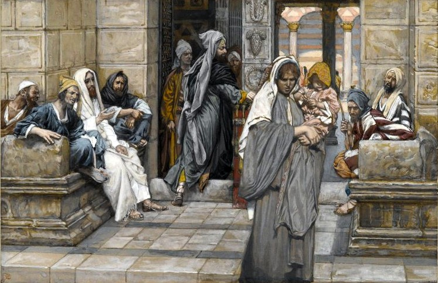

# Sessão 54 — Jejum, confissão, comunhão, ofertas

*James Tissot, The Widow's Mite (c. 1886-1894). Public Domain via Wikimedia Commons.*

> *A viúva deixa cair duas moedas no tesouro do templo. Jejum, confissão, comunhão pascal, oferta — não são transações comerciais. São pequenas rendições, repetidas, até o coração aprender o ritmo do sim.*

## São Pio X pergunta

**219.** O que ordena o Segundo Preceito com as palavras "jejuar nos dias prescritos"?

*O Segundo Preceito com as palavras "jejuar nos dias prescritos" ordena observar o jejum eclesiástico na Quaresma, em alguns dias do Advento, nas quatro Têmporas e em algumas vigílias.*

**220.** A que obriga o jejum eclesiástico?

*O jejum eclesiástico obriga a abstinência de determinados alimentos, e de outras refeições além do almoço: é permitida uma segunda refeição ligeira.*

**221.** Quem está obrigado ao jejum eclesiástico?

*Ao jejum eclesiástico estão obrigados todos os fiéis dos vinte e um anos completos aos sessenta, se não se está escusado por enfermidade, trabalhos pesados ou por outra justa razão.*

**222.** Por que a Igreja nos impõe abstinências e jejuns?

*A Igreja nos impõe, em conformidade com o exemplo e a doutrina de Jesus Cristo, abstinências e jejuns para penitência dos pecados, para mortificação da gula e das paixões e por outras necessidades particulares.*

**223.** O que nos ordena o Terceiro Preceito "confessar pelo menos uma vez por ano, e comungar pelo menos na Páscoa"?

*O Terceiro Preceito "confessar pelo menos uma vez por ano, e comungar pelo menos na Páscoa" nos ordena aproximarmo-nos à Penitência ao menos uma vez por ano, e à Eucaristia ao menos no tempo de Páscoa.*

**224.** Por que a Igreja, impondo confessar e comungar uma vez por ano, acrescenta as palavras "ao menos"?

*A Igreja, impondo confessar e comungar uma vez por ano acrescenta as palavras "ao menos" para recordar-nos a utilidade, aliás, a necessidade de receber frequentemente, como é de seu desejo esses sacramentos.*

**225.** O que nos ordena o Quarto Preceito "sustentar as necessidades da Igreja contribuindo segundo as leis ou os costumes"?

*O Quarto Preceito "sustentar as necessidades da Igreja contribuindo segundo as leis ou os costumes" nos ordena fazer as ofertas estabelecidas pela autoridade ou pelo uso, para o conveniente exercício do culto e para o honesto sustento dos ministros de Deus.*

**226.** O que nos proíbe o Quinto Preceito "Não celebrar solenemente as núpcias nos tempos proibidos"?

*O Quinto Preceito, "Não celebrar solenemente as núpcias nos tempos proibidos", proíbe a Missa com a bênção especial dos esposos desde o primeiro domingo do Advento até o Santo Natal e desde a Quarta-Feira de Cinzas até o Domingo de Páscoa.*

## Uma leitura pastoral

Cada preceito restante da Igreja ensina ao corpo algo que a alma precisa aprender.

**O jejum** ensina ao corpo que ele não é o senhor. São Tomás argumenta, com os Padres, que o jejum ordena três coisas ao mesmo tempo: oferece reparação pelo pecado, disciplina o apetite que nos puxa para a dissipação e eleva a mente à oração. O corpo, alimentado em excesso, deixa a alma pesada. O jejum não é desprezo do alimento (que é bom), mas um pequeno *não* deliberado pelo qual o corpo aprende a obedecer a algo maior do que sua fome.

**A confissão anual e a Comunhão pascal** são o mínimo absoluto, mas São Tomás observa a palavra *ao menos* no preceito: a Igreja nomeia esse piso apenas porque somos fracos, e deseja muito mais — confissão frequente para manter a alma lavada, Comunhão frequente para mantê-la alimentada. O preceito anual é o limiar mais baixo para ser chamado de católico praticante; o cristão que vive só no limiar está passando fome com o pão sobre a mesa.

**A oferta para as necessidades da Igreja** responde a uma pergunta que o católico moderno raramente faz: *quem paga por isto?* A Missa que o consola, o sacerdote que ouve sua confissão, o templo onde você entra para um casamento ou um funeral — tudo isso é sustentado pelas ofertas dos batizados. Dar é participar da obra do Corpo, não financiar uma caridade.

Não são transações comerciais. São pequenas entregas, repetidas, até que o coração aprenda o ritmo do sim.

> **Escritura.** *Agora, pois, diz o Senhor, convertei-vos a mim de todo o vosso coração, em jejum, em pranto e em lamentação.* — Joel 2, 12

> *Senhor, a regra não é a recompensa — mas a regra me mantém perto dela. Ajudai-me a guardá-la.*
