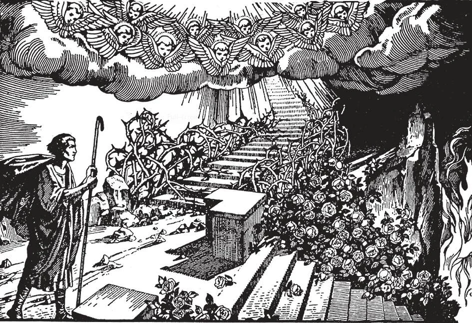

# 1. Religion and the End of Man

In creating us, God gave us the power and right to choose which path we should follow in life: either the path of obedience, or the path of disobedience to His commandments. The first seems wearisome and full of thorns, but reward comes in the end: happiness with God. The second seems full of pleasures and roses, but punishment awaits the traveller at the end: eternal damnation in hell. Each must choose for himself. We may find the choice a hard struggle. We shall be strengthened in the choice of the difficult path if we remember that we belong to God, that He loves us, that He will help us and is waiting for us at the end of the road-- of obedience.

**What is the destiny of man?**

— Man's high destiny is to go to God, because man comes from God, and belongs entirely to God. 1. Our reason tells us that Someone made us. That Someone is God.

> Nothing can proceed from nothing. If there had ever been a moment when nothing existed, nothing would ever have existed. Therefore, because we exist, we know Someone who made us also exists; that Someone is God. "He made us, and not we ourselves'' (Ps. 99: 3). "All things have been created through and unto Him" (Col. 1: 16).

2. Our reason also tells us that God must have made us for some purpose. God made man to know Him, to love Him, and to serve Him in this world, and to be happy forever with Him in the next. God made us for Himself. The end of man, as of all creation, is the glory of God; to manifest the divine perfections, to proclaim the goodness, majesty, and power of God.

> "The Lord hath made all things for Himself" (Prov. 16: 4). Whether he wishes to or not, man must manifest God's perfections, dominion, and glory. Man's very existence does this; even his sins will in the end show forth God's infinite holiness and justice.

3. Through glorifying God, man is destined to share His everlasting happiness in heaven. Man was created chiefly for the life beyond the grave; this present one is merely a preparation for the eternal life.

> In this life we are exiles, wanderers, pilgrims. Heaven, the Home of God, is our true country, our true Home. There God wants to share with us His own unmeasured bliss. "For here we have no permanent city, but we seek for the city that is to come" (Heb. 13: 14)

4. We belong to God. Since we are His creatures, we have certain duties towards God which we must fulfil. Religion teaches us what these duties are.

**What is Religion?**

— Religion is the virtue by which we give to God the honour and service due to Him alone as our Creator, Master, and Supreme Lord.

> It is by religion that we know, love, and serve God as He commands us to know, love and serve Him. It is by religion, then, that we fulfil the end for which we were made, and so save our soul.

In order to practice this virtue, we must: 1. Believe all the truths revealed by God.

> In religion we learn about God and His perfections. We learn something about His great love for us. We learn what is right and what is wrong. We learn what God commands us to do. We learn about the future that He has prepared for us.

2. Carry out in our lives what we learn about the duties we owe to God, about His commands and wishes. Mere knowledge is not religion, and will avail us nothing. The devil has knowledge, but he has no religion. Religion includes the service of God in fulfilling what we have learned of our duties towards Him. Religion is not a matter of feeling; it is a matter of will and of action.

> Our Lord says: "Blessed are they who hear the word of God and keep it" (Luke 11: 28). The Apostle St. James said: "But be doers of the word, and not hearers only, deceiving yourselves" (Jas. 1).

**Is it necessary for us to practice religion?**

— It is absolutely necessary for us to practice religion. God gives us no choice in the matter. 1. Our chief business in life, the business which God commands us to attend to, is to go to God. And this depends on our practice of religion.

> It is by religion that we fulfil the purpose for which we were created. By believing what God has revealed, we know God. By knowing God, we cannot help but love Him. By practising what we learn and obeying God's commands, we serve Him. "He who has my commandments and keeps them, he it is who loves me" (John 14: 21).

2. Many people spend their lives in a vain pursuit of riches, honours, and pleasures. But these never satisfy the heart of man even on earth. Besides, they have to be left behind when the hour of death comes.

> "For when he shall die, he shall take nothing away: nor shall his glory descend with him." (Ps.48: 18)

**From whom do we learn to know, love, and serve God?**

— We learn to know, love, and serve God from Jesus Christ, the Son of God, Who teaches us through the Catholic Church. 1. The study in which Jesus Christ teaches us about God and how to know, love, and serve Him, is the study of Religion. It is the most important study anyone can undertake. The neglect of this study is the root cause of crime in the world at present. Without a knowledge of God men give way to their basest passions.

> Our salvation is much more important than a knowledge of physics, poetry, or history. All our science and knowledge, with our wealth and honours, will be profitless if we do not save our soul. "What does it profit a man, if he gains the whole world, but suffer the loss of his own soul?" (Matt. 16: 26).

2. This study needs thought and attention. We need to listen to a good teacher. We cannot study it well by ourselves alone.

> The deacon Philip asked the Ethiopian reading Holy Scripture, "Dost thou then understand what thou art reading?" But he said, "Why, how can I, unless someone shows me?" (Acts 8: 31).

**Who are those that advocate no study of religion?**

— Those that advocate no study of religion are generally termed free-thinkers, agnostics, sceptics, and rationalists. 1. These thinkers claim that all problems can be solved by the use of the intellect alone, without necessity of any principle, law, dogma or authority.

> "Freedom of thought" has a pleasant sound, but it is against reason; by it the mind is fettered by error. We submit our minds freely to natural and scientific truths; that is true freedom. If there is no freedom of thought in mathematics, why in religion?

2. "Freedom of thought" is evidently a contradiction; we are not free to think what is not the truth. There are fundamental laws that bind the intellect.

> For instance, are we free to believe that the sun revolves around the earth, even if it appears to do so?

3. The intelligent man, in order to attain the kind of freedom humanly possible, should find out to which authority he must submit; he must discover which is the Law. And this is why the rational man studies Religion, to find out this fundamental Law.
