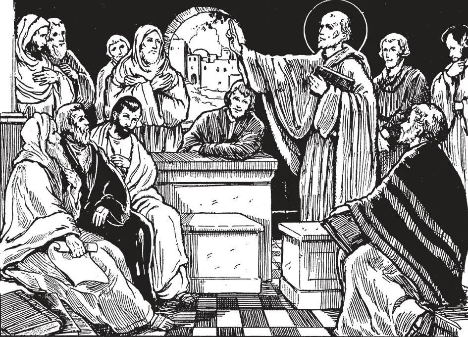

# 2. The Apostles' Creed

The Apostles, before they parted, gathered together in Jerusalem in the first Council of the Church. There they decided to put down in a brief statement their principal doctrines, so that their teachings might be uniform wherever they preached. This statement of the articles of faith we call today "The Apostles' Creed." It was formulated in order to put into fruition the command of Our Lord: "Go, therefore, and make disciples of all nations ... teaching them to observe all that I have commanded you; and behold, I am with you all days" (Matt. 28: 19-20).

**Where do we find the chief truths taught by Jesus Christ through the Catholic Church?**

— We find the chief truths taught by Jesus Christ through the Catholic Church in the Apostles' Creed. 1. A creed is a summary or statement of what one believes. "Creed" comes from the Latin *credo*, which means I believe; that is, I accept or hold true something on the word of another.

> "I believe," with relation to the Apostles' Creed, means that I firmly assent to everything contained in it. I believe it exactly as if I had seen those truths with my own eyes. I believe it on the authority or word of God, Who cannot deceive or be deceived.

2. The Apostles Creed is so called because it has come down to us from apostolic times, and contains a summary of the principal truths taught by the Apostles.

> The Apostles' Creed is repeated at Baptism, as a declaration of faith. In ancient times it was required before Baptism, as a sign of fitness for reception into the Church.

3. The Apostles' Creed has come down to us intact, except for a few clauses added by the Church later, in order to counteract various heresies. These additions, however, are not new doctrines, but a clarification of what the Creed already contained.

> Thus the words "Creator of heaven and earth" were added to counteract the Manichaean heresy that the world was created by the principle of evil; and the word "Catholic" was added, to distinguish the True Church from churches springing up around it. As our Lord said, "And you also bear witness, because from the beginning you are with me" (John 15: 27).

4. There are several other creeds used by the Church, in substance identical with the Apostles' Creed.

> The Nicene Creed, which is said in the Mass, was mainly drawn up at the Council of Nicea, in the year 325. The Athanasian Creed is said by priests in the Divine Office for Sunday.

**Into how many articles may the Apostles' Creed be divided?**

— The Apostles Creed may be divided into twelve articles. 1. All the articles are absolutely necessary to faith: if even one article is omitted or changed, faith would be destroyed.

> It is symbolical to divide the Apostles' Creed into twelve articles, because the Apostles numbered twelve; thus we are reminded that the Creed comes to us and was taught by the Apostles of Our Lord.

2. The following are the articles: (1) I believe in God, the Father Almighty, Creator of heaven and earth; (2) And in Jesus Christ, His only Son, Our Lord; (3) Who was conceived by the Holy Ghost, born of the Virgin Mary; (4) Suffered under Pontius Pilate, was crucified, died, and was buried. (5) He descended into hell; the third day He arose again from the dead; (6) He ascended into Heaven, sitteth at the right hand of God, the Father Almighty; (7) From thence He shall come to judge the living and the dead. (8) I believe in the Holy Ghost; (9) The Holy Catholic Church; the communion of saints; (10) The forgiveness of sins; (11) The resurrection of the body; (12) And life everlasting. Amen.

> The twelve articles of the Apostles' Creed contain the mystery of the Blessed Trinity, one God in three distinct Divine Persons, — Father, Son, and Holy Ghost, — with the particular operations attributed to each Person. The Creed contains three distinct parts. The first part treats of God the Father and creation. The second part treats of God the Son and our redemption. And the third part treats of God the Holy Ghost and our sanctification.

**What act of religion do we make when we say the Apostles' Creed?**

— When we say the Apostles' Creed we make an act of faith. 1. Christian faith is a supernatural gift of God which enables us to believe firmly whatever God has revealed, on the testimony of His word. By it we believe in the truth of many things which we cannot grasp with our understanding.

> For example, we believe in God, although we cannot see Him. We believe in the Trinity, although it is beyond our understanding. "Without faith it is impossible to please God" (He. 11: 6).

2. Faith does not require us to believe in anything contrary to reason. When we believe what we cannot perceive or understand, we act according to reason, which tells us that God cannot err, lie, or deceive us. We therefore put our trust in God's word.

> In many natural things we often believe what we do not see, as sound waves and atoms, on the testimony of scientists who have studied them. Thus we act within reason; but how much more reasonable it is to believe on the word of God!

3. A great reward in heaven awaits those who suffer persecution or die for the faith or some Christian virtue. The number of martyrs who have died for the Catholic faith is estimated at more than sixteen millions.

> All the Apostles suffered persecution, and all except St. John suffered death by martyrdom, for their faith. St. John the Baptist was beheaded because he censured Herod for violating the law of marriage. St. John Nepomucene was put to death because he refused to violate the seal of confession. "Therefore, everyone who acknowledges me before men, I also will acknowledge him before my Father in heaven" (Matt. 10: 32)

4. Neglect of the study of the truths of our religion is frequently the cause of lukewarmness, a bad life, and final apostasy and impenitence. We should be zealous in studying the Christian doctrine, in the catechism and religion lessons, in sermons, missions, and retreats.

> If we have any doubts, we should consult our priests; God will not forgive ignorance if we voluntarily neglect the means He has granted to dissipate it.
