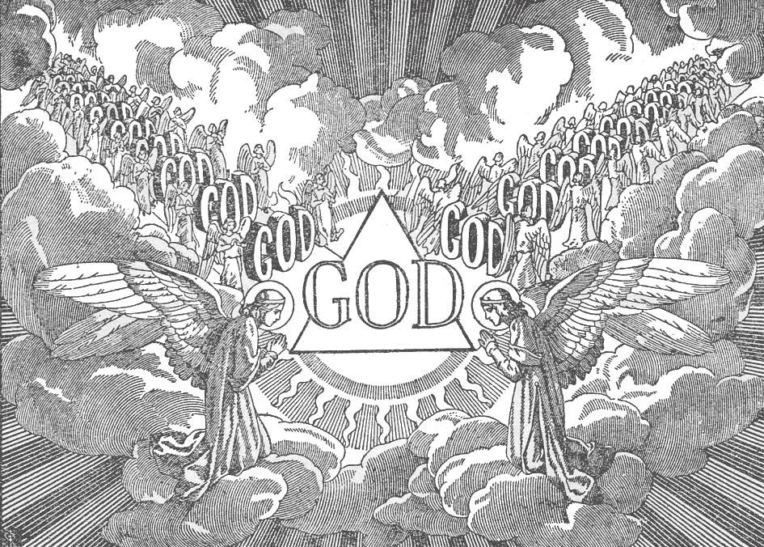

# 4. The Perfections of God

*God is eternal: He has no beginning and no end. Before there ever was anything, there was God. He always was, is, and ever will be. With God there is no time: everything is present. We cannot imagine eternity, but we can understand what it is to be without beginning or end.*

**What do we mean when we say that God is eternal?**

— When we say that God is eternal, we mean that He always was and always will be, and always remains the same.

1. God had no beginning; there never was a time when there was no God. God can never cease to exist; He will have no end. He will always be living, immortal.

> There is no time with God: with Him there is neither past nor future; everything is present. "One day with the Lord is as a thousand years, and a thousand years as one day" (2 Pet. 3: 8). "Before the mountains were made, or the earth and the world was formed, from eternity and to eternity thou art God" (Ps. 89: 2). "I am the Alpha and the Omega, the beginning and the end" (Apoc. 1: 8).

2. God will always remain the same. He is the "Father of lights, with whom there is no change" (Jas. 1: 17).

> God cannot change. The God that is God now is the same God that has ever been, the same God that will ever be, from and throughout all eternity, the "Father of Lights, with whom there is no change, nor shadow of alteration" (Jas. 1: 17).

**What do we mean when we say that God is all-good?**

— When we say that God is all-good, we mean that He is infinitely lovable in Himself, and that from His fatherly love every good comes to us.

1. God is Himself love. Love is part of His nature. Compared to God's infinite goodness, the goodness of man is nothing, only the shadow of a shadow.

> Men, creatures of God, are good because God made them to His image and likeness. "Oh, taste and see that the Lord is sweet" (Ps. 33: 9).

2. Out of His goodness, God created angels and men, although He had no need of them. God loves His creatures far more than a mother loves the children she has borne.

> God gives us the beautiful world to live in. He takes care of our body and soul. He showers benefits and graces on us day after day. He prepares for us a place in heaven. Above all, He sent His Son down to earth to die for us.

**What do we mean when we say that God is all-knowing?**

— When we say that God is all-knowing, we mean that He knows all things, past, present, and future, even our most secret thoughts, words, and actions.

1. God is all-knowing. Before His eyes all secrets, even the most hidden, are clear, even secrets that will not be thought of by man until the end of the world.

> God knows us for what we are: we cannot hide anything from Almighty God. "All things are naked and open to the eyes of him to whom we have to give account" (Heb. 4: 13).

2. God, all-knowing, will one day make everything known to everybody, disclosing our entire lives for all to read and know.

> If we think of this power of God to see and know all things, and His promise to make everything manifest on the last day, we can more easily resist temptations to sin. "For there is nothing hidden that will not be made manifest; nor anything concealed that will not be known" (Luke 8: 17).

**What do we mean when we say that God is all-present?**

— When we say that God is all-present, we mean that He is everywhere.

1. God is all-present, because there is nothing that can have existence apart from Him. All creation exists in Him as thought exists in the mind. There is no place where God is not.

> "'Do I not fill heaven and earth?' saith the Lord" (Jer. 23: 24). "In Him we live and move and have our being" (Acts 17: 28). However, we must not make the mistake of thinking that God, in Whom everything exists, is limited by this everything. He has no limits, and exists outside as well as in all creation.

2. God is all-present, present everywhere, at the same time. He is not like man, that cannot be in two places at the same time. God is wholly everywhere at the same time.

> The presence of God should be an incentive for us to do everything to please Him. As we are careful never to do anything wrong in the presence of our mother, how much more careful should we be in the presence of God! "Shall a man be hid in secret places, and I not see him?" (Jer. 23: 24).

3. Although God is everywhere, we do not see Him, because He is a spirit, and cannot be seen with our eyes.

> Similarly, we cannot see our own soul or that of another. "God is spirit, and they who worship him must worship in spirit and in truth" (John 4:24).

**What do we mean when we say that God is almighty?**

— When we say that God is almighty, we mean that He can do all things.

1. God can do anything, by a mere act of His will. Nothing is impossible to God.

> "Things that are impossible with men are possible with God" (Luke 18: 27). The only thing God cannot do is to make a contradiction:— He cannot will wrong, because wrong is a contradiction of His goodness.

2. God's omnipotence or power is known to us especially by the magnificence of creation, and by His miracles.

> Yet God created all the immensity of the heavens with nothing except His word. "Be light made. And light was made" (Gen. 1: 3). In the same way Our Lord worked many of His miracles. "Great is the Lord ... of his greatness there is no end" (Ps. 144).

**Is God all-wise, all-holy, all-merciful, and all-just?**

— Yes, God is all-wise, all-holy, all-merciful, and all-just.

1. God is all-wise. The more we learn of the wonders of the universe, the more we are amazed by the infinite wisdom of God, by His almighty power.

> His knowledge is infinite. He knows how to direct all things to the highest ends, and by the most fitting means.

2. God is infinitely holy in Himself. He loves good and hates evil. Therefore He is also all-just. He will punish the wicked and reward the good. "Be ye holy, because I the Lord your God am holy" (Lev. 19: 2).

> Partial justice is done in this life, for often the good are happy, and the wicked are tormented by their conscience. But complete justice will not be accomplished till the next life.

3. God is infinitely merciful.

> He gives sinners time for repentance. He receives us back with joy when we repent. But merciful as He is, we must not presume on His mercy, for "God will not be mocked." "The Lord is compassionate and merciful, long suffering and plenteous in mercy" (Ps. 102: 8). "He is long-suffering, not wishing that any should perish, but that all should turn to repentance" (2 Pet. 3: 9).
