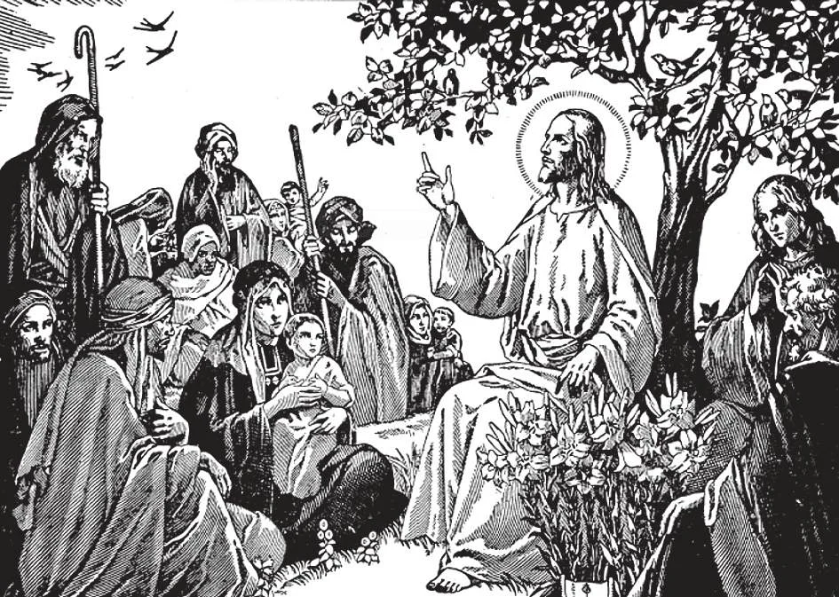

# 5. Divine Providence

Many people make themselves miserable worrying over the future. They should have more trust in Divine Providence. Let them do the best they can, and leave the rest to God, Who cares for them. Our Lord said, "Look at the birds of the air: they do not sow, or reap, or gather into barns; yet your heavenly Father feeds them. Are not you of much more value than they? ... Therefore do not be anxious, saying, 'What shall we eat?' or, 'What shall we drink?' or, 'What are we to put on?' for your Father knows that you need all these things. But seek first the kingdom of God and his justice, and all these things shall be given you besides" (Matt. 6: 26-33).

**Does God see us?**

— God sees us, and watches over us with loving care. 1. God preserves and governs the world. If He were to take away for one instant His sustaining power, the whole creation would at once fall back into nothingness.

> It is as if He held us in His hand. If He withdrew it for a moment, we would be nothing. "When thou shalt take away their breath, they shall die, and return again to the dust" (Ps. 103: 29)

2. Nothing happens without the will or permission of God. Our Lord tells us that not one sparrow falls to the ground without the will of our Heavenly Father, and that the very hairs of our head are numbered.

> God is to the world and men as the engine is to a train, as the pilot is to a ship. He guides the whole universe and all creatures. He guides the nations. "Cast all your anxiety upon him, because he cares for you" (1 Pet. 5: 7)

**What is God's loving care for us called?**

— God's loving care for us is called Divine Providence, His plan for guiding creatures to their proper end. 1. Divine Providence is good, constant, and just. It watches over even the humblest and most despised creature on earth.

> Of the paternal tenderness of God, Holy Scripture speaks thus: "Can a woman forget her infant, so as not to have pity on the son of her womb? And if she should forget, yet will not I forget thee. Behold, I have graven thee in my hands; thy walls are always before my eyes" (Is. 49: 15,16).

2. God has special care for those who are poor, despised, and forgotten by the world. He has often shown forth His glory by means of the humble.

> So poor shepherds were the first to receive news of the birth of the Saviour. So poor fishermen were His Apostles. So a poor maiden was His Mother.

**If Divine Providence is good, why do poverty, sickness, sufferings, and other physical evils exist?**

— Physical evils are often the result of the weakness of creatures in body and mind.

> Although we often do not understand God's arrangements, we must have faith and exclaim with the Apostle: "How incomprehensible are God's judgements, and how unsearchable his ways!" (Rom. 11: 33).

1. Physical evil is partly a punishment for actual sin. It serves to sanctify the good, and helps them attain eternal salvation. The greatest sufferers have often been the greatest saints. God sends suffering to the just man in order to prove his love.

> So holy Job lost everything he had, yet loved God more. So Tobias became blind and poor, and only proved his love for God.

2. God never sends anyone suffering beyond his strength. To gain merit, we must be patient and resigned under suffering. Let us imitate Our Lord in the Garden, whose prayer was, "Father, not my will, but thine, be done!" Our Lord taught us to say, in the Our Father, "Thy will be done on earth as it is in heaven."

> He who resigns himselfjoyfully to the will of God, in sickness, death, poverty, persecution, and other misfortunes, obtains true peace of heart; he will be blessed even on this earth.

3. God often sends physical evil to sinners in order to bring them back into the right way. It serves as a warning to them.

> Among those who were converted through bodily sickness, we may mention St. Francis of Assisi and St. Ignatius of Loyola.

4. Sufferings can be a boon, and should be welcomed. By sufferings, patiently accepted, the punishment due for sin is diminished or cancelled. The more we suffer in this world, the less would we have to pay in the next life, in purgatory.

> As St. Paul said, "I am filled with comfort; I overflow with joy in all our troubles" (2 Cor. 7: 4). "For I reckon that the sufferings of the present time are not worthy to be compared with the glory to come that will be revealed in us." And St. Ignatius spoke from experience when he said, "When God sends us some great trouble, it is a sign that He designs great things for us, to raise us to great holiness."

**If Divine Providence is just, why do the good often suffer misfortunes, and the wicked enjoy prosperity and honours?**

— The misfortunes and satisfactions of the world are not real and lasting, and cannot gauge God's justice. 1. No sinner has true happiness; his conscience will not give him inner peace. Riches, honour, and pleasures can never give peace to the spirit. On the other hand, no lover of God has true misery, for he possesses inner peace and a good conscience. Real reward and punishment begin only after death.

> On earth, sinners are rewarded for whatever good they do. Their good fortune lasts only for this life. The just are punished on earth for whatever sins they may have committed. Their reward is full in the other life.

2. We must therefore resign ourselves lovingly to the will of God. Thus we shall have peace of mind even in the midst of the greatest trials. Suffering should remind us that this is not our true home, and that we are citizens of heaven.

> "The Lord rule th me, and I shall want nothing" (Ps. 22: 1). "In thee, O Lord, have I hoped, because thou hast saved my soul" (Ps. 30: 1, 8).

**Is God responsible for sin?**

— God is not responsible for sin; sin is the result of man's wrong use of his free will. 1. God does not will or cause sin; He forbids it and will punish the sinner. He permits sin for His own reasons, to sanctify the good, by trying them and giving them opportunities for more faithful obedience.

> God created man free to choose good or evil. He wishes us to choose good, in order that we may merit heaven. But since we are free, we can, if we so wish, choose evil. God is not responsible for our sins.

2. Even the evil that God permits to happen, He turns to our good. He draws good out of evil.

> The wicked persecutions of the Church make the Gospel better known and loved among the just. Thus the patriarch Joseph said to his brothers, "You thought evil against me, but God turned it into good" (Gen. 50: 30). "For those who love God, all things work together unto good" (Rom. 8: 28).
