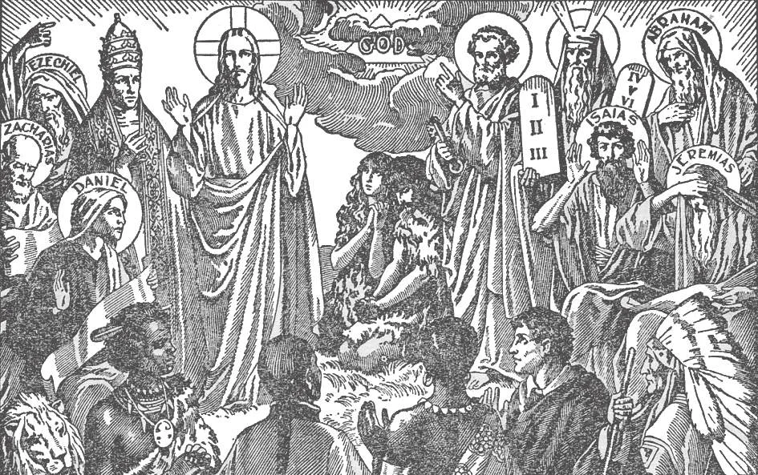

# 6. Existence of God

*Adam and Eve, our first parents, knew God in the Garden of paradise. God spoke to the patriarchs and prophets, and gave them messages for the rest of men. God gave the Commandments to Moses. Our Lord Jesus Christ, God Himself, came and taught about God.*

**How do we know by our reason that God exists?**

— We know by our reason that God exists, because of:

1. The existence of the world.

2. The order and harmony of the whole universe.

3. The testimony of our conscience.

**How does the existence of the world prove the existence of God?**

— The existence of the world proves the existence of God, because it could not have come into existence by itself.

1. Everything in the world had a beginning. Men, animals, plants, the earth, planets and stars, — all had a beginning. They could not have come into existence by themselves. They must have been made by Someone Who had no beginning. Planets and men could no more have made themselves than a watch can make itself.

> The astronomer Kircher had a friend who denied the existence of God. During a visit one day, this friend saw a globe in the study of the astronomer. — "This is an interesting globe," said he; "Who made it?" — "Why," replied Kircher, "it just made itself!" The friend had a hearty laugh at the idea. Kircher asserted, "It would be much easier for a little globe like that to make itself than for the immense globe of the earth to create itself."

2. When we see footprints on the sand, we conclude that someone has passed that way. The universe is filled with the footprints of a Supreme Creator. Every single existing thing or being gives clear testimony of Him.

> A light cannot kindle itself; after it is kindled, it will go out in a few hours. But the light of the sun in the heavens has burned for thousands of years and continues to burn.

**How do the order and harmony of the universe prove the existence of God?**

— They lead us to infer the existence of a Supreme Architect and Preserver of surpassing skill.

1. The heavenly bodies go along their appointed courses age after age. The seasons succeed one another year by year. There is splendour, beauty, arrangement, and order everywhere. The whole universe is governed and preserved by immutable law.

> From Adam and Eve down to the present, all men have acknowledged the existence of God. Even pagans and primitive peoples recognize a Supreme Being, a god. They have sacrifices, and they worship some deity whom they recognize as superior and supernatural, on whom man depends.

> If you plant an orange seed, you are certain an apple will not spring from it. Every morning you are sure the sun, when it rises, will appear in the east. At night you can go peacefully to sleep, assured that after your rest the day will come again.

2. To say that this universal order is the result of accident, or that the planets direct their own courses, is as foolish as to say that an automobile goes sensibly around the city streets running itself.

> "The heavens show forth the glory of God, and the firmament declareth the work of His hands" (Ps. 18: 2). God is the Intelligent Cause.

3. Long ago the pagan Cicero said: "When we contemplate the heavens, we arrive at the conviction that they are all guided by a Being of surpassing skill."

> And Cicero also says, "There is no nation to be found so savage as to be ignorant of the existence of God." The great astronomer Newton often uncovered and bowed when God's name was uttered.

**How does the testimony of our conscience prove the existence of God?**

— By our conscience we can distinguish right from wrong.

1. Our conscience approves the right and condemns the wrong. Thus within ourselves, there is a recognition of a Supreme Lawgiver to whom we are responsible, Who will reward the good we do, and punish the evil.

> "The fool says in his heart: There is no God" (Ps. 13: 1).

2. Those who persist in denying the existence of God in spite of external and internal testimony are atheists who are eaten up by pride, or live vicious lives, or both. Of them Our Lord said:

> "Seeing they do not see and hearing they do not hear, neither do they understand ... For the heart of this people has been hardened, and with their ears they have been hard of hearing, And their eyes they have closed; Lest at any time they see with their eyes, and hear with their ears, and understand with their mind, and be converted, and I heal them" (Matt. 13: 13-15).
