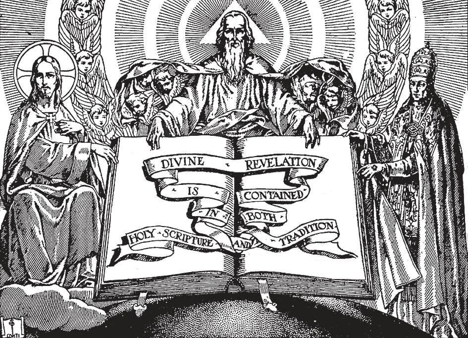

# 7. Divine Revelation

Divine Revelation comes down to us by two means: through Holy Scripture, written down under divine inspiration, and through Tradition, handed down orally from Apostolic times. We read the Bible with great respect, for it is the Word of God. We treat Tradition with as great reverence, for God speaks through Tradition as well. It is wrong to believe the Bible alone without Tradition. That is like believing the Word of God written in the morning and denying it spoken in the afternoon.

**Can we know God in any other way than by our natural reason?**

— Besides knowing God by our natural reason, we can also know Him from supernatural revelation. 1. God has often revealed Himself to men through means beyond the ordinary course of nature. This is supernatural, or Divine Revelation, as opposed to the natural revelation of Himself that God makes in the external world, and the revelation He makes through our natural reason and conscience.

> Some revealed truths are beyond the power of the human understanding; we could never, by our own abilities, have known such truths if God had not revealed them. For instance, could we by ourselves have known about the Blessed Trinity, had God not revealed it?

2. The public revelation of truths to men by God began with Adam and Eve and ended at the death of Saint John the Apostle.

> Private revelations have been made to holy persons, such as those of the Sacred Heart of Jesus to St. Margaret Mary, and those of Our Lady of Lourdes to St. Bernadette. But these private revelations are never proposed to the faithful as articles of faith. When the Church approves them, it merely states that there is nothing in them contrary to faith or morals.

**How may Divine Revelation be classified?**

— Divine Revelation may be classified into pre-Christian and Christian revelation. 1. Pre-Christian revelation may be divided into: (a) primitive revelation, made to Adam and Eve; (b) patriarchal revelation, made to the patriarchs; and (c) Mosaic revelation, made to Moses and the prophets.

> God spoke to Adam and Eve in the Garden of Paradise. He spoke to Abraham, to Noe, sending Noe to preach to sinful men before the Flood. He sent Moses to the Israelites when Pharaoh oppressed them. The patriarchs and prophets were called messengers of God, and often received from Him extraordinary powers, of miracles and prophecy, in order that they might be believed.

2. Christian revelation contains the truths revealed to us by Jesus Christ, either directly or through His Apostles.

> Our Lord commanded His Apostles to teach all these truths to the end of time. "Go, therefore, and make disciples of all nations."

**Why should we believe in Divine Revelation?**

— We should believe in Divine Revelation because God, Who is its Author, cannot deceive nor be deceived. 1. No reasonable man can believe in any truth until he is sure it is revealed by God. We know that God is the Author of Revelation because He has proved it by external acts, especially by miracles and prophecies.

> The writers who made Divine Revelation known worked under direct inspiration of the Holy Ghost, Who is, therefore its Author.

2. Miracles are extraordinary works perceptible to the senses, that cannot be accomplished by the mere powers of nature. They are brought about by the action of a higher power.

> The coming to life of a dead man is a miracle. So is the instantaneous cure of a man blind or paralytic from birth. Our Lord and the Apostles worked many miracles.

3. Some extraordinary works never before heard of or known but invented are not miracles. They are mere discoveries of previously unknown processes or combinations.

> An example is the radio. And so were the first telegraph, telephone, wireless, phonograph, etc. All of these are very wonderful. Even today people in general do not understand them fully. But they are not miracles, because they are produced by the forces of nature as harnessed through the ingenuity of man.

4. Prophecies are predictions of future events that could not have been known by natural means. For the confirmation of the faith, or for the benefit of men, God raised up prophets. Generally speaking, the gift of prophecy is a sure sign that the possessor is a messenger of God.

> The prophets told about the coming of the Messi as. Their prophecies were fulfilled when Christ came on earth. The major prophets were Isaias, Jeremias, Ezechiel, and Daniel. They are distinguished from the twelve minor prophets, because of the greater volume of their prophecies. Forecasting the weather correctly is not prophecy. It is the result of a scientific knowledge of natural facts.

**How has Divine Revelation come down to us?**

— Divine Revelation has come down to us through Holy Scripture, written down under divine inspiration, and through Tradition, handed down orally from Apostolic times. 1. From Adam and Eve, at different times, God inspired men to write down His revelations. These passed from generation to generation as sacred books.

> For pre-Christian revelation, there were forty-five of these sacred books, composing the Old Testament. They were jealously guarded by the Israelites, the Chosen People, whom God Himself had chosen to keep His truths intact for the instruction of future generations.

2. Finally our Lord Jesus Christ, Son of God, came to earth to reveal Divine truths to men. After His death, His Apostles and disciples wrote about Him and His teachings.

> There are twenty-seven of these books, composing the New Testament. With the forty- five books of the Old Testament, they were scattered in different parts of the world, until the Church gathered them together into one Book, Holy Scripture, or the Bible.

3. The deposit of faith which Jesus Christ entrusted to the Church is made up of two parts: Holy Scripture, and Divine Tradition, this latter being composed of the truths passed down by word of mouth, and not written down till after the death of Christ's Apostles and disciples, principally by the Fathers of the Church.

> Divine Revelation was completed at the death of the last of the Apostles. Since that time no new revelation has been made for the instruction of the whole of mankind. Whenever the Church decides a point of faith, it does so according to Scripture or Tradition. It simply finds out what has been revealed from the beginning.
