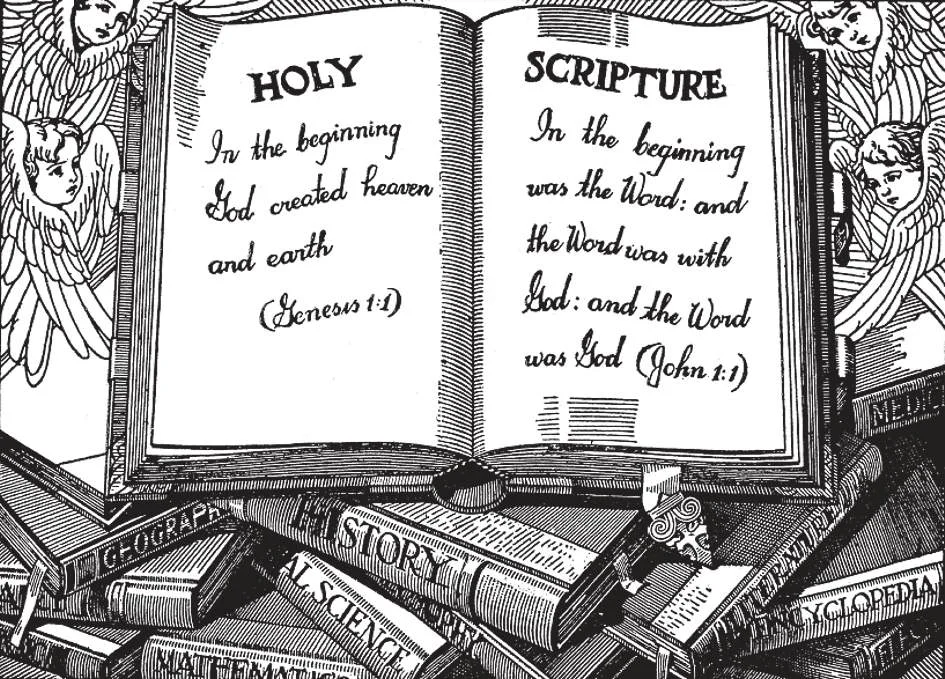

# 8. Holy Scripture, or the Bible

*The Bible is the best Book in the world. It is the Word of God. It is better than any other book that has ever been written or ever will be written. Catholics are not only permitted, but urged, to read the Bible. They must read a version approved by the Catholic Church. Catholic Bibles have the necessary explanations for the guidance of the faithful. To find a text in the Bible, as Matt. 16:26, turn to the Gospel of St. Matthew, Chapter 16, verse 26. All texts are found in the same manner.*

**What is Holy Scripture, or the Bible?**

— It is the Word of God written by men under the inspiration of the Holy Spirit, and contained in the books of the Old and the New Testaments.

1. The seventy-two sacred books, together forming the Bible, were composed by forty writers in three different languages: Hebrew, Aramaic and Greek. The period of composition covers at least 1,300 years, from Moses, to St. John the Evangelist.

> "God, who at sundry times and in divers manners spoke in times past to the fathers by the prophets, last of all in these days has spoken to us by his Son" (Heb. 1:1).

2. The writers were inspired by God. By a supernatural influence, God enlightened their mind and moved their will to write all that He wished, and only that. They acted as free instruments of God, Who directed them and preserved them from error.

> The writers of Holy Scripture were, however, not passive instruments. Each writer brought his personality with him into what he wrote. The writers were like skilled painters who paint from the same model. The products are similar and all correct, but with differences according to talents.

**Is God the Author of the Bible?**

— Yes, God is the Author of the Bible.

1. An author is not the stenographer that writes down what he is told, but the one who tells what is to be written. Since God is the Author, the Bible cannot contain any error.

> "All Scripture is inspired by God" (2 Tim. 3:16). Copyists and printers, however, can and do make mistakes in copying the Bible.

2. Since the Bible is the Word of God, it must be treated with the greatest reverence.

> This is why we take solemn oaths on the Bible, stand up when the Gospel is read, and have incense and lights used when the Gospel is sung at solemn High Mass.

**Can the books of the Bible be proved to be reliable historical records?**

— Yes.

1. Science throughout the years has been proving itself the handmaid, instead of the enemy, of the Bible. Recent excavations and researches have proved that such distant events as the Fall of Jericho, the destruction of Sodom and Gomorrha, and the Deluge, really and actually happened, and are no mere figures of speech.

> Sir Charles Marston, the eminent British archaeologist who has worked extensively in Palestine, firmly declares that far from being mere mythology, the Old Testament is, substantially, contemporary eyewitness accounts of events set down as they took place. Remains he has found include information on events that took place in the times of Abraham, Moses, Solomon, and Jeremias the Prophet; even the name of Abraham has been found. Tablets found in Babylonia and Assyria refer to the Deluge.

2. The Old Testament was recognized by Jesus Christ, approved by Him, and often quoted by Him. Evidences from the New Testament prove that this was written by Christ's Apostles and disciples.

> The style of the Gospels shows clearly that they were written by Jews. That the writers lived in the first century is shown by the vividness of their knowledge about Jerusalem, which was destroyed before the end of that century. The earliest Christian writers testify to the reliability of the Gospels; the consent of the churches of the time proves such reliability.

3. The Gospels have not been changed by the passage of centuries. This can be proved from the oldest copies, from ancient translations and quotations. The Gospels could not have been altered, because the fervour of the early Christians carefully guarded them.

> When in the fourth century St. Jerome was ordered by Pope Damasus to gather all existing texts of the Bible and translate them into Latin, there were some 35,000 ancient copies. After thirty-four years of labour, he finished the translation, our Catholic Bible, called the Latin Vulgate, from which the Catholic English version has been made.

**How is the Bible divided?**

— The Bible is divided into two parts: the Old Testament and the New Testament.

1. The Old Testament, written before Christ, consists of forty-five books:

> (a) Twenty-one historical books relating to the earliest ages of the world, or to the history of the Jews, among which books are the five books of Moses and the four books of Kings; (b) Seven doctrinal books, made up of maxims and prayers, among which are the Psalms and the Proverbs; and (c) Seventeen prophetical books, of four greater and twelve lesser prophets, among which books are Isaias, Jeremias, and Daniel.

2. The New Testament, written after the Ascension of Christ, consists of twenty-seven books, as follows:

> (a) The four Gospels according to Sts. Matthew, Mark, Luke, and John, containing the story of the life of Christ; (b) The Acts of the Apostles, by St. Luke, containing the history of the Apostles after the Ascension of Our Lord into heaven; (c) Twenty-one epistles by Sts. Paul, James, Peter, John, and Jude; and (d) The Apocalypse by St. John. The four Gospels and the Acts are mainly historical. The Epistles are doctrinal. The Apocalypse is prophetical.

**Who are the four Evangelists?**

— The four Evangelists are Saints Matthew, Mark, Luke, and John.

1. St. Matthew was one of the twelve Apostles. Before he followed Our Lord, he was a tax-gatherer or publican called Levi.

> Matthew was the first Evangelist to write the Gospel, about six years after Our Lord's Ascension. His work, written in Hebrew for the Jews of Palestine, was translated into Greek in the time of the Apostles. His work shows Jesus as proving Himself to be the promised Messias.

2. St. Mark was the disciple of St. Peter, and wrote according to what he heard from St. Peter himself.

> He wrote for the Christians of Rome about ten years after Our Lord's Ascension. St. Peter approved what he wrote, which shows Christ as the Son of God.

3. St. Luke was converted by St. Paul and became his disciple.

> He wrote about twenty-four years after Our Lord's Ascension, for a distinguished citizen of Rome. His work contains many details about the Blessed Virgin.

4. St. John was Christ's Beloved Disciple. He wrote about sixty-three years after Our Lord's Ascension.

> The last of the Apostles to die, he wrote in his old age to testify, against heretics who had arisen, that Jesus Christ is true God.
