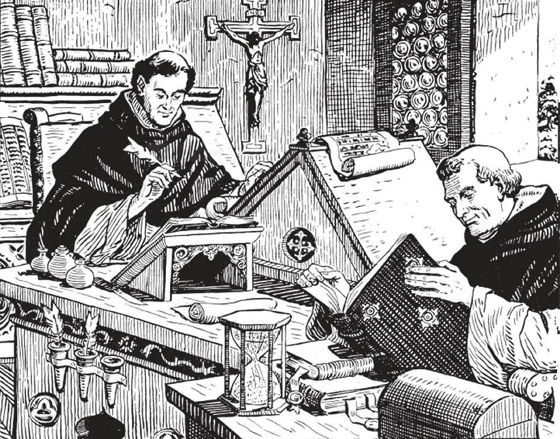

# 9. Divine Tradition

*Before the 15th century when printing was invented, the Bible was reproduced by copying in longhand. We should be very grateful to the monks and nuns of ancient times who labored lovingly, making manuscript copies of old documents that had come down from earliest times. Without this loving care, we would not have our Holy Bible today.*

**Are all the truths revealed for us by God found in the Bible?**

— Not all the truths revealed for us by God are found in the Bible; some are found only in Divine Tradition.

1. The Bible itself states that it does not contain all that God revealed.

> "There are, however, many other things that Jesus did; but if every one of these should be written, not even the world itself, I think, could hold the books that would have to be written" (John 21: 25)

2. The truths of Divine Revelation which have not been written down in Holy Scripture have come to us by the Tradition of the Church.

> St. Paul bade the Thessalonians: "Hold the teachings that you have learned, whether by word or by letter of ours" (2 Thess. 2: 15).

**What is meant by Divine Tradition?**

— By Divine Tradition is meant the revealed truths taught by Christ and His Apostles, which were given to the Church only by word of mouth and not through the Bible, though they were put in writing principally by the Fathers of the Church.

1. In a wide sense Tradition embraces the whole teaching of the Church, including the Bible, since it is only from the Church that we have the Bible. In a stricter sense, Tradition includes only what was handed down orally from the Apostles.

> The Apostles themselves say that there is much that they have delivered to the faithful by word of mouth (2 John 12; 1 Cor. 11: 2). Among many examples of truths in Tradition, not clearly manifested in Holy scriptures, are: the exact number of sacraments, the time of institution of some sacraments, the books that make up the Bible, the Baptism of infants, and Sunday observance.

2. All the truths of Divine Tradition now have found their way into books. From the first Christian centuries the practices and doctrines of Tradition were preserved by saintly teachers whom we call Fathers of the Church. They were disciples of the Apostles, contemporaries of those disciples, or disciples of the disciples. These holy and learned men instructed the Church in the years of its first growth.

> Chief among the Fathers of the first six centuries (date is of death), are: the Doctors of the Church (see below), and Saints Clement of Rome (99), Ignatius of Antioch (107), Polycarp (155), Justin (165), Irenaeus (202), Cyprian (258), Dionysius (265), Gregory Thaumaturgus (270), Optatus (372), Martin of Tours (397), Gregory of Nyssa (398), Epiphanius (403), Celestine I (432), Vincent of Lerins (450), and Caesarius of Arles (542).

3. Besides the writings of the Fathers, the truths of Divine Tradition may be found chiefly in: (a) writings of the Doctors of the Church; (b) decrees of Popes and Church councils; and (c) the liturgy of the Church as found in the Missal and rituals.

> We call "Doctors of the Church" those ecclesiastical writers, noted for learning and holiness of life, who have by Church authority been proclaimed with that title, and whose feasts have been extended to the whole Western Church. Among the Fathers of the Church, these are honoured as Doctors: Saints Hilary (368), Athanasius (373), Ephraem (378), Basil the Great (379), Cyril of Jerusalem (386), Gregory Nazianzen (389), Ambrose (397), John Chrysostom (407), Jerome (420), Augustine (430), Cyril of Alexandria (444), Peter Chrysologus (450), Leo the Great (461), and Gregory the Great (604). Among the outstanding Doctors of the Church of the Middle Ages are: Saints Peter Damian (1072), Anselm of Canterbury (1109), Bernard (1153), Thomas Aquinas (1274), Bonaventure (1274), Albert the Great (1280). Of later Doctors we have: Saints Peter Canisius (1597), John of the Cross (1605), Francis de Sales (1612), Robert Bellarmine (1621), and Alphonsus Liguori (1787).

**Why must Divine Tradition be believed as firmly as the Bible?**

— Divine Tradition must be believed as firmly as the Bible because it also contains the word of God.

1. Several years passed before the Gospels were written down. In the meantime, Christians had to depend on Tradition solely: Tradition is older than the New Testament.

> When the books composing the New Testament were written, the various writers had some definite and immediate purpose in mind. For example, St. Paul wrote his Epistles to the various churches of Gentiles that he had converted, to remind them of his teachings in his absence. St. Luke wrote his Gospel for the citizen of Rome, Theophilus, to instruct him in the new religion. St. John's Gospel was to combat heresies denying the divinity of Christ.

2. If the Church teaches any doctrine that cannot be found in Holy Scripture, it will be found in Tradition, and therefore traceable to the Apostles.

> Those who follow up the course of a river gradually draw near the source, and discover whence the waters flow. In the same way we can trace the historical sources of the teachings of the Church and arrive at their source: the Apostles themselves.

3. Divine Tradition teaches us all the doctrines that were taught by the Apostles. It comes to us from the Apostles. Every single doctrine the Church teaches comes direct from the Apostles. The Church does not issue new doctrines.

> The four Evangelists wrote their relations of the life and teachings of Jesus Christ in widely separated places; it is a proof of authenticity that the Gospels agree in their essentials, and often even repeat the very same words. When the writers of the New Testament did begin to write, they did not intend to set down all the details of Catholic faith and practice, but only such points as were immediately interesting or that needed clarification.

**Without Tradition, would we know what the Bible is?**

— No.

1. Tradition teaches us what books belong to the Bible. By tradition the Church kept intact all the books of the Bible for fifteen hundred years before the existence of denominations that nevertheless assert the Church does not care for the Bible.

> Protestant denominations reject Tradition. Consequently, they cannot agree about which books to include in the Bible. One denomination eliminates one part, other denominations omit other parts, according to the respective private interpretation.

2. Having rejected Tradition, Protestants cannot be certain that the books they have accepted are genuine. On whose authority have they accepted what they have? Protestant Bibles, the most popular of which is called the "King James version," omit all or parts of the Books of Tobias, Judith, Wisdom, Ecclesiasticus, Baruch, Machabees (I and II), and parts of Esther and Daniel.

> Luther rejected the Epistle of St. James, because the Apostle said that faith without works is dead. Luther and followers omitted the Apocalypse, the Epistle to the Hebrews, and the Epistle of St. Jude.
