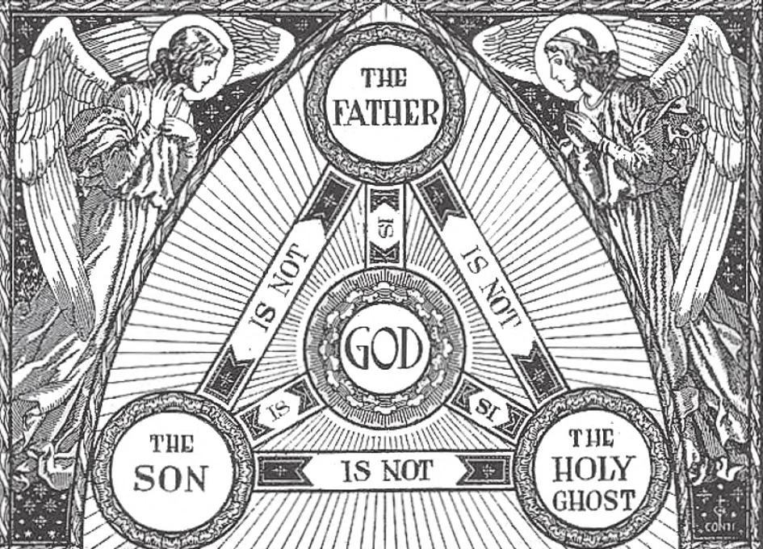

# 11. One God in Three Persons

A good concrete illustration of the Blessed Trinity is an equilateral triangle. Such a triangle has three sides equal in every way, and yet distinct from each other. There are three sides, but only one triangle. As we see in this illustration, each Divine Person is different from the other two, but all three are God. Each one is God, distinct from the two others, and yet one with them. The three Persons are equal in every way, with one nature and one substance: three Divine Persons, but only one God.

**Is there only one God?**

— Yes, there is only one God.

> "I am the first, and I am the last, and besides me there is no God" (Is. 44: 6). There can be only one God, because only one can be supreme, all-powerful, and independent of all.

**How many Persons are there in God?**

— In God, there are three Divine Persons — the Father, the Son, and the Holy Ghost. 1. In speaking of the "Persons" in God, we do not use the term in exactly the same way we use it when speaking of people. We use it only for lack of another to show our meaning better.

> In speaking of a man as a "person," we mean that he is an intelligent being, acting individually for himself.

> The acts he performs belong to him and he is responsible for them — he himself, not his tongue, nor his mind, nor his whole body even, but the whole of himself.

We speak of three "Persons" in God because to each belongs something we cannot attribute to any other: His distinct origin.

> From all eternity the Father begets the Son, and the Son proceeds from the Father. From all eternity the Father and Son breathe forth the Holy Ghost, and He proceeds from Them, as from one Source.

**Are the three Divine Persons really distinct from one another?**

— The three Divine Persons are really distinct from one another.

> "So there is one Father, not three Fathers; one Son, not three Sons; one Holy Ghost, not three Holy Ghosts. And in this Trinity, None is before or after Other. None is greater or less than Another; but the whole three Persons are Co-eternal together, and Co- equal. So that in all things, as in aforesaid, the Unity in Trinity, and the Trinity in Unity is to be worshipped.'' (From the Athanasian Creed.)

1. This is the simplest way by which the distinct origin of each Divine Person has been explained: God is a spirit, and the first act of a Spirit is to know and understand. God, knowing Himself from all eternity, brings forth the knowledge of Himself, His own image. This was not a mere thought, as our knowledge of ourselves would be, but a Living Person, of the same substance and one with the Father. This is God the Son. Thus the Father "begets" the Son, the Divine Word, the Wisdom of the Father.

> "In the beginning was the Word, and the Word was with God; and the Word was God" (John 1: 1).

2. God the Father, seeing His own Image in the Son, loves the Son; and God the Son loves the Father from all eternity. Each loves the other, because each sees in the other the Infinity of the Godhead, the beauty of Divinity, the Supreme Truth of God. The two Persons loving each other do not just have a thought, as human beings would have, but from Their mutual love is breathed forth, as it were, a Living Person, one with Them, and of Their own substance. This is God The Holy Ghost. Thus the Holy Ghost, the Spirit of Love, "proceeds" from the Father and the Son.

> "But when the Advocate has come, whom I will send you from the Father, the Spirit of truth who proceeds from the Father, he will bear witness concerning me" (John 15: 26)

3. But we are not to suppose that once God the Father begot the Son and now no longer does so, nor that once the love of the Father and the Son for each other breathed forth the Holy Ghost, but now no longer does. These truths are eternal.

> God the Father eternally knows Himself, and continues to know Himself, and thus continues to bring forth the Son. God the Father and God the Son continue to love each other, and their delight in each other continues to bring forth the Spirit of Love, God the Holy Ghost. In a similar way, fire has light and colour. As long as there is fire, it continues to produce light. As long as there is fire with light, they continue to produce colour. But all three exist at one and the same time.

4. In this imperfect way, we vaguely see that God must necessarily be three Divine Persons, because only in that way can God with His Divine Knowledge and Will be complete in Himself.

> Our Lord Jesus Christ spoke to us of the Blessed Trinity when, before the Ascension, He said to His Apostles: "Go, therefore, and make disciples of all nations, baptising them in the name of the Father, and of the Son, and of the Holy Spirit" (Matt. 28: 19)

**What do we mean by the Blessed Trinity?**

— By the Blessed Trinity we mean one and the same God in three divine Persons. 1. The Father is God and the First Person of the Blessed Trinity. Omnipotence, and especially the work of creation, is attributed to God the Father.

> God the Father could have created millions of beings instead of you yourself; but He chose you out of a love wholly undeserved, saying, "I have loved thee with an everlasting love" (Jer. 31: 3). Let us then cry in thanksgiving, "Abba, Father!" (Rom. 8: 15). Let us show our gratitude by avoiding all that could displease God the Father, by trying to please Him with virtue, by trying for greater perfection, in obedience to that injunction of Our Lord's: "You therefore are to be perfect, even as your heavenly Father is perfect" (Matt. 5: 48)

2. The Son is God and the Second Person of the Blessed Trinity. To God the Son, we owe our redemption from sin and eternal death; by His death He gave us life.

> For us God the Son debased Himself, taking the form of a servant, ... "becoming obedient to death, even to death on a cross" (Phil. 2: 8). In Holy Communion, we are united with Him, for He Himself said; "He who eats my flesh, and drinks my blood, abides in me and I in him" (John 6: 57). In return we should be "other Christs," and, as the Apostle urged, "walk even as He walked."

3. The Holy Ghost is God and the Third Person of the Blessed Trinity. He manifests Himself in us particularly in our sanctification. The word "Ghost" applied to the Third Person means "Spirit."

> At our Baptism God the Holy Ghost purifies us from all sin and fills our souls with divine grace, so that we become truly children of God, sons and heirs, and co-heirs with Jesus Christ. By Baptism we become living temples of the Holy Ghost: "Or do you not know that your members are the temple of the Holy Spirit, who is in you?" (1 Cor. 6: 19). In return for such benefits, we should make our body the instrument for the glory of God, keeping it from all stain of sin, adorning it with virtues. "Glorify God and bear him in your body" (1 Cor. 6: 20). Let us keep our souls a sanctuary for the Holy Spirit, that God may be happy to dwell in us.
