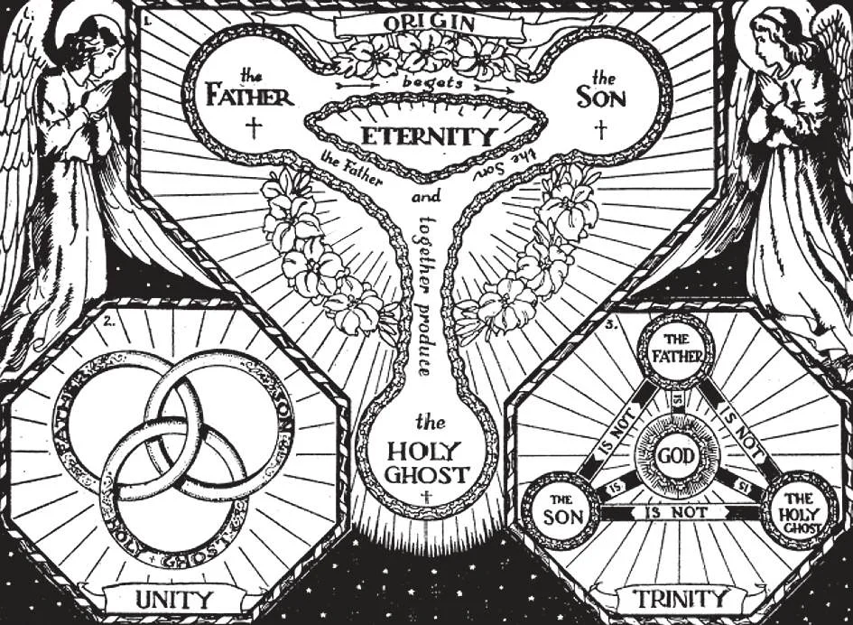

# 12. Unity of the Blessed Trinity

"And the Catholic Faith is this, that we worship one God in Trinity, and Trinity in unity. Neither confounding the Persons, nor dividing the Substance. ... But the Godhead of the Father, of the Son, and of The Holy Ghost is One, the Glory Equal, the Majesty co-Eternal. ... The Father is made of none, neither created, nor begotten. The Son is of the Father alone: not made, nor created, but begotten. The Holy Ghost is of the Father and the Son: neither made, nor created, nor begotten, but proceeding. ... And in this Trinity None is before or after Other, None is greater or less than Another, but the Three Persons are co-Eternal together, and co-Equal" (From the Athanasian Creed).

**Are the three Divine Persons perfectly equal to one another?**

— The three divine Persons are perfectly equal to one another, because all are one and the same God.

> "Such as the Father is, such is the Son, and such is the Holy Ghost. The Father Uncreated, the Son Uncreated, and the Holy Ghost Uncreated. The Father Incomprehensible, the Son Incomprehensible, and the Holy Ghost Incomprehensible. The Father Eternal, the Son Eternal, and the Holy Ghost Eternal, and yet they are not Three Eternals but One Eternal. As also there are not Three Uncreated, nor Three Incomprehensible, but One Uncreated, and One Incomprehensible. So likewise the Father is Almighty, the Son Almighty, and the Holy Ghost Almighty. And yet they are not Three Almighties, but One Almighty." (From the Athanasian Creed.)

All three Persons are equal in every way, equal in power and glory. The attributes and external works of God are common to all three Persons. However, in human speech we attribute certain works to each Person.

> Thus we attribute to the Father the works of creation, to the Son the work of redemption, and to the Holy Ghost the work of sanctification. In reality, these works belong equally to all three.

**How are the three divine Persons, though really distinct from one another, one and the same God?**

— The three divine Persons, though really distinct from one another, are one and the same God because all have one and the same divine nature.

1. Each of the Divine Persons is God.

> "So the Father is God, the Son is God, and the Holy Ghost is God. And yet they are not three Gods, but one God. So likewise the Father is Lord, the Son is Lord, and the Holy Ghost is Lord. And yet they are not three Lords but one Lord. For, like as we are compelled by Christian truth to acknowledge every Person by Himself to Be God and Lord, so are we forbidden by the Catholic Religion to say, there be three Gods or three Lords." (From the Athanasian Creed.)

2. There are three Persons, but only one Being. The Father is neither the Son nor the Holy Ghost. The Son is neither the Father nor the Holy Ghost. The Holy Ghost is neither the Father nor the Son.

> It was the Son Who became man and died for us, not the Father or the Holy Ghost. But when we receive God the Son in Holy Communion, we also spiritually receive God the Father and God the Holy Ghost. The Blessed Trinity then dwells in us as in a Temple.

**Can we fully understand how the three divine Persons, though really distinct from one another, are one and the same God?**

— We cannot fully understand how the three divine Persons, though really distinct from one another, are one and the same God, because this is a supernatural mystery. 1. A supernatural mystery is a truth which we cannot fully understand, but which we firmly believe because we have God's word for it. A supernatural mystery is above reason, but not contrary to it. No man can explain a mystery; neither can anyone know it unless it is revealed by God. "Great art thou, O Lord, in counsel, and in com pre- hens i ble in thought" (Jer. 32:19).

> It is not unreasonable to believe in a supernatural mystery. There are many natural mysteries around us that no one has yet been able to explain, yet we believe them: electricity, magnetism, force, and many of the processes of life.

2. The doctrine of the Blessed Trinity is a strict mystery; that is, we cannot learn it from reason, nor understand it completely, even after it has been revealed to us.

> The doctrine contains two truths our reason cannot fully understand: (1) that there is only one God; and (2) that each of the three Persons is God. We can understand each of these truths separately, but not when taken together.

3. The mystery of the Blessed Trinity is not a contradiction. We do not say that there are three gods in one God, nor that the three divine Persons are one Person.

> We only say that there are three Persons in one God, that is, three Persons, and one nature or essence. Somewhat similarly, the soul of man has will, understanding, and memory, but it is only one soul. Also, the sun has form, light, and heat, but it is only one sun. Three flames put together make only one flame.

**Why do we believe in the mystery of the Blessed Trinity?**

—We believe in the mystery of the Blessed Trinity because God Himself revealed it to us.

> "Thy word is Truth" (John 17:17). The mystery of the Blessed Trinity is the greatest of all mysteries. We believe it because God has revealed it to us, but we cannot fully understand it. It would be foolish to refuse to believe just because we cannot understand; that would be like a blind man who refuses to believe there is a sun, because he cannot see it. Is God limited because we are?

1. The Jews did not explicitly believe in the Blessed Trinity, although there are references to the mystery in the Old Testament.

> Before making man, God said: "Let Us make man to Our own image" (Gen. 1:26). David says: "The Lord said to my Lord, Sit on my right hand."

2. Our Lord Jesus Christ revealed the mystery. He said:

> "Go, therefore, and make disciples of all nations, baptising them in the name of the Father, and of the Son, and of the Holy Spirit" (Matt. 28:19). "But when the Advocate has come, whom I will send you from the Father, the Spirit of truth who proceeds from the Father, he will bear witness concerning me" (John 15:26).

3. The Blessed Trinity manifested Itself at the baptism of Jesus Christ.

> God the Father spoke from the heavens; God the Son was baptised; God the Holy Ghost descended in visible form, in the form of a dove.

**When do we profess our faith in the Blessed Trinity?**

— We profess our faith in the Blessed Trinity especially when we make the sign of the cross. 1. We also honour the Blessed Trinity every time we say the doxology or "prayer of praise": "Glory be to the Father, and to the Son, and to the Holy Ghost. As it was in the beginning, is now, and ever shall be world without end."

> The Feast of the Blessed Trinity, called Trinity Sunday, is kept on the first Sunday after Pentecost.

2. All the sacraments are administered in the name of the Blessed Trinity.

> On our death-bed, the Church through the priest will comfort us with the words: "Even though he hath sinned, he hath not denied the Father, the Son, and the Holy Ghost."
