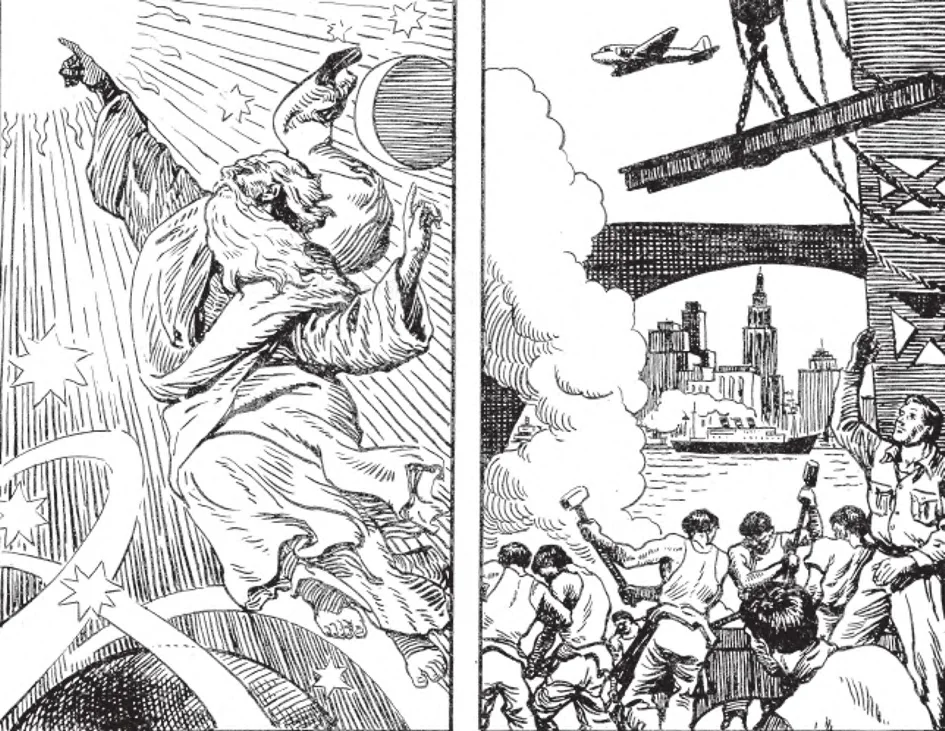

# 13. Creation

*God is Almighty. He can make anything from nothing, by a mere act of His divine will. It was thus that He created the heavens and earth and everything that is in them. Man can make many wonderful things, but he must make them out of something. He must use the things God created. Before he can make a stone house, he must have stone, cement, brick, etc. But God needs nothing to make anything. Only God could create the very first thing or matter in the universe.*

**What do we mean when we say that God is the Creator of heaven and earth?**

— When we say that God is the Creator of heaven and earth, we mean that He made all things from nothing by His almighty power.

> "All things were made through him, and without him was made nothing" (John 1: 3) "For in him were created all things" (Col. 1: 16).

1. In the beginning God alone lived. Then out of nothing, by His almighty power, He created heaven and earth, and all things in heaven and on earth. Only God can create; that is, He alone can make something out of nothing. Time began with this creation. Before it there was only eternity.

> "Before the mountains were made, or the earth and the world was formed, from eternity Thou art God" (Ps. 89: 2).

2. God created heaven and earth, and everything in heaven and earth. By this is meant everything which is not God. "Heaven" refers to the angels and their abode; and "earth" to all the material universe, including the earth, stars, planets, and all things and beings in them.

> God created everything by an act of his will. "He spoke and they were made; he commanded and they were created" (Ps. 32: 9).

3. In its first book, Genesis, Holy Scripture tells the story of Creation. In the beginning all the earth was void and empty and darkness was over all things; that is, God created things in a formless state. Then out of this formlessness God brought about order and law, creating heaven and earth.

> "In the beginning, God created heaven and earth. And the earth was void and empty, and darkness was upon the face of the deep; and the spirit of God moved over the waters" (Gen. 1: 1-2).

**In how many days did God create the world?**

— God created the world in six days, resting on the seventh day.

1. These “days” of creation reveal God as standing outside and above all created things, creating them and ordering them. These “days” can be taken as longer periods of time than 24 hours since our sun had not yet appeared. Thus the “seventh day” is still going on. For Holy Scripture says that on that day God rested.

> The Hebrew word for “day” may stand for a day, a week, a month, a century, or any indefinite period of time. The Church states that one may take the “days” of Creation in the proper sense as a natural day, or in the improper sense as a certain space of time. In these matters, the faithful must believe the infallible veracity of Scripture and always be ready to submit to the final judgement of the Church on its interpretation.

2. The six days of Creation reveal the wisdom of God who ordered all things to man as the summit of creation, so that man would through these created things come to the knowledge of the Creator and praise Him above all things.

> In the creation, God worked from the lower to the higher: He first made plants, and then He created the animals that would use them for food. Man was the crown of His earthly creations; all other works in the material universe, were for man’s enjoyment and use.

(a) On the first day, God said: "Be light made," and light was made. Then He divided light from darkness, and called the light Day and the darkness Night. On the second day, God made the sky or firmament and divided the waters.

> The "heaven" thus made is the material heaven in which the stars, the moon, and the sun pursue their courses.

(b) On the third day, God made dry land to appear, bade it bring forth plants.

> Scripture reveals how all things were created, adorned and ordered. It shows that God imparted to all things their natural principles and laws, guiding them to their purposes. On the Third Day, God separated the earth from the seas and began the work of adornment by creating plants. This work of adornment continued for the next three days.

(c) On the fourth day, God made the sun, moon, and stars. On the fifth day, He made creeping things, birds, and fishes. On the sixth day, He made beasts and cattle. Finally, "God created man to His own image."

> Man is different from the animals in his possession of reason and free will. Surpassing them all in dignity, he is the crown of God's creations, the one for whom the world had been made ready.

(d) On the seventh day, God "rested ... from all His work which He had done."

> On the seventh day God ceased to make new kinds of things. This "seventh day" continues to the present; everything that is "made" now is a development or a combination of already existing matter. It is true that "nothing is new under the sun." However, God continues to work in this sense: that He preserves and governs created things, and that He creates souls for those to be born.

**Is there no contradiction between the account in the book of Genesis, and the latest discoveries of science, concerning the origin of matter?**

— No, there is not the least contradiction between the account in the book of Genesis, and the latest discoveries of science.

> An apparent contradiction arises through the mistake of uninformed persons, who do not understand Scripture properly nor do they realize the changing nature of many unproven scientific theories which are alleged against Scripture.

1. In the Creation account, Moses, inspired by the Holy Ghost, carefully taught the Jews (and consequently all men) the essential things necessary to avoid idolatry and to lead a holy life, with great clarity and authority.

> At that time the Jews were surrounded by idolatrous peoples who believed in the existence of many gods, and worshipped all kinds of creatures, even the sun, moon, plants, animals, and images.

2. Although written in ordinary speech for common people, no philosophical or scientific writer has ever approached the simplicity, majesty and universal truthfulness of the account of Creation written by Moses and inspired by God.

> The words used, while in themselves not scientifically exact, are in conformity with ordinary speech, and understandable by ordinary people. In the same way today we say, “The sun rises in the east”, even when we know through the investigations of science that the sun does not “rise” at all. In simple language Scripture teaches the greatest truths.
