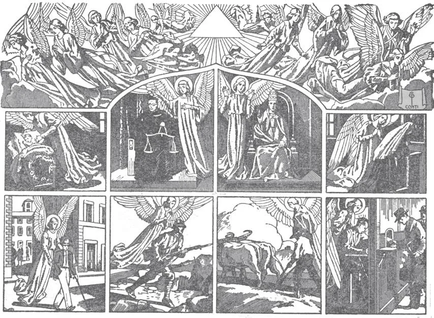

# 15. The Angels

Whoever we are, wherever we are, each of us has always a guardian angel at our side. He sees everything we do: both good and evil. We should always be very careful not to offend or hurt him. We should often thank him for his love and care. We should ask him to intercede with God for us in our necessities. We should pray to him often, especially in temptation or danger.

**Which are the chief creatures of God?**

— The chief creatures of God are angels and men. 1. God created angels and men for His own external glory. Their creation was a reflection of His wisdom and greatness.

> By reason alone we cannot know that angels exist. However, reason indicates that in the orderly sequence of creatures from the lowest to the highest, there would be a greater gap between man and God, if the angels did not exist.

2. God created angels and men for their good and happiness. They find their happiness in their union with God. God did not create angels or men for His own happiness; He is perfectly happy in Himself alone.

**What are Angels?**

— Angels are created spirits, without bodies, having understanding and free will.

> Angels are spiritual beings superior to man and inferior to God; this is of faith. We do not know the number of angels, but we can infer from Holy Scripture that their number is very great.

1. Before the creation of man, God created hosts of angels. They are pure spirits, without bodies, in contrast to men, who have both body and spirit.

> When angels or devils appear to men, they assume human form or some other visible shape. Thus the angels that appeared to the Blessed Virgin and to Zachary assumed human form. The devil that tempted Eve appeared as a serpent.

2. Even demons are pure spirits. They were angels before they became devils.

> The word "angel" means messenger, and angels have often been sent by God to make known His will to men. Even the devils do service to God, since God always turns the attacks of the devil to show forth more brightly His own glory.

**What gifts did God bestow on the Angels when He created them?**

— When God created the angels He bestowed on them great wisdom, power, and holiness. 1. Angels are the most excellent beings created by God. They are nobler in nature than men. They know more, and have greater power. Of all God's creatures, angels resemble Him most.

> We can imply the knowledge of the angels from the words of Our Lords: "But of that day (the day of Judgement) and hour no one knows, not even the angels of heaven, but the Father only" (Matt. 24: 36). The power of angels was shown in Egypt when one destroyed all the first-born of the Egyptians; another angel destroyed the hosts of the Assyrian King, for blaspheming God.

2. The angels were not created equal. They rank according to the amount of gifts given, and the work assigned to them.

> In the Bible nine choirs of angels are mentioned: seraphim, cherubim, thrones, dominations, virtues powers, principalities, archangels, and angels.

**Did all the angels remain faithful to God?**

— Not all the angels remained faithful to God; some of them sinned. 1. God gave free will to the angels, as He did to men. He put them to a test, in order to make them earn the happiness of heaven.

> We do not know the exact nature of the test which God gave the angels.

2. In this trial, many angels, using their free will, refused to submit themselves to God; for this serious sin they were punished.

> "For God did not spare the angels when they sinned, but dragged them down by infernal ropes" (2 Pet. 2: 4). Wherever the devils were later permitted to go, they had in a way their hell with them, for they were forever deprived of the love of God.

**What happened to the angels who remained faithful to God?**

—The angels who remained faithful to God entered into the eternal happiness of heaven, and these are called good angels.

> "See that you do not despise one of these little ones; for I tell you, their angels in heaven always behold the face of my Father" (Matt. 18: 10).

1. The good angels behold the face of God continually, praise and glorify Him, and are perfectly happy in His presence.

> Angels are commonly represented with wings to show the speed with which they pass from place to place. They are also shown as small children to show their innocence and perpetual youth. They have harps to indicate their perpetual praise of God, and lilies, to symbolize their perfect purity.

2. When we say that the angels were in heaven before their test, we do not mean that they saw God. They were very happy where God had placed them, but they did not see God until they had been proved.

**How do the good angel help us?**

— The good angels help us by praying for us, by acting as messengers from God to us, and by serving as our guardian angels.

> Our Lord Himself said of little children: "See that you do not despise one of these little ones for I tell you, their angels in heaven always behold the face of my Father in heaven" (Matt. 18: 10).

1. The good angels are God's messengers, and often reveal God's will to man.

> The angel Raphael accompanied Tobias on his journey. The angel Gabriel was sent to the Blessed Virgin Mary at the Annunciation. Angels appeared to the shepherds at the Nativity. An angel was sent to St. Joseph after the departure of the Magi, and after the death of Herod. Angels appeared to the women at Christ's sepulchre, and to Mary Magdalen.

2. Certain angels have special charge of nations, communities, churches, etc.

> Our Lord Himself several times spoke of angels; especially the guardian angels.

**How do our guardian angels help us?**

— Our guardian angels help us by praying for us, by protecting us from harm, and by inspiring us to do good. 1. Our guardian angels are given special care of us, watching over each from birth to death.

> We should always love and pray to our Guardian Angel who never leaves our side. The Church celebrates the feast of the Guardian Angels on October 2.

2. Our guardian angels put good thoughts into our minds, moving our will to what is good. They protect us in dangers of soul and body. They offer our prayers and good works to God. They pray for us. They help us in our work and needs.

> "He hath given his angels charge over thee, to keep thee in all thy ways" (Ps. 90: 11). For instance, angels kept Daniel safe in the lions' den, and the three young men in the fiery furnace. We often hear of little children meeting with accidents and escaping unhurt. But the chief work of our guardian angels is to keep us safe from the devil.
