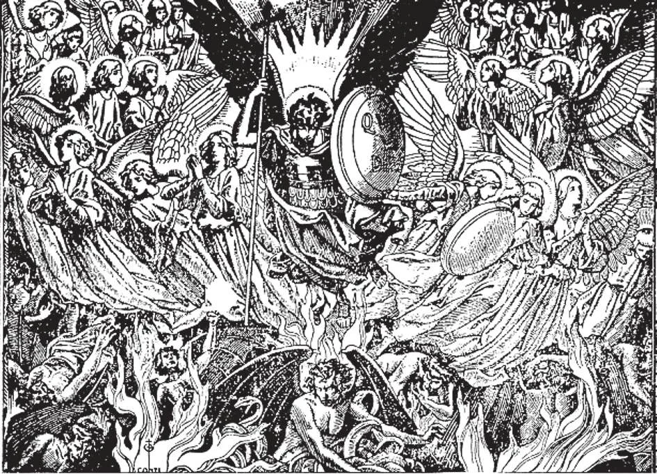

# 16. The Devils; Temptation

It was the archangel Michael who led the good angels: "And there was a great battle in heaven; Michael and his angels battled with the dragon, and the dragon fought and his angels. And they did not prevail, neither was their place found any more in heaven" (Ap. 12: 7,8).

**What happened to the angels who did not remain faithful to God?**

— The angels who did not remain faithful to God were cast into hell, and these are called bad angels, or devils.

> "Depart from me, accursed ones, into the everlasting fire which was prepared for the devil and his angels" (Matt. 25: 41).

1. We also call them demons or fallen angels. Led by the most excellent of the angels created by God, Lucifer or Satan, the bad angels refused to obey God when He tested them. God did not give them a chance to repent, but cast them at once into hell.

> "How art thou fallen from heaven, O Lucifer. ... Thou saidst in thy heart: 'I will ascend into heaven, ... I will be like the Most High,'" (Is. 14: 12-14). Jesus said, "I was watching Satan fall as lightning from heaven" (Luke 10: 18).

2. God did not create devils, but glorious angels. The rebel angels turned themselves into devils by their sin.

> By one grave sin against God these angels of light became vile demons, and were condemned to hell for all eternity. We should draw a lesson from this and determine never to sin.

**What is the chief way in which the bad angels try to harm us?**

— The chief way in which the bad angels try to harm us is by tempting us to sin. 1. The bad angels tempt man and try to draw him away from God. Often the devil appears as an angel of light, and we are tempted by evil which appears good. Under this guise, the devil is most dangerous.

> "Be sober, be watchful! For your adversary the devil, as a roaring lion, goes about seeking someone to devour" (1 Pet 5: 8-9).

2. Without God's permission, the devil can do us no harm. God sometimes permits the devil to tempt just men, to cleanse them from imperfections.

> Our Lord Himself was tempted by the devil. God permitted Job to be harmed bodily by the devil. Saint Anthony, Saint Teresa, and many other saints suffered from the temptations of the evil one. But these temptations only drive the just to greater love of God. “The life of man is a warfare” (Job. 7: 1).

3. Sometimes devils are permitted to enter the body of a man, exercising power over his faculties; this is called diabolic "possession." At other times, devils torment one from without; and this state is called diabolic "obsession."

> When God permits diabolic obsession or possession, it is to show in some way His glory, or to punish sin, convert sinners, or provide some means for the practice of virtue.

4. In cases of diabolic possession or obsession, the aid of the Church should be sought; for the Church received from Christ the power of exorcism. This is the act of driving out or warding off evil spirits. It is only with the permission of his bishop that a priest is permitted to exorcise evil spirits.

5. The Church forbids Catholics to have anything to do with spiritism. This is calling up the spirits of the dead.

> Some manifestations are spirit-rapping, table-lifting, slate-writing, apparitions, communications through mediums in a state of trance. Most of the spiritist seances are fraudulent, but sometimes the devil manifests himself. God can permit the souls of the dead to return to earth. But there is no indication that He permits Himself to obey mediums. The devil may sometimes impersonate the spirits of the dead. Satan is old and skilful in deceit, and can assume the appearance of an angel of light.

**Do all temptations come from the bad angels?**

— Some temptations come from the bad angels; but other temptations come from ourselves and from the persons and things about us. 1. This is what we mean when we say that temptations come to us from the flesh, the world, and the devil.

> The evil inclinations of our weak and corrupted nature tempt us to sin. The world, with its sinful wants and vanities, tempts us to sin. The devil goes about continually tempting us, making use of both our nature and the world for his evil purposes.

2. In itself, temptation is not a sin. It becomes sinful only when: (a) we bring it upon ourselves by carelessness or over-confidence; (b) we play with, take pleasure in, or yield to it.

> The greatest saints have often been most strongly tempted. Our Lord even permitted Himself to be tempted. Thus we see that temptation is not a sin, because we are not responsible for it.

3. God permits us to be tempted in order to try us, to let us win an eternal reward.

> God subjected the angels to a test. Those who passed it are now enjoying Him in heaven, their reward. "Because thou wast acceptable to God, it was necessary that temptation should prove thee" (Tob. 12: 13). God permitted the devil to tempt our first parents. Temptations serve to keep us humble. God permits all mankind to have temptations but never temptation beyond their strength to resist. "God is faithful and will not permit you to be tempted beyond your strength" (1 Cor. 10: 13).

4. The stronger the temptation, the greater the graces God gives for its conquest.

> The conquest by the saints of wicked temptations have made them greater saints. Christ Himself was tempted by the devil, to gluttony, to avarice, and to pride. He wanted to show us that by resisting, we may rise to greater love of God. Good men who art worried because so many temptations assail them should remember that ants quickly gather over a jar of honey; the devil strives to catch the good, because he is already sure of the wicked.

**Can we always resist temptations?**

— We can always resist temptations, because no temptation can force us into Sin, and God will always help us if we ask Him.

> The length of time during which a temptation persists does not make it sinful, if we continue resisting it. A temptation may attack us all our lives, but as long as we fight it, or pay no attention to it, as long as we do not yield, we commit no sin. We have not been conquered, and God will reward us for the good fight.

1. No temptation can do us harm if we obey God's laws and keep away from sin. If we resist, temptation will flee from us.

> Our lot for all eternity depends entirely on ourselves. God votes for heaven; the devil votes for hell. The deciding vote is ours. Shall we vote for heaven or for hell? "Resist the devil, and he will flee from you” (James 4: 7).

2. When assailed by temptation, one must at once resist. It is easier to conquer temptation at the beginning than later on, just as a fire is easier to put out at the outset.

> Since nothing can be done without divine grace, one must pray. One must imitate the Apostles who had recourse to Jesus when a storm arose. Let him say at once, "Lord, make haste to help me!"

3. Some remedies against temptation are: a. Watchfulness and prayer.

> "Watch and pray, that you may not enter into temptation" (Matt. 26: 41). Avoid idleness, keeping always occupied, either by work, or by wholesome recreation. If evil thoughts enter the mind, think of other things, in this way ignoring the temptation.

b. Frequent confession and Holy Communion.

c. Devotion to the Blessed Virgin and the Guardian Angels.
