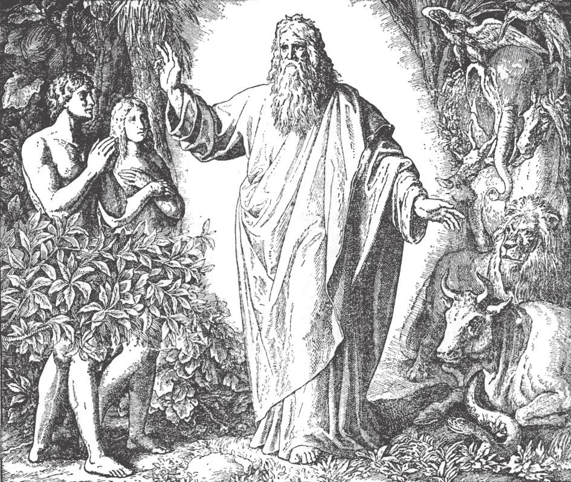

# 18. Adam and Eve: Our First Parents

*Our first parents were perfectly happy in Paradise. If they had not sinned, they would never have died or suffered from sickness and sorrow. When the time came for their leaving the earth, they would have been taken body and soul to Heaven. The tree of life grew in Paradise. By eating of its fruit Adam and Eve were preserved from death, sickness, and all manner of weakness of the body. All these gifts were lost as a punishment of the sin our first parents committed.*

**Who were the first man and woman?**

— The first man and woman were Adam and Eve, the first parents of the whole human race.

1. God made Adam's body out of the slime of the earth, and breathed an immortal soul into it (Gen. 2:7). God then cast a deep sleep upon Adam, and taking one of his ribs formed it into Eve (Gen. 2:22).

> Adam's body was formed from the earth. But his soul was immediately created out of nothing by the almighty power of God. The soul of every person is created in this way. We do not inherit our soul from our parents; it comes directly from the hand of God at the same moment that we receive life.

2. Adam and Eve were our first parents. All of mankind makes up one great family.

> Sacred Scripture says that before the creation of Adam "there was not a man to till the earth" (Gen. 2:5) ; and that Eve was the "mother of all the living" (Gen. 3:20). Legends of all races tell of an original happiness from which man fell, and of a flood that covered the earth.

a. All men have common bodily characteristics.

> The beat of the pulse, the temperature of the body, the physical structure, and even such faculties as the sense of smell, of sight, of hearing; all these vary little among different races. Differences are results of variations in climate, food, ways of living, and opportunity.

b. Emotionally and intellectually all races are the same.

> Researches have discovered a universal sameness in ideas of right and wrong; there is a universal moral code, even among the most primitive of tribes. For example, all men consider wrong the murder of those who are not enemies, cruelty to children, incest, and irreverence. If the moral code were the result of fear of reprisal, why was not stealing considered wrong when committed against an enemy? Science almost compels the conviction of the origin of mankind from only one pair of ancestors; Religion declares it.

**What was the chief gift bestowed on Adam and Eve by God?**

— The chief gift bestowed on Adam and Eve by God was sanctifying grace, which made them children of God and gave them the right to heaven.

1. God created Adam and Eve in the state of innocence and holiness. This made them pleasing to God, and full of love for Him. It made them children of God, and therefore heirs of heaven. This state of innocence we term "sanctifying grace."

> "God filled them with wisdom and the knowledge of understanding. ... He created in them the science of the spirit, he filled their heart with wisdom. ... And their eye saw the majesty of his glory, and their ears heard his glorious voice" (Ecclus. 17:6,11).

2. God's abiding grace made Adam and Eve so happy that their happiness almost equalled that of the angels.

> "Thou hast made him a little less than the angels; thou hast crowned him with glory and honour" (Ps. 8:6).

**What other gifts were bestowed on Adam and Eve by God?**

— The other gifts bestowed on Adam and Eve by God were happiness in the Garden of Paradise, great knowledge, control of the passions by reason, and freedom from suffering and death.

> If our first parents had not sinned, these gifts would have been transmitted to all men as the possession of human nature.

1. God put Adam and Eve in the "paradise of pleasure," a garden which contained all kinds of plants, flowers, birds, and beasts and everything good that could be imagined.

> All the birds and beasts were perfectly obedient to Adam and Eve. In the midst of the garden grew the tree of the knowledge of good and evil. Near it was the tree of life, which protected Adam and Eve from disease.

2. God also gave Adam and Eve infused knowledge; that is, without experience or study they understood all that people needed in order to fulfil the purpose of their creation, and as educators of men.

> For example, Adam knew the indissolubility of marriage; his insight helped him give suitable names to the animals.

3. God blessed Adam and Eve with a freedom from subjection to their lower appetites, such as impurity, drunkenness, etc. They had no inclination to evil.

> Their will was free from all weakness, weakened by no sensual desires. On account of the absence of rebellion of the flesh against the spirit, they felt no shame even though they were naked in Paradise.

4. Lastly, God gave Adam and Eve freedom from bodily disease and death.

> Adam and Eve were created immortal, and were made free from all subjection to sickness, which is the prelude to death. Had Adam and Eve been faithful to God, they would never have died, nor suffered disease.

**What commandment did God give Adam and Eve?**

— God gave Adam and Eve the commandment not to eat of the fruit of a certain tree that grew in the garden of Paradise.

1. God wanted Adam as head and representative of the human race to merit heaven. And so, after granting him His abiding grace, and blessing him with wonderful gifts, and giving him the Garden of Paradise to live in, He commanded him not to eat of the fruit of a certain tree.

> "Of every tree of Paradise thou shalt eat: but of the tree of knowledge of good and evil thou shalt not eat; for in what day soever thou shalt eat of it, thou shalt die the death" (Gen. 2:16,17). The fruit of the forbidden tree was not evil in itself, for in Paradise, God did not place anything bad. It was bad only because it was forbidden; and if Adam and Eve partook of it, they would have disobeyed God.

2. If Adam and Eve had been faithful to God, they would have passed without disease and without bodily death from their earthly Paradise to heaven, God's home, where they would see Him face to face.

> All the children of Adam, the entire human race, would have been born as Adam had been Created, in a state of friendship with God, and with all his gifts. If one had sinned, he would have been punished by God, but not being the head of the entire human race, he would not have passed on the stain to his descendants. Everybody would then have suffered for his own sins alone.

**Did Adam and Eve obey the commandment of God?**

— Adam and Eve did not obey the commandment of God, but ate of the forbidden fruit.

> The devil tempted Eve to eat of the fruit, and she ate; then she gave some to Adam, and he also ate (Gen. 3:1-13). They committed the sins of pride and disobedience.
