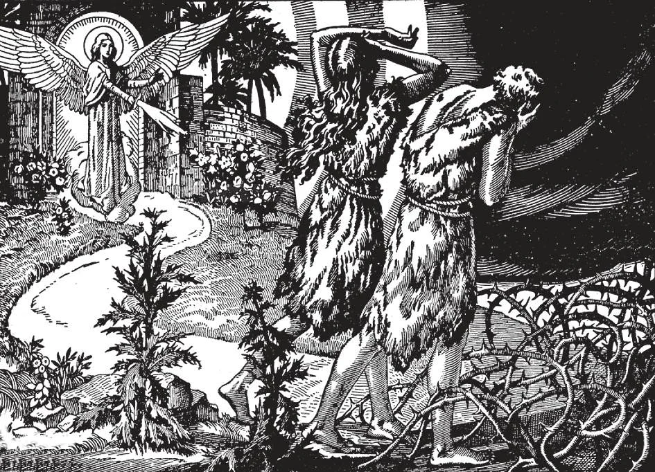

# 20. Original Sin

God punished Adam and Eve for the sin they committed. "And the Lord God sent him out of the paradise of pleasure, to till the earth from which he was taken" (Gen. 3: 23). All the calamities in the world today, war, disease, poverty, etc., are consequences of Adam's sin. We inherited all the weaknesses that were part of his punishment.

**What happened to Adam and Eve on account of their sin?**

— On account of their sin Adam and Eve lost sanctifying grace, the right to heaven, and their special gifts; they became subject to death, to suffering, and to a strong inclination to evil, and were driven from the Garden of Paradise. 1. Adam and Eve immediately lost God's abiding grace and friendship, their holiness and innocence: they lost sanctifying grace.

> This was the worst punishment. Having lost sanctifying grace, they lost the right to heaven, to see God.

2. They lost their special gifts: they became subject to suffering and death.

> Their minds and wills were so weakened that they became inclined to evil, subjected to temptation. "In the sweat of thy face shalt thou eat bread till thou return to the earth, out of which thou wast taken: for dust thou art, and unto dust thou shalt return" (Gen. 3: 16 - 19).

3. God expelled Adam and Eve from the Garden of Paradise.

> "And the Lord God sent him out of the paradise of pleasure" (Gen. 3: 23, 24).

4. Some wonder how the eating of one fruit could have been so grievous a crime. We must remember that God gave Adam and Eve every blessing. He only required them, as proof of their faithfulness, to abstain from eating the fruit of one tree.

> Doubtless Paradise was filled with trees having more delicious fruit than the forbidden tree. Pride and disobedience and ingratitude caused them to sin. They defied God, and despised His threats. They wanted to be as powerful and great as God.

**What has happened to us on account of the sin of Adam?**

— On account of the sin of Adam, we, his descendants, come into the world deprived of sanctifying grace and inherit his punishment, as we would have inherited his gifts had he been obedient to God.

> "Therefore as through one man sin entered into the world and through sin death, and thus death has passed into all men" (Rom. 5: 12).

1. This sin in us is called original sin. It is the state in which every descendant of Adam comes into the world, totally deprived of grace, through inheriting the punishment, not of Adam's personal sin, but of his sin as head of the human race. This sin is called original because it comes down to us through our origin, from Adam.

> Thus all men are born in sin, that is, they are born without the friendship of God, and with no right to heaven. Original sin does not come to us from Eve but from Adam alone, since God made him representative and head of the whole human race. Eve was punished for her disobedience, as Adam was, but did not pass on her guilt to all mankind. Our original sin comes from our first father.

2. Because of original sin, heaven was closed to all men until the death of Our Lord Jesus Christ. Our Lord instituted the sacrament of Baptism in order to restore to us the right to heaven that Adam had lost.

> A person after baptism is in the state of grace and free from sin. If he dies immediately after baptism, even if he had committed sins, he goes straight to heaven. His sins and their punishment are all forgiven him.

**What are the chief punishments of Adam which we inherit through original sin?**

— The chief punishments of Adam which we inherit through original sin are: death, suffering, ignorance, and a strong inclination to sin. 1. By original sin, we became subject to disease and death. This was part of the punishment God laid on Adam.

> "In what day soever you shall eat of it, you shall die the death" (Gen. 2: 17).

2. Our whole nature became inclined to evil. Our reason is in perpetual conflict with our passions.

> Even after our souls are cleansed of original sin by baptism, the corruption of our nature and other punishments, such as sickness, evil inclinations, etc., remain. "The imagination and thought of man's heart are prone to evil" (Gen. 8: 21). "The flesh lusts against the spirit, and the spirit against the flesh" (Gal. 5: 17)

**Is God unjust in punishing us on account of the sin of Adam?**

— God is not unjust in punishing us on account of the sin of Adam, because original sin does not take away from us anything to which we have a strict right as human beings, but only the free gifts which God in His goodness would have bestowed on us if Adam had not sinned. 1. All mankind must suffer for the sin of Adam because he was the head and representative of the whole human family.

> In much the same way. the ruler of a country represents the whole people. He declares war or makes peace, and the people are affected by his acts. When Alfonso XIII of Spain was dethroned, his children lost their right to the throne through no fault of their own. So also the children of a rich man who goes bankrupt lose all the inheritance they hoped for, through no fault of theirs.

2. We should have shared in Adam's blessings of soul and body without any merit of our own, if he had not sinned. In the same way we share in his guilt.

> If Adam had not sinned, we would have been born in the state of holiness and grace that had been his. Each man, however, would have been free to commit actual sin, and to be cast into hell. However, not being the head of the human race, he would not have transmitted his sin to all mankind.

**Was any human person ever preserved from original sin?**

—The Blessed Virgin Mary was preserved from original sin in view of the merits of her Divine Son, and this privilege is called her Immaculate Conception.

> "And when the angel had come to her, he said, 'Hail, full of grace, the Lord is with thee. Blessed art thou among women'" (Luke 1: 28).

1. From the very first moment of her conception, the Blessed Virgin was preserved from all stain of original sin. She was conceived and born without original sin.

> God, having ordained that Mary was to be the Mother of His Son, could not permit her soul to lack for a single instant all those graces that would make her most pleasing to Him.

2. Our Blessed Mother's soul was created as pure and spotless as the soul of Eve. Where Eve committed sin and lost her spotlessness, our Mother Mary kept herself pure and spotless to the end of her life.

> We commemorate the Immaculate Conception of the Blessed Virgin Mary on December 8.

3. St. John the Baptist was cleansed from original sin while he was still in the womb of his mother. He was born free from sin, but he was, like us, conceived in sin.
