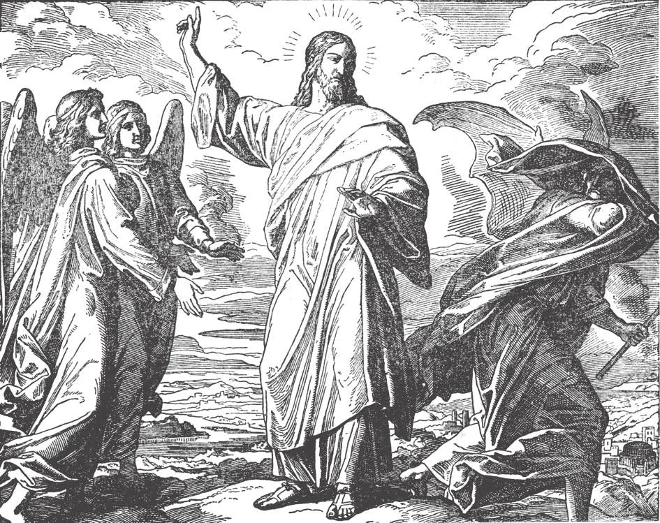

# 21. Actual Sin

*Christ permitted Himself to be tempted by the devil. After Our Lord's forty days' fast in the desert, the devil appeared to Him and tempted Him to gluttony, to pride, and to avarice. But Our Lord resisted the devil and sent him away. Then angels came to minister to Him. God wishes to show us that temptation, far from being a sin in itself, is a source of merit if we resist firmly. Then God will send us His blessings and consolations, and we shall be dearer to Him after our successful fight against temptation.*

**What is actual sin?**

— Actual sin is any wilful thought, desire, word, action, or omission forbidden by the law of God.

1. There are two general classes of sins: original and actual. Original sin is the kind of sin that we inherit from Adam. Actual sin is the kind of sin that we ourselves commit. In general, when we speak of "sin" we mean actual sin.

> Sin is an offence against God, a violation of His commandments. To sin is to despise God, to disobey Him, to offend Him. One who sins takes the gifts that God has given, and uses them to insult Him.

2. No person exists who does not sin, however holy he may be. The only human being who was created without sin, and never committed sin, was the Blessed Virgin; this was a special privilege bestowed on her because she was to be the Mother of our Saviour.

> St. John says: "If we say that we have no sin, we deceive ourselves, and the truth is not in us" (1 John 1:8).

**In what way do we fall into sin?**

— We fall step by step from temptation into sin.

> The different steps at times follow each other rapidly and are accomplished in the twinkling of an eye.

1. Sin is not committed without temptation. First an evil thought comes into the mind. This in itself is not sinful; it is only a temptation.

> A man may be in a jewellery store looking at some jewels. The salesman turns away to talk to someone else, leaving a precious diamond ring on the counter. The thought enters the man's mind that it would be easy for him to take the ring and walk away unnoticed. This is temptation, not sin.

2. If we do not immediately reject the thought, it awakens in the mind an affection or liking for it.

> If the man in the above example does not resist and reject the thought, but plays with it, and becomes pleased with the idea, he thereby gives partial consent, and commits a slight sin.

3. Next the thought is followed by an evil desire in which we take pleasure.

> If, still playing with the thought, the man wishes that he could take the diamond ring without being noticed, the consent is complete, and he commits a sin in his heart (interiorly).

4. The resolution to commit the sin when occasion presents itself follows. Then the exterior act is committed.

> Finally, the man glances to see if the salesman is still busy. Then he takes the ring and walks away with it. Thus the wish or desire has been translated into an exterior act. Even should the man be prevented from stealing, he is guilty of grave sin.

**Why is an exterior sin more evil than an interior sin?**

— An exterior sin is more evil than an interior sin, because it is attended by worse consequences.

1. An exterior sin often causes scandal, and is more severely punished by God here on earth as well as after death.

> Drunkenness reduces the drunkard and his family to poverty and sickness. Impurity destroys the body, sometimes producing insanity. Murder often leads the culprit to the electric chair.

2. And worse, an exterior sin increases the malice of the will, and destroys the sense of shame. The repetition of exterior sins forms the habit of sinning, and vice is formed. The conscience goes to sleep, and the sinner becomes so hardened that he no longer sees the evil and wickedness of his sin.

> Thus it becomes easier and easier for him to commit sins of a worse kind. His state becomes worse and worse until finally he becomes a hardened sinner who believes himself sinless.

**Are all evil acts sinful?**

— Not all evil acts are sinful; there may be times when such acts are not sinful, as:

1. When we do not know that the act is sinful.

> Noe became intoxicated, but committed no sin, because he was not aware of the strength of the wine. So one might by mistake take poison instead of medicine and die, but he would not be guilty of suicide. Such an act is termed a material sin.

2. When the act is done through no fault of our own.

> If one is not aware that a certain day is a day of abstinence, and eats meat, he commits no sin. Again, one might by pure accident and through no negligence on his part drop a loaded revolver. Even if it explodes and kills a person, he is not guilty of murder.

3. When we do not consent to the evil.

> A stronger man may take our hand, and in spite of our refusal and protest force it to drop a lighted match into a gasoline tank. Even if there is an explosion and a whole town is set on fire, we are not guilty of arson. In the same way, as long as one does not consent to an evil thought, it remains a temptation, and he commits no sin.

**When are we guilty of sins which we ourselves do not commit?**

—We are guilty of sins which we ourselves do not commit when we cooperate with another person's sins. 1. We share in another's sin: (a) by counsel; (b) by command; (c) by consent; (d) by provocation; (e) by praise or flattery; (f) by silence; (g) by assistance; (h) by defence or concealment; and (i) by not punishing the evil done.

> Thus rulers, legislative leaders, parents, employers, teachers, superiors, owners of shows and theatres, editors, publishers, and others in a position of responsibility, may easily render themselves guilty of the sins of others. One who is to blame for another's sin is as guilty as if he had committed the sin himself.

2. One who tempts or provokes another into sin is perhaps the more guilty of the two.

> Our Lord says: "But whoever causes one of these little ones who believe in me to sin, it were better for him to have a great millstone hung around his neck, and to be drowned in the depths of the sea" (Matt. 18:6).

**How many kinds of actual sin are there?**

— There are two kinds of actual sin: mortal sin and venial sin.

1. Another classification is: (a) sins of thought; (b) sins of desire; (c) sins of word; (d) sins of deed; (e) sins of omission.

> If we take pleasure in thinking proudly of ourselves, we sin by thought. If we cannot rest content because we envy somebody's clothes and wish we had them, we sin by desire. If we get angry and say angry words to someone, we sin by word. If we are so angry that we begin striking the person, we sin by deed. If we do not do what is our duty, such as going to Mass on Sunday, we sin by omission.

2. Sins are also classified into (a) our own sins; and (b) sins in which we cooperate and for which we are responsible.

> We must not be presumptuous and over-confident. We must remember that when we do not sin, it is only through the grace of God. "Let him who thinks he stands take heed lest he fall" (1 Cor. 10:12). A humble distrust of ourselves is a preservative against sin.
