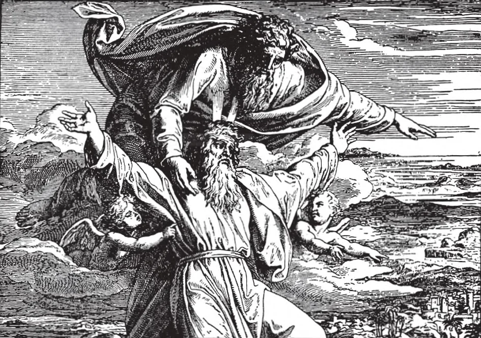

# 23. Venial Sin

We are prone to look upon venial sin as of no consequence, and to be careless about guarding against it, forgetting that it is second only in evil consequences to mortal sin. In Holy Scripture, we see from many examples how God regards venial sin; even in this life. He has punished it most severely. For only a slight doubt about God's mercy, because of the wickedness of his people, Moses was punished: he was not permitted to lead the Israelites into the Promised Land.

**What is venial sin?**

— Venial sin is a less serious offence against the law of God, which does not deprive the soul of sanctifying grace, and which can be pardoned even without sacramental confession.

1. A sin can be venial in two ways:

a. When the evil done is not seriously wrong. If we sin against God in matters of slight importance, we commit venial sin.

> Grumbling when told by your mother to open the window is not gravely wrong; it is a venial sin.

b. When the evil done is seriously wrong, but the sinner sincerely believes it is only slightly wrong, or does it on the spur of the moment, without sufficient reflection, or without full consent of the will.

> Stealing an expensive diamond ring is seriously wrong, but if the sinner took it in the belief that it was only a cheap imitation, the sin had not full consent, and is venial. If one eats meat on a day of abstinence, thinking it only a slight sin to do so; or if one in a sudden outburst of anger insults a companion seriously, he commits a venial sin for lack of sufficient reflection and consent.

2. Examples of venial sin are impatience, slight fault-finding, lies that harm nobody.

> The word "venial" comes from the Latin *venialis*, meaning easily pardonable. Even the most just of mortals falls into venial sin again and again. God permits this to keep us humble. The most imperfect of mortals attains a very high degree of perfection as soon as he can avoid all deliberate venial sin: as soon as he does not commit any sin deliberately, with full advertence and consent.

3. If a person is in the state of grace, venial sins are forgiven in many ways without necessity of confession.

> Provided one has sorrow and a sincere resolution not to commit the sins again, they are forgiven not only by Confession, but also by Holy Communion, by acts of contrition, prayer, good works, etc.

4. A distinction exists between venial sins and imperfections. Imperfections are faults that arise from ignorance or weakness, not from a bad will.

> For instance involuntary distractions in prayer, "white lies" told while telling a story or in exaggerations or jokes, bad manners that hurt no one much, are imperfections. We should, however, try to avoid all imperfections, for they are not praiseworthy, are often a cause of irritation to others, and make us accustomed to doing what is not correct.

**How does venial sin harm us?**

— Venial sin harms us by making us less fervent in the service of God, by weakening our power to resist mortal sin, and by making us deserving of God's punishments in this life or in purgatory. 1. Although venial sin is not a grievous offence against God, it is nevertheless a great moral evil, next alone to mortal sin.

> It is like a drop of ink in a glassful of clear water; the ink, however little, takes away the clearness.

2. If often committed, venial sin weakens the will, lessens our power to resist evil, and makes it easier for us to fall into mortal sin.

> "He that contemneth small things shall fall by little and little" (Ecclus. 19: 1). "He who is faithful in a very little thing is faithful also in much; and he who is unjust in a very little thing is unjust also in much" (Luke 16:10). A great fire is started by a tiny breeze. Venial sin, by weakening the will, makes us indisposed for good, and lukewarm in God's service.

3. Venial sin deprives us of many actual graces we need for resisting temptation.

> When a mirror is dusty, it cannot reflect the image clearly; similarly the mirror of the soul, when dusty with venial sin, cannot reflect the light of grace and justice. God will not bestow his blessings and graces on one whose soul is disfigured by venial sin, as a distinguished personage is not expected to embrace a man who is disfigured by a skin disease.

4. Venial sin deprives us of heaven for a time.

> If we die with venial sins on our souls, or without fully satisfying for them, we have to expiate for them in purgatory.

5. A great desire not to offend God in the least is the best proof of love and loyalty towards our heavenly Father.

> Holy Scripture shows many instances of God's hatred for venial sin, which He punishes severely even on earth. For her curiosity, Lot's wife was turned into a pillar of salt. "But I tell you, that of every idle word men speak, they shall give account on the day of judgement" (Matt. 12: 36).

**How can we keep from committing sin?**

— We can keep from committing sin by praying and by receiving the sacraments; by remembering that God is always with us; by recalling that our bodies are temples of the Holy Ghost; by keeping occupied with work or play; by promptly resisting the sources of sin within us; by avoiding the near occasions of sin. 1. Prayer and the sacraments protect us from sin. They are like a strong fortress against which the enemy strikes in vain, and within which the soul remains safe in the grace of God.

> When the Apostles were in danger on the lake of Genessareth, they had recourse to prayer. We are ever in danger from sin while we live; let us build up around us a rampart of prayer. God will protect us, as He protected the Apostles; He will answer our prayer. The soul nourished by the sacraments is strong, and will not easily succumb to sin; as a healthy body does not easily succumb to disease.

2. Even good people fall into sins frequently because they forget God's presence. Let us remember that the eye of God is always upon us, every single moment. Then, if we love Him, we would never sin, never insult His presence by sin.

> If we had a distinguished personage before us, would we commit indecent acts? Would we steal, or use bad language? But is not God the most distinguished of all persons, and is He not always looking on us?

3. When we are in the state of grace, our body is the temple of the Holy Ghost.

> God dwells in it as Jesus Christ lives in the tabernacle. If we remember this always, we shall be greatly helped in avoiding sin.

4. The most practical way of avoiding sin is to keep occupied with work or play. Man must do something; if he does not do something good, he will do something evil.

> A busy instrument cannot be used in doing mischief. Robbers will hesitate to enter a house where the occupants are busy. If we are occupied in doing good, we have no time to sit idly and wag our tongues in gossip.
