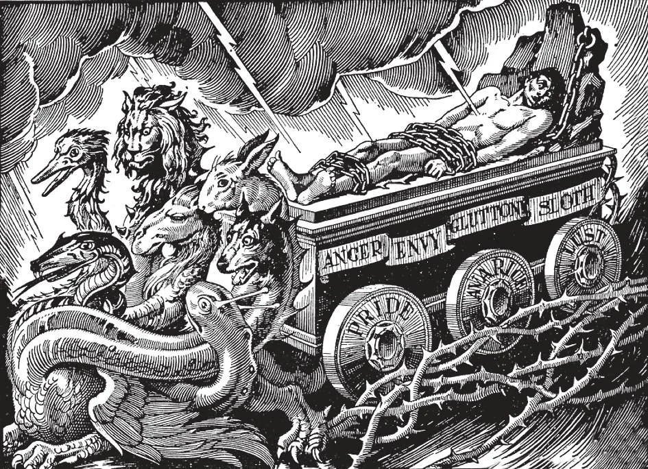

# 24. Occasions and Sources of Sin

Vice is easily formed, but requires great struggle to overcome it. The longer a man indulges in vice, the harder is the struggle. He becomes its slave. He is completely carried away by his passions. Only the great grace of God, coupled with a resolute will, can eradicate vice, once it is strongly rooted in a man's nature. This is one reason why we must be most careful to avoid sin, in order not to become victims of vice. If we are so unfortunate as to fall into sin, we must at once repent and resolve to avoid it in the future.

**What are the near occasions of sin?**

— The near occasions of sin are all persons, places, or things that may easily lead us into sin. Most common occasions are: 1. Bad companions. One who provokes or leads us into sin is not our friend. We must stop going with that companion.

> One rotten apple in a basket of good apples quickly rots the rest. The same is true of human beings. Sin is a contagious disease. If we do not wish to be infected, we must go far away from it.

2. Dance halls. Not every dance is sinful. But many dances are occasions of sin; and public dances without the presence of respectable adults are extremely dangerous. A safe rule to follow is never to go to any place where you would be ashamed to take your virtuous mother or sister.

> In many dances, the women tend to dress with extravagance and immodesty, just to "follow the fashion". Sometimes, too, dances are an occasion for the taking of liberties, due to late hours, and the spirit of unrestrained pleasure.

3. Bars and liquor saloons. These are very proximate occasions of sin, leading to intemperance, and worse evils.

> Those who frequent saloons are likely to be not only habitual drunkards, but constant gamblers, who neglect their homes and duties, become involved in disputes, and finally end badly even in the temporal sense.

4. Obscene literature. Bad newspapers and magazines are no less dangerous because their wickedness is often not apparent, many hiding their evil under the guise of cleverness, science, art, etc.

> Bad periodicals gradually undermine faith and make one insensitive to evil. It is the duty of every Catholic to subscribe to a Catholic periodical, and never to favour a wicked press.

5. Bad books. Many novels are harmless; some are very helpful, but many are positively wicked. We must be very careful in the selection of the books we read. There are national book clubs under Catholic auspices. Among them may be mentioned the Catholic Book Club, and the Pro Parvulis Book Club, headquarters of both of which are in New York City.

> These book clubs send members lists of books of merit according to literary standards, and not offensive to Catholic morals. They publish reviews of current fiction most useful for the general reader. We must remember that poisonous food will only kill the body, but poisonous reading kills the soul.

6. Indecent pictures and shows. Today many movies and theatrical shows are not decent. We must be careful to choose only the good, those approved by the National Legion of Decency. This Legion, working under the hierarchy, each week issues a list giving the moral evaluation of current films; it reviews and classifies. It asks every Catholic to take a pledge not to patronize lewd pictures.

> This pledge is nothing extraordinary for any decent person, Catholic or non-Catholic; it merely puts down clearly something that any upright person is obliged in conscience to do. The Legion of Decency was formed in order to unite the laity with the hierarchy in a persistent drive to prevent the showing of lewd pictures. If every decent person kept away from such obscene shows, the producers would surely make better pictures. Supply is according to the demand; we get what we ask for.

**How should we act towards occasions of sin?**

— We should never seek, but always try to avoid occasions of sin. 1. It is wrong voluntarily to seek the occasions of sin.

> "He that loveth the danger shall perish in it" (Ecclus. 3: 27). However, those who by their calling or other necessity are continually exposed to such dangerous occasions, as priests, officials, doctors, and others, must put their trust in God, Who will give them grace and protect them.

2. We must avoid occasions of sin as soon as we perceive them.

> If one goes to the theatre and sees that the play is indecent, he must stand up and leave at once. Otherwise he commits a sin. He will fall into further sin, and commit besides the sin of not avoiding the occasion.

**What are the chief sources of actual sin?**

— The chief sources of actual sin are: pride, covetousness, lust, anger, gluttony, envy, and sloth, and these are commonly called capital sins.

> They are called capital, from the Latin *caput* (which means head), because they are the heads or sources of all sins. Thus they originate sins of luxury, gossip, excessive ambition, etc.

1. They are called capital sins, not because they are the greatest sins in themselves, but because they are the chief reasons why men commit sin. They are the origin of every sin, all other sins arising from them as from their fountain-head.

> These sins are termed deadly, because they are either mortal of their own nature, or may easily become mortal. They may be mortal or venial according as the matter is serious or less serious.

2. These sins are called vices, because they produce permanent disorders in the soul. They are the seven fatal diseases of the soul, which end in death.

> He who will be a friend of God must divest himself of these vices. Before we can plant the beautiful garden of virtues, we must root up the thorns and weeds growing out of these deadly sins.

**Does God punish sin?**

— Yes, God punishes sin, partly in this life, but chiefly after death. 1. In this life, sinners suffer from remorse of conscience, fear, and unhappiness. Their sin often brings upon them disease or death, the hatred and scorn of their fellow-men, and other temporal punishments. Even on earth, "the wages of sin is death."

> Thus a robber or murderer is ever afraid his crime will be detected. If it is discovered, he is sent to prison or to the electric chair.

2. The punishment of the sinner is fully meted out to him only after death. Then the unrepentant sinner is punished in hell. Justice is not always done in this world, where the wicked often prosper and the just are made to suffer.

> On earth, God rewards the sinner for whatever good he may do. It is only in the next life that the evil he does is given its full and just punishment.
