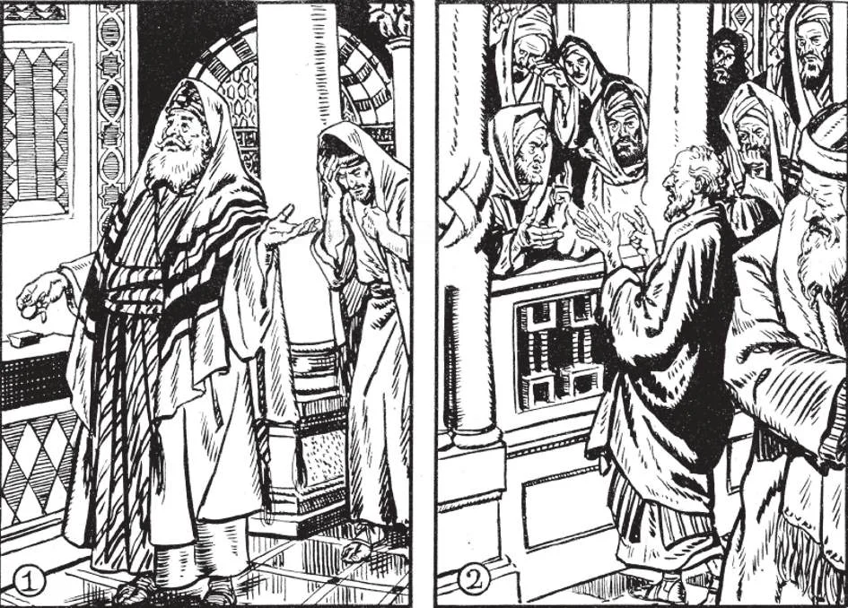

# 25. Pride, Covetousness, Lust

Pride makes one admire himself, in the belief that his excellence, imagined or real, is the result of his own worth. Our Lord condemned pride in the parable of the Pharisee and the Publican (1). Jesus said that the humble and repentant publican was justified in the eyes of God, while the proud Pharisee went home unjustified. Covetousness is one of the ugliest of sins. It was a sin of Judas. He loved money so much that he even betrayed Our Lord for thirty pieces of silver (2).

**What is pride?**

— Pride is an inordinate love of one's own excellence, an excessive self-esteem.

> Our Lord is the best example of meekness and patience. Did He use His almighty power to punish those who did Him evil? For hours He hung meekly on the cross, until He died. Every day, God is patient with sinners, giving them time to change their ways. God, the Supreme One, is not proud.

1. The proud man overestimates himself, and believes himself the source of his own excellence. The virtue of humility, which disposes us to acknowledge our limitations, is opposed to pride.

> Some are proud of their appearance; others of their family, talents, position, money, and the virtues they imagine, they possess. Even if we do have excellent abilities or possessions, we should not be proud of them, remembering that they all come from God. Instead, we should be humbly thankful, and see in what way we can make a return to God for such gifts. "Every proud man is an abomination to the Lord" (Prov. 16: 5).

2. Pride may be called the mother of all vices, for most sins can be traced to it. From pride arise ambition, vanity, presumption, disobedience, hypocrisy, obstinacy in sin.

> "For pride is the beginning of all sin: he that holdeth it shall be filled with maledictions and it shall ruin him in the end" (Ecclus. 10: 15). "Never suffer pride to reign in thy mind or in thy words, for from it all perdition took its beginning" (Tob. 4: 14). Pride was the sin of our First Parents, who wanted to be as great as God. It was the sin of King Pharaoh; he was so proud that in spite of the miracles Moses worked, he refused to be convinced. For this God "hardened his heart" (Exod. 9: 12); that is, God permitted him to close the window of his soul against the grace of the Holy Ghost, "Because thou hast rejected the word of the Lord, the Lord has rejected thee" (1 Kings 15: 26).

3. The proud man tries to attract notice and praise, strives after honours, distinctions, and other worldly favours.

> He is over-confident in himself, and despises the assistance of God. Pride was the sin of Lucifer. The proud man pretends to be greater than he is, and tries by all manner of means to attract the praise of others, even using false humility to do so.

4. God hates pride, and punishes it severely. He often punishes secret pride by withdrawing His assistance from the proud man. And deprived of God's aid, the proud man often falls into grievous sins leading to his humiliation.

> "The beginning of the pride of man is to fall off from God" (Ecclus. 10: 14). "God resists the proud" (1 Pet. 5: 5). "Everyone who exalts himself shall be humbled" (Luke 14: 11). Thus the proud King Herod was eaten up by worms and died. Thus, the proud Roman Empire fell and became nothing. Our Lord pointed out the pride in the heart of the Pharisee, and praised the humble publican.

5. If we, however, despise sin as beneath us, that is not pride, but a virtuous self respect.

> A decent regard for cleanliness and neatness is not vanity. The ambition to exceed in good things, as in studies, in order to make the best use of God's gifts, is to be commended. God wishes us to be His excellent children. (See Chapter 44, on Humility, Liberality, Chastity)

**What is covetousness?**

— Covetousness is the excessive love for, and seeking after, wealth and other worldly possessions. 1. Covetousness is also called avarice. A covetous person strives for more riches than he requires, and is never content, however much he already possesses.

> He greedily clings to what he has, and is stingy and hates to give anything away. For money, Judas betrayed the Lord. "There is not a more wicked thing than to love money; for such a one setteth even his own soul to sale" (Ecclus. 10: 10). "Take heed and guard yourselves from all covetousness, for a man's life does not consist in the abundance of his possessions" (Luke 12: 15). We meet with covetous persons among both rich and poor. Often among the rich, there is money without avarice, and among the poor, avarice without money.

2. From covetousness arise hard-heartedness towards the poor, lying, cheating, usury, defrauding labourers of wages, and other sins.

> "Those who seek to become rich fall into temptation and a snare ... For covetousness is the root of all evils" (1 Tim. 6: 9-10). It destroys faith, for the avaricious are so absorbed in money-getting that they have no time for their spiritual welfare.

3. To provide for one's future and that of one's family is praiseworthy. To avoid waste and extravagance is a virtue.

> To accumulate even considerable wealth, by proper means, is not wrong. The rich, however, must remember their obligation to use their wealth for the glory of God, not for their own pride.

4. Liberality, which disposes us rightly to use worldly goods, is opposed to covetousness. (See Chapter 44, on Humility, Liberality, Chastity)

> The avaricious man is very foolish. He works hard all his life and becomes hated by men: he earns besides eternal damnation after death and all for nothing. When he dies, all he has are a few feet of earth for his grave; his money is left to heirs who most probably ridicule his miserliness or waste the money to gain which he lost his soul. "For when he shall die, he shall take nothing away; nor shall his glory descend with him" (Ps. 48:18).

**What is lust?**

— Lust is the inordinate seeking of the pleasures of the flesh. 1. Lust defiles a man as no other sin does. It degrades man to the level of the beast. Pride is the sin committed by Lucifer, avarice by Judas, and lust by the brute.

> Of all vices, lust is most severely punished on earth. It leads to loss of health and reason. It was the cause of the Deluge. It was the cause for the destruction with fire and brimstone of Sodom and Gomorrha. "But immorality and every uncleanness or covetousness, let it not even be named among you, as becomes saints" (Ephes. 5: 3).

2. Those tempted to lust should remember that man was made to the image and likeness of God. Will they so rashly destroy that image, to make themselves like to beasts? In fact, beasts are better than lustful men, for beasts act in that manner from instinct; they have no soul like God.

> Impurity weakens the will and darkens the understanding. For this reason, amendment is very difficult, and the sinner falls into many other sins. So Solomon, who yielded to lust, finally lost all his wisdom and turned to worship false gods.

3. From lust spring jealousy, hatred, murder, loss of faith, despair, instability, worldliness, selfishness, and other sins.

> The consequences of lust are seen in the case of Henry VIII. It was the cause of his apostasy, and his apostasy dragged an entire nation into similar apostasy. "For know this and understand, that no fornicator, or unclean person, or covetous one (for that is idolatry) has any inheritance in the kingdom of Christ and God" (Ephes. 5: 5) (See Chapter 44, on Humility, Liberality, Chastity)

4. Sodomy, or sins against purity by persons of the same sex, is a form of lust. Sodomy is worse than lust because it is also contrary to nature.
