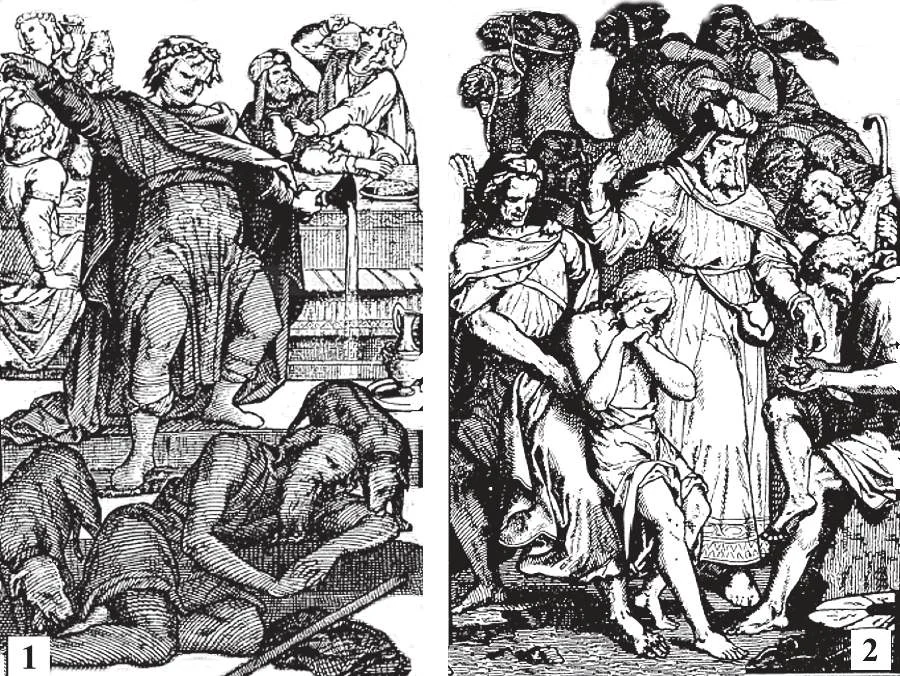

# 26. Anger, Gluttony, Envy, Sloth

Our Lord showed how hateful gluttony is in the parable of the rich man, Dives, and the poor Lazarus (1). Dives was so greedy that he would not even give scraps to Lazarus, who sat at his gate. But when Dives died, he went to hell, while Lazarus went to heaven. The brothers of Joseph (2), were so envious of him that they sold him to some merchants going to Egypt. God rebuked their sin by blessing Joseph in Egypt, and causing him to be in a position to help his envious brothers later.

**What is anger?**

— Anger is a strong feeling of displeasure, combined with a desire to inflict punishment on the offender. 1. An angry man loses his reason. In anger, a man will do what he afterwards regrets. From anger arise hatred, revenge, quarrelling, blasphemy, contumely, and murder. The virtues of patience and meekness are opposed to anger. (See Chapter 45 on Meekness, Abstinence, Zeal, Brotherly Love)

> Anger, or wrath, is a temporary madness. A man with this vice flies into a rage at every little thing. He always puts the blame of his anger on others, and even when he is alone he gets angry. "The wrath of man does not work the justice of God" (Jas. 1: 20).

Wilful murder, one of the "sins that cry to heaven for vengeance," arises from anger.

> When the first wilful murder took place, and Cain killed his brother Abel, God said to Cain, "The voice of thy brother's blood crieth to me from the earth" (Gen. 4: 10).

2. He who indulges in anger injures his health, becomes hated, incurs damnation.

> Many men have had a stroke of paralysis brought on by anger; some have even died. If anger is so hurtful to the body, how much more to the soul!

3. When we feel ourselves becoming angry, we should never speak or act, but try to calm ourselves by prayer.

> St. Francis de Sales said: "I have made an agreement with my tongue never to utter a word while my heart is excited." "Let every man be slow to speak and slow to wrath" (Jas. 1: 19).

4. If we should be so unhappy as to have offended anyone by our anger, we should hasten to apologize.

> "Do not let the sun go down upon your anger" (Ephes. 4: 26)

5. A just anger against sin and injustice is praiseworthy. We may hate the sin, but not the sinner.

> Christ had this just wrath when He drove the sellers from the Temple. Holy Scripture says, "Be angry and do not sin" (Ephes. 4: 26).

**What is gluttony?**

— Gluttony is an excessive desire for or indulgence in food or drink. 1. Gluttony is greediness, intemperance in eating and drinking. Of the gluttonous, St. Paul said that "their god is the belly " (Phil 3: 19). We should not be either too greedy or too dainty about the nourishment we take. The virtue opposed to gluttony is temperance.

> We should not eat more than we need to support life. "We do not live to eat, but eat to live." We must not take what is injurious to health, even if its taste is pleasing. We must have regular hours for our meals. We should not be too particular about food, eat what is set before us, and not get angry when a dish is not very appetizing. The purpose of food is to give strength for the work we do while still on earth preparing for our final end.

2. Gluttony produces dullness of mind, laziness, and sensuality. The vice of drunkenness is a terrible evil, leading to worse sins. A man when drunk loses his reason, and often makes a fool of himself. If reason is the chief difference between man and the beast, why should one extinguish it by drunkenness?

> "The sensual man does not perceive the things that are of the Spirit of God" (1 Cor. 2: 14). "He who sows in his flesh, from the flesh also he will reap corruption" (Gal. 6: 8). It is well for young people to abstain from drinking alcoholic beverages and smoking till after they are twenty years of age. If they do this, the likelihood is that they will not contract vice. (See Chapter 45 on Meekness, Abstinence, Zeal, Brotherly Love)

**What is envy?**

—Envy is a bitter feeling at the excellence or good fortune of those who are better or happier, with a desire to rob them of what they have. 1. Envy consists in discontent or anger at the success of another, as though it were evil to oneself. It also consists in rejoicing over another's misfortune, as if it were a good to oneself.

> Envy is against the commandment of God to love our neighbour. It is the mark of the petty mind and the hard heart. The devil envied Adam and Eve in Paradise; Cain envied Abel, whose offering was pleasing to God.

> Some are, so envious that they even envy the holiness of others, but without any desire or attempt at imitation. This was the case with the Pharisees, and their envy led them to plot the death of Jesus Christ.

2. Envy leads to calumny, gossip, detraction, hatred, scandal, and other sins. An envious man looks on everything with malice; as a result, his envy does not even make himself happy, but destroys his peace of heart.

> The sons of Jacob were envious of their brother Joseph because he was the favourite son. Their envy led them to sell him into Egypt. Often the envy in a man's heart causes him to be so soured on the world that he sells himself for nothing to the devil.

3. A form of envy, one of the greatest sins, is envy at another's spiritual good. This is a most diabolical sin; it shows that the sinner has closed his heart against the charity of God, and instead houses God's enemy, Satan. The virtue opposed to envy is charity, or brotherly love. (See Chapter 45 on Meekness, Abstinence, Zeal, Brotherly Love)

**What is sloth?**

—Sloth is the neglect of one's duties, spiritual or temporal, through laziness. 1. The rule of the universe is activity; life and movement may be found in all nature. The slothful man is the exception; and he by his laziness goes against nature.

> "Go to the ant, O sluggard, and consider her ways, and learn wisdom" (Prov. 6: 6). The slothful keep putting off doing anything till tomorrow, and tomorrow, and tomorrow, which often never comes.

2. Many complain of hard luck, but often misfortunes come from laziness. The virtues of diligence and zeal are opposed to sloth.

> Even on earth, most rewards go only to the industrious and energetic.

3. Spiritual sloth is called lukewarmness. It is also called tepidity.

> The lukewarm person would like to have the rewards given by God, but will not move a finger to serve Him. As soon as it is necessary to exert himself, he shrinks from the effort. Great Sinners have been known to become great saints, but the lukewarm, never. Holy Scripture says: "I would that thou wert cold or hot. But because thou an lukewarm, and neither cold nor hot, I am about to vomit thee out of my mouth" (Apoc. 3: 15,16).

4. Sloth leads to many sins; idleness begets vice. The lazy neglect good works.

> If man has no useful occupation, his natural activity turns to all kinds of mischief. A busy person avoids many temptations. (See Chapter 45 on Meekness, Abstinence, Zeal, Brotherly Love)
