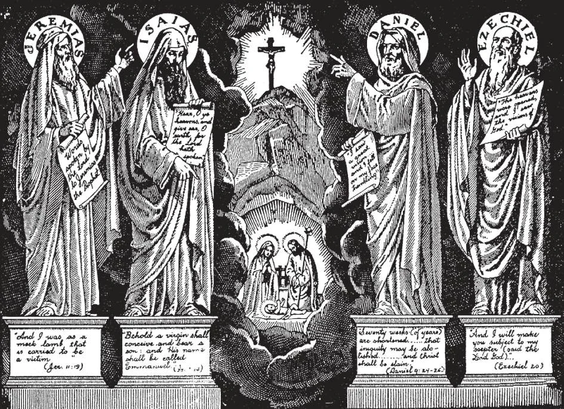

# 28. The God-man

Throughout the centuries, God sent prophets to predict different events and facts concerning the promised Saviour. Among the most important prophets were Jeremias, Isaias, Daniel, and Ezechiel. Daniel predicted the exact time of the birth of the Redeemer. He said His kingdom would have no end, and would embrace all kingdoms. Isaias prophesied that the Messias would be born of a virgin, would be both God and Man, and would die patiently and willingly like a lamb for our sins.

**What is the chief teaching of the Catholic Church about Jesus Christ?**

— The chief teaching of the Catholic Church about Jesus Christ is that He is God made man. 1. Christ Himself said that He is God. The Jews understood His claim literally, and He was condemned to death for blasphemy, for making Himself the Son of God.

> Christ said: "All power in heaven and on earth has been given to me" (Matt. 28: 18). "And the high priest said to him, 'I adjure thee by the living God that thou tell us whether thou art the Christ, the Son of God. Jesus said to him, 'Thou hast said it'" (Matt. 26: 63). "I and the Father are one" (John 10: 30).

2. Christ proved His claims by wonderful miracles, by prophecies, by His knowledge of all things, and by the holiness of His life.

These miracles Christ worked in His own name, not as His followers did, who worked in the name of God. He simply said: "I will, be thou made clean" (Matt. 8: 3)

> Christ Himself appealed to His miracles as a testimony of the truth of His doctrines and divinity, saying: "If you are not willing to believe me, believe the works" (John 10: 38) . Christ foretold future events. Among other things, He predicted His passion, death, and resurrection, the treason of Judas and the perpetuity of His Church.

3. The Apostles, the followers of Christ Himself, plainly taught that Christ is God, and died in testimony of their faith.

> St. John says: "In the beginning was the Word and the Word was with God and the Word was God." "And the Word was made Flesh." St. Paul writes: "In him (Christ) dwells all the fullness of the Godhead bodily" (Col. 2: 9). St. Thomas openly professed the divinity of Christ when he said: "My Lord and my God" (John 20: 28). St. Peter said: "Thou art the Christ, the Son of the Living God."

4. The Church teaches that Jesus Christ is God. Its teachings have spread throughout all nations, in spite of untold obstacles.

> The Church has grown by the simplest of means, its spread ever accompanied by wonderful miracles, by which God designs to show forth the truth of the Church. The doctrine of the divinity of Christ is the foundation of the Christian religion.

5. Even the enemies of the Catholic Church have admitted their belief in the divinity of Jesus Christ.

> Napoleon, about to die, said: "I know men, but Jesus Christ was more than man. My men deserted me in the field when I was there leading them. Christ's army has been faithful for centuries. A Leader who has an army which functions though He is dead is not man."

**Why is Jesus Christ God?**

— Jesus Christ is God because He is the only Son of God, having the same divine nature as His Father.

> "And they all said, 'Art thou, then, the Son of God?' He answered, 'You yourselves say that I am' And they said, 'What further need have we of witness? For we have heard it ourselves from his own mouth'" (Luke 22: 70-71)

1. Man after the Fall was unable to regain of himself his former holiness. He became like a sick man who could not arise from bed. He needed Someone to raise him up. Since the sin he had committed had been an offence against an Infinite God, the atonement needed had to be by an Infinite One, the Son of God Himself.

> "God so loved the world that he gave his only begotten Son" (John 3: 16). "This is my beloved Son, in whom I am well pleased" (Matt. 3: 17).

2. Christ is called the "Word". Just as the thought in our minds finds expression in a word, so the Son of God dwelling in the bosom of His Father was shown to the world when the Word became man.

> "In the beginning was the Word, and the Word was with God, and the Word was God.... The Word was made flesh, and dwelt among us" (John 1: 1,14).

**Why is Jesus Christ man?**

— Jesus Christ is man, because He is the Son of the Blessed Virgin, and has a body and soul like ours. 1. The birth of Jesus Christ is a fact of history. He was born of Mary, who was espoused to a carpenter named Joseph, who lived in Nazareth of Galilee.

> The archangel Gabriel said to Mary, "The Holy One to be born shall be called the Son of God."

2. Jesus Christ is true man, because He has a body and soul like ours. He derived His human nature from His mother.

> History tells us of Jesus Christ, Who preached in and about Jerusalem over nineteen hundred years ago. Many records tell of His appearance, of His words, of His actions, of His teachings. Nobody doubted that Jesus Christ was a Man, for He could be seen and touched like other men. He lived and died just as men of all times live and die.

**How can we prove that the religion God has revealed through Christ is worthy of belief?**

— We can prove that the religion God has revealed through Christ is worthy of belief, because: 1. Jesus Christ, announcing Himself as the true Son of God, whose coming was foretold by the prophets, preached doctrines which He said all must believe.

> If Christ is God, then the religion He established is true, and the Church He founded is the true Church. We can believe everything He says, even without understanding it, because God cannot err. If Jesus Christ were not God, then Christianity would be a farce, and the sooner it were done away with the better. If Christ were not God, then He were an impostor who, by claiming divinity, had led billions into error for more than 2,000 years.

2. Christ worked wonderful miracles, which showed that the God of truth approved His teachings.

> Christ worked so many miracles publicly that all flocked to Him to be cured. "But when John had heard in prison of the works of Christ, he sent two of his disciples to say to him, 'Art thou he who is to come, or shall we look for another?' And Jesus answering said to them, 'Go and report to John what you have heard and seen: the blind see, the lame walk, the lepers are cleansed, the deaf hear, the dead rise, the poor have the gospel preached to them'" (Matt. 11: 2-5)

a. Christ performed miracles on inanimate objects, as when He changed water to wine, calmed the storm, multiplied loaves. b. He healed in an instant the sick, the blind, the lame. He expelled devils. c. He raised the dead to life; as the daughter of Jairus, the son of the widow of Naim and Lazarus. Even His enemies acknowledged His miracles. The Pharisees planned to kill Lazarus, because the Jews believed in Jesus as a result of the miracle. d. He worked miracles on His own Person, as in the Transfiguration, Resurrection, and Ascension.
